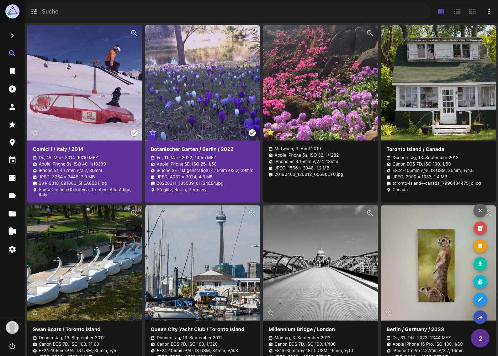

# PhotoPrism: Browse Your Life in Pictures

PhotoPrism® ist eine KI-gestützte, selbstgehostete Plattform, um deine Fotos und Videos privat zu durchsuchen, zu organisieren und zu teilen. Sie nutzt modernste Technologien, um Bilder zu verschlagworten und zu finden, ohne dir dabei im Weg zu stehen. Du kannst sie zu Hause, auf einem privaten Server oder in der Cloud betreiben.

{ class="shadow" }

## Grenzenlose Möglichkeiten ##

* Genieße deine [Foto](user-guide/search/index.md)- und [Video](https://demo-de.photoprism.app/library/videos)-Sammlung ohne dir Gedanken über [RAW-Konvertierung, Duplikate oder Videoformate machen zu müssen](user-guide/settings/library.md)
* Finde Bilder mithilfe von umfangreichen [Suchfiltern](https://demo-de.photoprism.app/library/browse?view=cards&q=flower%20color%3Ared)
* Privatsphäre: PhotoPrism sendet keine Daten an Google, Amazon, Facebook oder Apple, es sei denn, du lädst explizit Dateien auf einen dieser Dienste hoch :closed_lock_with_key:
* PhotoPrism erkennt die [Gesichter](https://demo-de.photoprism.app/library/people) deiner Familie und Freunde
* [Automatische Klassifizierung](https://demo-de.photoprism.app/library/labels) von Bildern anhand des Inhalts und Standorts
* Spiele [Live Photos](https://demo-de.photoprism.app/library/browse?view=cards&q=type%3Alive) ab, indem du in [Alben](https://demo-de.photoprism.app/library/albums) oder Suchergebnissen über sie fährst
* Da die [Benutzeroberfläche](https://demo-de.photoprism.app/) eine :material-language-html5: [Progressive Web App](https://developer.mozilla.org/en-US/docs/Web/Progressive_web_apps) ist,
  verhält sie sich wie eine [native App](https://en.wikipedia.org/wiki/Progressive_web_application) und du kannst sie bequem auf dem Startbildschirm aller gängigen Geräte und Betriebssysteme installieren
* Vier hochauflösende [Weltkarten](https://demo-de.photoprism.app/library/places) lassen Erinnerungen an deine Lieblingsreisen wieder aufleben
* Metadaten werden aus Exif-, XMP- und proprietären Formaten, wie von Google Photos, ausgelesen und zusammengeführt
* Viele weitere Bildeigenschaften wie [Farbe](https://demo-de.photoprism.app/library/browse?view=cards&q=color:red), [Chroma](https://demo-de.photoprism.app/library/browse?view=cards&q=mono%3Atrue) und [Qualität](https://demo-de.photoprism.app/library/review) können ebenfalls als Suchfilter verwendet werden
* Übertrage mit :material-sync: [PhotoSync](https://link.photoprism.app/photosync) deine Bilder von Apple iOS- und Android-Geräten
* WebDAV-Clients wie Microsofts Windows Explorer und Apples Finder können eine direkte [Verbindung](user-guide/sync/webdav.md) zu PhotoPrism herstellen, so dass du Dateien auf deinem Computer öffnen, bearbeiten und löschen kannst, als wären sie lokal gespeichert

[Vollständige Funktionsübersicht ›](https://www.photoprism.app/teams/#compare)

### 100% Privatsphäre :lock:
Da PhotoPrism sich zu [**100 % selbst finanziert und unabhängig**](https://www.photoprism.app/membership/) ist, können wir versprechen, dass wir [**niemals deine Daten verkaufen werden**](https://www.photoprism.app/privacy/) und dass wir unsere Software und Dienste [**stets transparent**](https://www.photoprism.app/terms/) gestalten. 
Deine Daten werden auch niemals an Google, Amazon, Facebook oder Apple weitergegeben, es sei denn, du lädst absichtlich Dateien auf einen dieser Dienste hoch.

  <a class="action-button action-secondary" href="https://demo-de.photoprism.app/" target="_blank">Demo testen</a>
  <a class="action-button action-secondary" href="https://docs.photoprism.app/getting-started/" target="_blank">🇬🇧  Setup</a>
  <a class="action-button action-primary" href="user-guide/">Erste Schritte</a>

