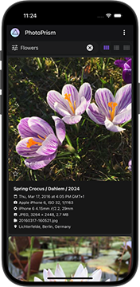

Unsere schrittweise Installationsanleitung für die Community-Edition ist in englischer Sprache unter [docs.photoprism.app/getting-started](https://docs.photoprism.app/getting-started/) zu finden.

Alles, was du brauchst, ist ein Webbrowser und
[Docker](https://store.docker.com/search?type=edition&offering=community), um den Server zu betreiben.

Docker ist für [Mac](https://docs.docker.com/desktop/setup/install/mac-install/), [Linux](https://docs.photoprism.app/getting-started/troubleshooting/docker/#installation) und [Windows](https://docs.docker.com/desktop/setup/install/windows-install/) verfügbar. PhotoPrism läuft auch auf [PikaPods](https://docs.photoprism.app/getting-started/cloud/pikapods/), [DigitalOcean](https://docs.photoprism.app/getting-started/cloud/digitalocean/),
[Raspberry Pi](https://docs.photoprism.app/getting-started/raspberry-pi/), [Portainer](https://docs.photoprism.app/getting-started/portainer/), [FreeBSD](https://docs.photoprism.app/getting-started/ports/freebsd/), und vielen [NAS-Geräten](https://docs.photoprism.app/getting-started/nas/synology/).

{ align=right }

Sobald die [Installation](https://docs.photoprism.app/getting-started/) abgeschlossen ist, führt dich unser [Erste Schritte 👣](./first-steps.md) Tutorial durch die Benutzeroberfläche und die Einstellungen, um sicherzustellen, dass deine Bibliothek nach deinen individuellen Präferenzen indexiert wird.

## PhotoPrism® Plus ##

Als Mitglied kannst du [zusätzliche Funktionen](https://link.photoprism.app/membership) aktivieren, indem du dich mit dem [bei der Installation angelegten Admin-Benutzer](https://docs.photoprism.app/getting-started/config-options/#authentication) anmeldest und dann den [in unserer Aktivierungsanleitung beschriebenen](https://www.photoprism.app/kb/activation) Schritten folgst. Vielen Dank für deine Unterstützung, die für den Erfolg des Projekts unerlässlich war und ist! :octicons-heart-fill-24:{ .heart .purple }

!!! tldr ""
    Wir empfehlen neuen Nutzern, [unsere kostenlose Community Edition zu installieren](https://docs.photoprism.app/getting-started/), bevor sie sich [für eine Mitgliedschaft anmelden](https://link.photoprism.app/membership).
[Mitgliedschaften vergleichen ›](https://link.photoprism.app/membership){ class="pr-3 block-xs" } [FAQ ansehen ›](https://www.photoprism.app/membership/faq) 

## Unterstützung erhalten ##

Gängige Probleme kannst du mit unseren [Checklisten zur Fehlerbehebung](https://docs.photoprism.app/getting-started/troubleshooting/) schnell finden und lösen. Du kannst deine Fragen auch auf [GitHub Discussions](https://link.photoprism.app/discussions) posten, in unserem [Community-Chat](https://link.photoprism.app/chat) stellen oder unseren [virtuellen Experten](https://www.photoprism.app/kb/getting-support#virtual-experts) auf [ChatGPT](https://link.photoprism.app/chatgpt) um Hilfe bitten.[^1]

[Silber-, Gold- und Platinum-Mitglieder](https://link.photoprism.app/membership) sowie [Nutzer mit einem Team-Tarif](http://link.photoprism.app/team-editions) können uns gerne eine E-Mail senden, um technischen Support und Beratung zu erhalten.

[Support-Optionen ansehen ›](https://www.photoprism.app/kb/getting-support)

!!! tldr ""
    **Bitte erstelle keine Bug Reports in Github Issues, außer du bist sicher, dass du ein Problem gefunden hast, das direkt in der App behoben werden muss.**
    [Wende dich an uns](https://www.photoprism.app/contact) oder ein [Community-Mitglied](https://link.photoprism.app/discussions), wenn du Hilfe brauchst. Es könnte sich um ein Konfigurationsproblem oder um ein Missverständnis bei der Funktionsweise der Software handeln.

[^1]: ChatGPT kann Fehler machen und, wenn du das nicht abstellst, können deine Chats für Trainingszwecke verwendet werden.
