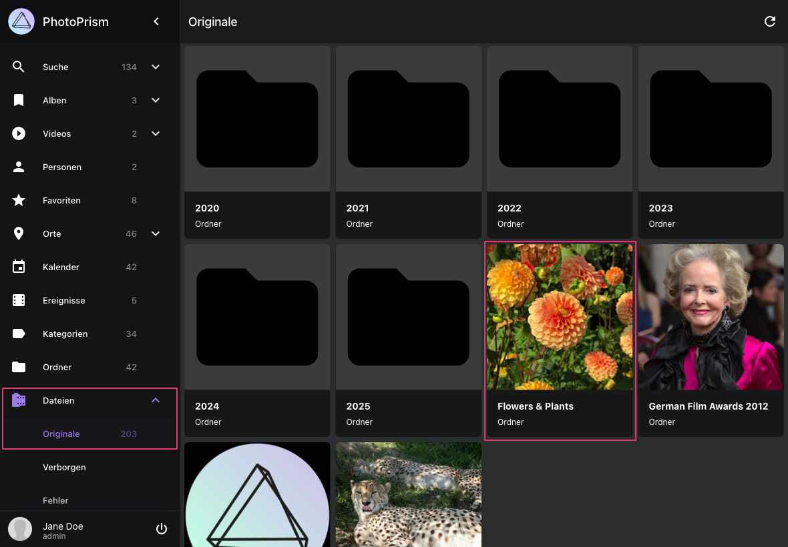
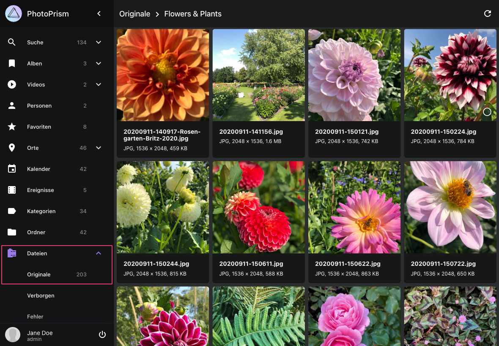

# Originals Verzeichnis anzeigen #

Im Bereich *Originale* werden alle Dateien deines *Originals* Verzeichnis angezeigt.

Klicken auf eine Datei öffnet den Bearbeitungs-Dialog. 

{ class="shadow" }

{ class="shadow" }

Über das Kontext-Menü können folgenden Aktionen ausgeführt werden:

## Dateien herunterladen ##
1. Selektiere Dateien 
2. Öffne das Kontext-Menü
3. Klicke :material-download:

## Dateien zu Album hinzufügen##
1. Selektiere Dateien
2. Öffne das Kontext-Menü
3. Klicke :material-bookmark:
4. Wähle ein vorhandenes Album aus oder tippe einen neuen Albumnamen ein
5. Klicke *Zum Album hinzufügen*
