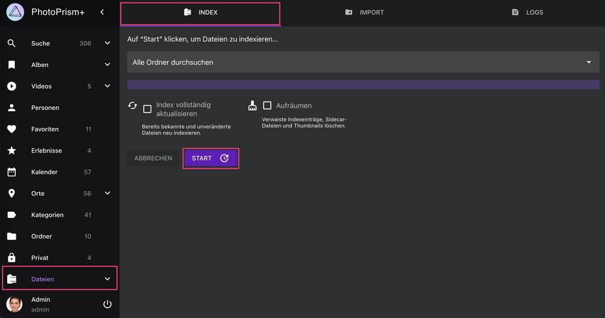

# Dateien indexieren #

!!! info ""
    Wenn du PhotoPrism zum ersten Mal verwendest, stelle sicher, dass deine Bild und Video Sammlung als [*Originals* Ordner konfiguriert ist](https://docs.photoprism.app/getting-started/docker-compose/#photoprismoriginals) und dass die [Bibliothekseinstellungen](../settings/library.md) deinen individuellen Vorlieben entsprechen.    

## Manuelles Indexieren

1. Öffne den Bereich *Dateien*, indem du auf den Link in der Hauptnavigation klickst

2. Wählen einen Unterordner aus, oder nutze die Standardeinstellung, um alle Dateien zu indexieren

3. Wähle *Index vollständig aktualisieren*, falls du alle Dateien, einschließlich bereits indexierterer und unveränderter Dateien, indexieren möchtest

4. Klicke *Start*, um mit der Indexierung zu beginnen


{ class="shadow" }


!!! tip ""
    Du kannst [WebDAV](webdav.md)-kompatible Anwendungen wie den Windows Explorer von Microsoft und den Finder von Apple verwenden,  um Dateien von einem Remote-Computer oder einem mobilen Gerät zu deinem *Originals* Ordner hinzuzufügen.

!!! tip "NSFW" 
    Ein NSFW-Detektor kann aktiviert werden, um Bilder, mit anstößigem Inhalt, automatisch als privat zu kennzeichnen. 
    Beachte, dass der Mechanismus nicht 100% zuverlässig ist.
    
    Bilder, die bereits indexiert wurden, bevor der NSFW-Detektor aktiviert wird, werden vom Detektor nicht gescannt.

### Index Vollständig aktualisieren ###

Wenn die Option "Index vollständig aktualisieren" gewählt ist, werden alle Dateien in *Originals* neu indexiert. Also auch Dateien, die bereits indexiert und nicht verändert wurden.
Das kann nach einem Upgrade auf eine neue Hauptversion erforderlich sein.

!!! tldr ""
    Manuell eingegebene Informationen wie Kategorien, Personen, Titel oder Beschreibungen werden bei der Indexierung nicht verändert, selbst wenn du den Index vollständig aktualisierst.

### Aufräumen ###
Admins können "Aufräumen" aktivieren, um ungenutzte Vorschaubilder aus dem Cache zu löschen und verwaiste Indexeinträge zu entfernen. Wenn du dies von Zeit zu Zeit tust, kann dies die Indexierung beschleunigen und die Speichernutzung reduzieren.

## Regelmäßige und automatische Indixierung ##

[PhotoPrism 240523-923ee0cf7](https://docs.photoprism.app/release-notes/#may-23-2024) und neuere Versionen können optional zeitgesteuerte Rescans deiner Bibliothek durchführen. Diese Funktion kannst du aktivieren, indem du [einen Zeitplan in deiner Konfiguration einstellst](https://docs.photoprism.app/getting-started/config-options/#indexing). Wenn du einen externen Scheduler verwendest, achte bitte darauf, dass du nicht mehrere Indexierungsprozesse gleichzeitig startest, da dies nicht nur eine hohe Serverlast verursacht, sondern auch zu unerwarteten Ergebnissen führen kann.

Standardmäßig wird auch automatisch ein Rescan der Bibliothek nach einer Sicherheitsverzögerung von 5 Minuten ausgelöst, wenn Dateien [über WebDAV](../sync/webdav.md) mit dem Ordner Originals synchronisiert werden.
Du kannst die Sicherheitsverzögerung über die Konfigurationsoption [PHOTOPRISM_AUTO_INDEX](https://docs.photoprism.app/getting-started/config-options#indexing) ändern.

## Verzeichnisse und Dateien ignorieren ##
Versteckte Dateien oder Ordner, deren Namen mit  `.`, `@`, `_.` oder `__` wie `__MACOSX` beginnen, werden automatisch ignoriert.
Falls bestimmte Dateien oder Ordner nicht indexiert werden sollen, erstelle eine `.ppignore` Datei im Verzeichnis, in welchem diese Dateien/Ordner liegen.
In dieser Datei kannst du konfigurieren, welche Dateien oder Ordner ignoriert werden sollen.

```
# Ignoriere den Ordner "foo"
foo
# Ignoriere alle Dateien in diesem Ordner
*.*
# Ignoriere alle Ordner, die mit # starten
[#]*
# Ignoriere alle Dateien, die auf .gif enden
*.gif
# Ignoriere Videos, deren Name mit MVI beginnt
MVI_*.MOV
# oder
MVI_*.*
```

Dateien werden im Ordner, in welchem die .ppignore Datei liegt, sowie in allen Unterordnern ignoriert. 
Du kannst `*` als Wildcard benutzen.

Bereits indexierte Dateien und Ordner werden nicht nachträglich aus dem Index entfernt, wenn du Sie auf die Ignorieren Liste setzt.
Hast du Dateien, die du ignorieren willst, bereits indexiert, kannst du die Datenbank zurücksetzen, um mit einem neuen Index zu starten.
