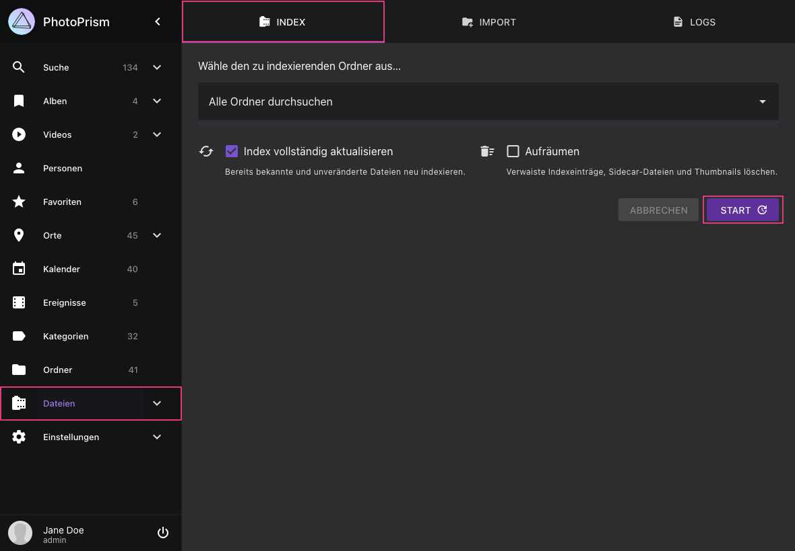

# Dateien indexieren #

!!! info ""
    Wenn du PhotoPrism zum ersten Mal verwendest, stelle sicher, dass deine Bild- und Videosammlung als [*Originals*-Ordner konfiguriert ist](https://docs.photoprism.app/getting-started/docker-compose/#photoprismoriginals) und dass die [Bibliothekseinstellungen](../settings/library.md) deinen individuellen Vorlieben entsprechen.

## Manuelles Indexieren

1. Öffne den Bereich *Dateien*, indem du auf den Link in der Hauptnavigation klickst

2. Wähle einen Unterordner aus oder nutze die Standardeinstellung, um alle Dateien zu indexieren

3. Wähle *Index vollständig aktualisieren*, falls du alle Dateien einschließlich bereits indexierter und unveränderter Dateien erneut indexieren möchtest

4. Klicke *Start*, um mit der Indexierung zu beginnen

{ class="shadow" }

!!! tip ""
    Du kannst [WebDAV](webdav.md)-kompatible Anwendungen wie den Windows Explorer von Microsoft und den Finder von Apple verwenden,  um Dateien von einem Remote-Computer oder einem mobilen Gerät zu deinem *Originals* Ordner hinzuzufügen.

!!! tip "NSFW"
    Ein NSFW-Detektor kann aktiviert werden, um Bilder mit anstößigem Inhalt automatisch als privat zu kennzeichnen.
    Beachte, dass der Mechanismus nicht 100% zuverlässig ist.

    Bilder, die bereits indexiert wurden, bevor der NSFW-Detektor aktiviert wird, werden vom Detektor nicht gescannt.

### Index Vollständig aktualisieren ###

Wenn die Option "Index vollständig aktualisieren" gewählt ist, werden alle Dateien in *Originals* neu indexiert. Also auch Dateien, die bereits indexiert und nicht verändert wurden.

Wir empfehlen, den Index nach größeren Updates vollständig zu aktualisieren, um neue Suchfilter und Sortieroptionen nutzen zu können. Lies dazu die [Anmerkungen zu den einzelnen Releases](https://docs.photoprism.app/release-notes/), um zu sehen, was sich geändert hat und ob dich das betrifft, etwa wegen der bei dir vorhandenen Dateitypen oder weil neue Suchfunktionen hinzugekommen sind. Wenn du auf Probleme stößt, die du anders nicht lösen kannst, versuche es bitte ebenfalls zuerst mit einer vollständigen Aktualisierung, bevor du einen Fehler meldest.

!!! tldr ""
    Manuell eingegebene Informationen wie Kategorien, Personen, Titel oder Bildunterschriften werden bei der Indexierung nicht verändert, selbst wenn du den Index vollständig aktualisierst.

### Aufräumen ###
Admins können "Aufräumen" aktivieren, um ungenutzte Vorschaubilder aus dem Cache zu löschen und verwaiste Indexeinträge zu entfernen. Wenn du dies von Zeit zu Zeit tust, kann dies die Indexierung beschleunigen und die Speichernutzung reduzieren.

## Regelmäßige und automatische Indexierung ##

[PhotoPrism 240523-923ee0cf7](https://docs.photoprism.app/release-notes/#may-23-2024) und neuere Versionen können optional zeitgesteuerte Rescans deiner Bibliothek durchführen. Diese Funktion kannst du aktivieren, indem du [einen Zeitplan in deiner Konfiguration einstellst](https://docs.photoprism.app/getting-started/config-options/#indexing). Wenn du einen externen Scheduler verwendest, achte bitte darauf, dass du nicht mehrere Indexierungsprozesse gleichzeitig startest, da dies nicht nur eine hohe Serverlast verursacht, sondern auch zu unerwarteten Ergebnissen führen kann.

Standardmäßig wird auch automatisch ein Rescan der Bibliothek nach einer Sicherheitsverzögerung von 5 Minuten ausgelöst, wenn Dateien [über WebDAV](../sync/webdav.md) mit dem Ordner Originals synchronisiert werden.
Du kannst die Sicherheitsverzögerung über die Konfigurationsoption [PHOTOPRISM_AUTO_INDEX](https://docs.photoprism.app/getting-started/config-options/#indexing) ändern oder diese Funktion damit auch ganz deaktivieren.

!!! tldr ""
    Beachte, dass die automatische Indexierung dazu führen kann, dass Dateien oder Dateigruppen unvollständig indexiert werden, wenn du eine langsame oder unzuverlässige Internetverbindung verwendest. Das ist besonders bei [großen Video- oder RAW-Dateien](https://github.com/photoprism/photoprism/issues/4310) von Bedeutung.

## Schwellwert freier Speicherplatz ##

Damit sich das *storage*-Volume nicht vollständig füllt – was den Betrieb unterbrechen und zu Fehlern oder Datenverlust führen kann – kann PhotoPrism das Indexieren, [Importieren](import.md) und [Hochladen](upload.md) pausieren, sobald der freie Speicherplatz unter einen konfigurierten Schwellwert fällt.

Diese Prüfung ist **standardmäßig deaktiviert**, da die zugrundeliegende Abfrage auf manchen Dateisystemen den freien Speicherplatz nicht zuverlässig ermitteln kann – zum Beispiel bei Netzwerkfreigaben, FUSE-Schichten und Container-Overlays – wo ein falsch gemeldeter niedriger Wert Schreibvorgänge fälschlich blockieren würde. Ein [mit `PHOTOPRISM_FILES_QUOTA` konfiguriertes Speicherlimit](https://docs.photoprism.app/getting-started/config-options/#storage) wird davon unabhängig weiterhin durchgesetzt.

Um die Prüfung zu aktivieren, setze die Konfigurationsoption [`PHOTOPRISM_STORAGE_FREE`](https://docs.photoprism.app/getting-started/config-options/#storage) (oder den Kommandozeilen-Parameter `--storage-free`) auf den Anteil an freiem Speicherplatz, den du mindestens verfügbar halten möchtest, angegeben als Prozentsatz der Gesamtkapazität:

- `-1` (der Standard) deaktiviert die Prüfung vollständig.
- Ein Wert zwischen `1` und `99` aktiviert die Prüfung mit diesem Prozentsatz.
- `0` oder ein Wert ab `100` verwendet den eingebauten Standard von **1 % der Gesamtkapazität**.

Ist die Prüfung aktiv, gilt zusätzlich eine absolute Untergrenze von **100 MB** freiem Speicherplatz – maßgeblich ist, welcher Schwellwert zuerst erreicht wird. Es wird dann eine Warnung in die Logs geschrieben und der betroffene Vorgang übersprungen, bis wieder genügend Platz verfügbar ist; die Prüfung wird automatisch erneut ausgewertet, sobald Speicherplatz frei wird.

!!! warning ""
    Aus Sicherheitsgründen kann dieser Schwellwert nur von Server-Administratoren über die Konfiguration geändert werden und ist bewusst nicht in den App-Einstellungen verfügbar. Wir empfehlen, die Prüfung auf Dateisystemen zu aktivieren, auf denen sich der freie Speicherplatz zuverlässig auslesen lässt, da eine volle Festplatte den Betrieb unterbrechen und zu Datenverlust führen kann.

## Verzeichnisse und Dateien ignorieren ##
Versteckte Dateien oder Ordner, deren Namen mit  `.`, `@`, `_.` oder `__` wie `__MACOSX` beginnen, werden automatisch ignoriert.
Falls bestimmte Dateien oder Ordner nicht indexiert werden sollen, erstelle eine `.ppignore` Datei im Verzeichnis, in welchem diese Dateien/Ordner liegen.
In dieser Datei kannst du konfigurieren, welche Dateien oder Ordner ignoriert werden sollen.

```
# Ignoriere den Ordner "foo"
foo
# Ignoriere alle Dateien in diesem Ordner
*.*
# Ignoriere alle Ordner, die mit # starten
[#]*
# Ignoriere alle Dateien, die auf .gif enden
*.gif
# Ignoriere Videos, deren Name mit MVI beginnt
MVI_*.MOV
# oder
MVI_*.*
```

Dateien werden im Ordner, in welchem die .ppignore Datei liegt, sowie in allen Unterordnern ignoriert.
Du kannst `*` als Wildcard benutzen.

Bereits indexierte Dateien und Ordner werden nicht nachträglich aus dem Index entfernt, wenn du Sie auf die Ignorieren Liste setzt. Sie bleiben also indexiert und in der Benutzeroberfläche sichtbar, auch wenn du ihren Namen oder ein passendes Namensmuster später hinzufügst.

Beachte außerdem, dass bereits indexierte Dateien weiterhin Teil eines [Bildstapels](../organize/stacks.md) bleiben können, wenn eine zugehörige Datei mit demselben Namen, aber anderer Dateiendung existiert und nicht ignoriert wird. Eine bereits indexierte `.raw`-Datei kann also auch nach dem Hinzufügen einer `.ppignore`-Regel weiterhin zusammen mit ihrer `.jpg`-Datei in einem Bildstapel erscheinen.

!!! tldr ""
    Wenn du PhotoPrism noch nicht lange verwendest und bereits Dateien oder Ordner indexiert wurden, ist es in der Regel am einfachsten, die Datenbank zurückzusetzen und mit einem neuen Index zu starten, indem du `photoprism reset` [in einem Terminal](https://docs.photoprism.app/getting-started/docker-compose/#command-line-interface) ausführst.
