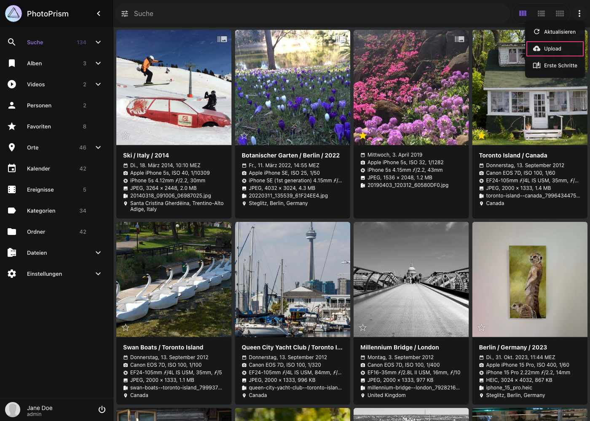
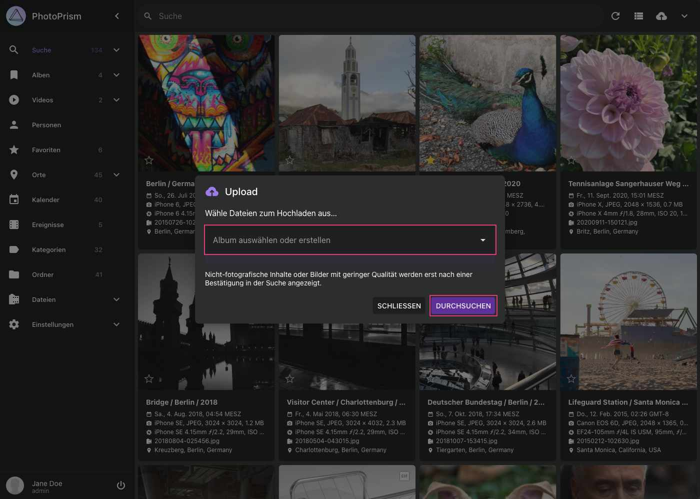
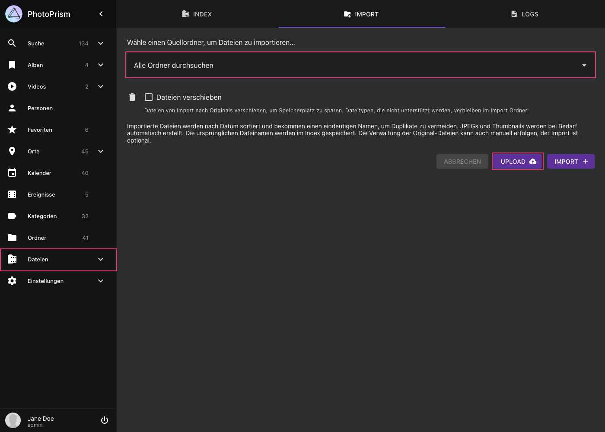
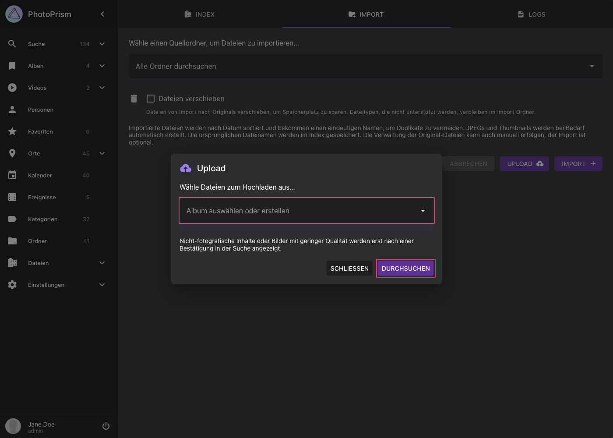

# Web Upload #

!!! tip "Tastenkombination"
    Du kannst den Upload-Dialog schnell öffnen, indem du **Strg + U** von überall in der Anwendung drückst.

=== "Über Suchleiste"

    1. Klicke auf :material-dots-vertical: in der oberen rechten Ecke

    2. Klicke :material-cloud-upload: 

         { class="shadow" }
    
    2. Wähle oder erstelle ein Album, falls deine Dateien automatisch einem Album hinzugefügt werden sollen

    3. Klicke auf *Durchsuchen*

         { class="shadow" }

    4. Wähle Dateien aus

    5. Klicke *Upload*, um mit dem Hochladen und Importieren der ausgewählten Dateien zu beginnen

=== "Über Dateien"

      1. Öffne den Bereich *Dateien*, und wechsele zum Tab *Import*

      2. Klicke auf *Upload*

         { class="shadow" }

      3. Wähle oder erstelle ein Album, falls deine Dateien automatisch einem Album hinzugefügt werden sollen

      4. Klicke auf *Durchsuchen*

         { class="shadow" }

      5. Wähle Dateien aus

      6. Klicke *Upload*, um mit dem Hochladen und Importieren der ausgewählten Dateien zu beginnen

!!! info "iOS Original-Format beim Upload beibehalten"
    iOS kann Fotos und Videos in ein besser kompatibles Format umwandeln, **bevor** sie über Safari oder die PhotoPrism‑PWA hochgeladen werden. In diesem Fall erhält und speichert PhotoPrism bereits konvertierte Dateien.

    Um das Original-Format beim Upload beizubehalten:

    - Öffne im iOS‑Fotowähler das Drei‑Punkte‑Menü (…) → *Optionen* und stelle **Format** von **Automatisch** auf **Aktuell**, damit deine Originaldateien erhalten bleiben.
    - Alternativ kannst du spezielle Sync‑Apps wie [PhotoSync](sync/sync-phone.md#photosync-verwenden) verwenden, die Dateien im Original-Format per WebDAV hochladen können.