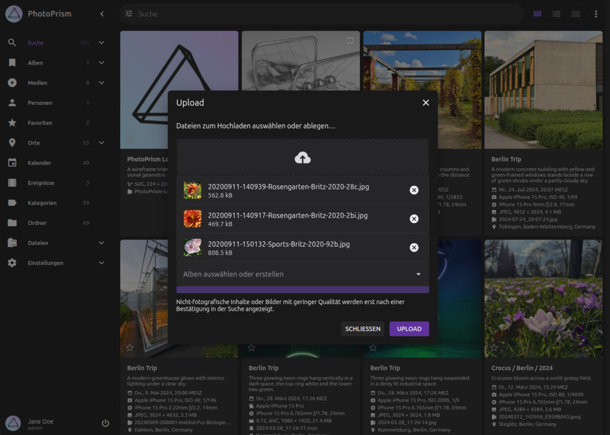
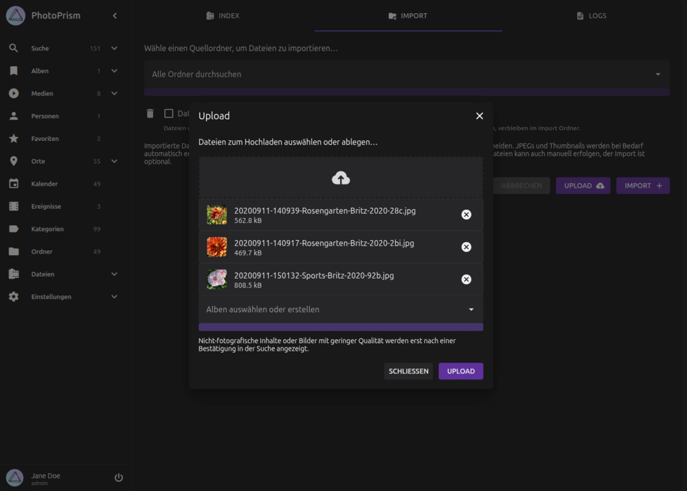

# Web Upload #

Der Upload-Dialog unterstützt Drag-and-drop: Ziehe eine oder mehrere Dateien (oder ganze Ordner) auf die Upload-Fläche oder klicke darauf, um den Datei-Dialog des Systems zu öffnen. Hinzugefügte Dateien werden mit ihrer Größe aufgelistet; der Aktionsbutton bleibt deaktiviert, bis mindestens eine Datei bereitsteht.

!!! tip "Tastenkombination"
    Du kannst den Upload-Dialog schnell öffnen, indem du **Strg + U** von überall in der Anwendung drückst.

!!! info ""
    Uploads werden automatisch pausiert, wenn der freie Speicherplatz unter den [konfigurierten Schwellwert](originals.md#schwellwert-freier-speicherplatz) fällt, damit sich das *storage*-Volume nicht vollständig füllt.

=== "Über die Symbolleiste"

    1. Klicke auf :material-dots-vertical: in der oberen rechten Ecke

    2. Klicke auf :material-cloud-upload: im erscheinenden Menü

         { class="shadow" }

    3. Wähle ein Album, falls deine Dateien direkt einem Album hinzugefügt werden sollen

    4. Ziehe Dateien auf die Upload-Fläche oder klicke darauf, um den Datei-Dialog zu öffnen

         { class="shadow" }

    5. Bestätige die Auswahl und klicke auf *Upload*

=== "Über Dateien"

    1. Öffne den Bereich *Dateien* über die Hauptnavigation und wechsele zum Tab *Import*

    2. Klicke auf *Upload*

         { class="shadow" }

    3. Wähle ein Album, falls deine Dateien direkt einem Album hinzugefügt werden sollen

    4. Ziehe Dateien auf die Upload-Fläche oder klicke darauf, um den Datei-Dialog zu öffnen

         { class="shadow" }

    5. Bestätige die Auswahl und klicke auf *Upload*

!!! info "iOS Original-Format beim Upload beibehalten"
    iOS kann Fotos und Videos in ein besser kompatibles Format umwandeln, **bevor** sie über Safari oder die PhotoPrism‑PWA hochgeladen werden. In diesem Fall erhält und speichert PhotoPrism bereits konvertierte Dateien.

    Um das Original-Format beim Upload beizubehalten:

    - Öffne im iOS‑Fotowähler das Drei‑Punkte‑Menü (…) → *Optionen* und stelle **Format** von **Automatisch** auf **Aktuell**, damit deine Originaldateien erhalten bleiben.
    - Alternativ kannst du spezielle Sync‑Apps wie [PhotoSync](../sync/mobile-devices.md#photosync-verwenden) verwenden, die Dateien im Original-Format per WebDAV hochladen können.

!!! info "Warum GPS-Daten nach dem Upload vom Handy fehlen können"
    Aktuelle Android-Versionen entfernen die eingebetteten GPS-Koordinaten aus Fotos, sobald sie von einer App gelesen werden, die nicht über die System-Berechtigung *media location* verfügt ([`ACCESS_MEDIA_LOCATION`](https://developer.android.com/training/data-storage/shared/media#location-info-photos)). Da Webbrowser diese Berechtigung nicht anfordern können, kommen Bilder, die über die Weboberfläche eines Handys hochgeladen werden, möglicherweise **ohne Standortdaten** an. iOS kann sich je nach Browser und dessen Datenschutzeinstellungen ähnlich verhalten.

    Das passiert auf dem Gerät, **bevor** die Dateien PhotoPrism erreichen. Die Koordinaten lassen sich daher beim Indexieren nicht wiederherstellen. Um den eingebetteten Standort zu erhalten:

    - Lade die Originaldateien über einen **Desktop-Browser** hoch, oder
    - verwende eine spezielle Sync-App wie [PhotoSync](../sync/mobile-devices.md#photosync-verwenden), die über die nötige Berechtigung verfügt und Dateien unverändert per WebDAV überträgt.

    Ob eine Datei noch GPS-Daten enthält, kannst du mit [ExifTool](https://exiftool.org/) prüfen (zum Beispiel `exiftool -a -G1 photo.jpg`).
