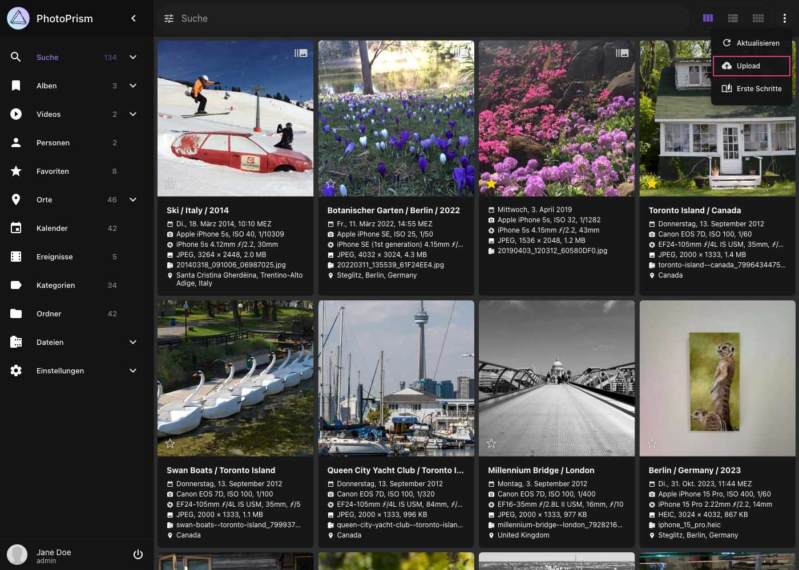
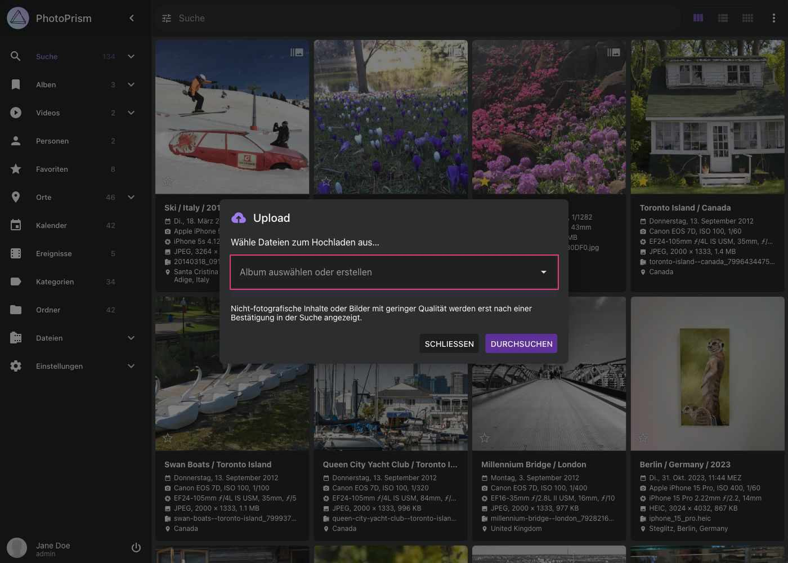

# Web Upload #

=== "Über Suchleiste"

    1. Klicke :material-cloud-upload: in der oberen rechten Ecke

         { class="shadow" }
    
    2. Wähle oder erstelle ein Album, falls deine Dateien automatisch einem Album hinzugefügt werden sollen

    3. Klicke auf *Upload*

         { class="shadow" }

    4. Wähle Dateien aus

    5. Klicke *Upload*, um mit dem Hochladen und Importieren der ausgewählten Dateien zu beginnen

=== "Über Dateien"

      1. Öffne den Bereich *Dateien*, und wechsele zum Tab *Import*

      2. Klicke auf *Upload*

         { class="shadow" }

      3. Wähle oder erstelle ein Album, falls deine Dateien automatisch einem Album hinzugefügt werden sollen

      4. Klicke auf *Upload*

         { class="shadow" }

      5. Wähle Dateien aus

      6. Klicke *Upload*, um mit dem Hochladen und Importieren der ausgewählten Dateien zu beginnen