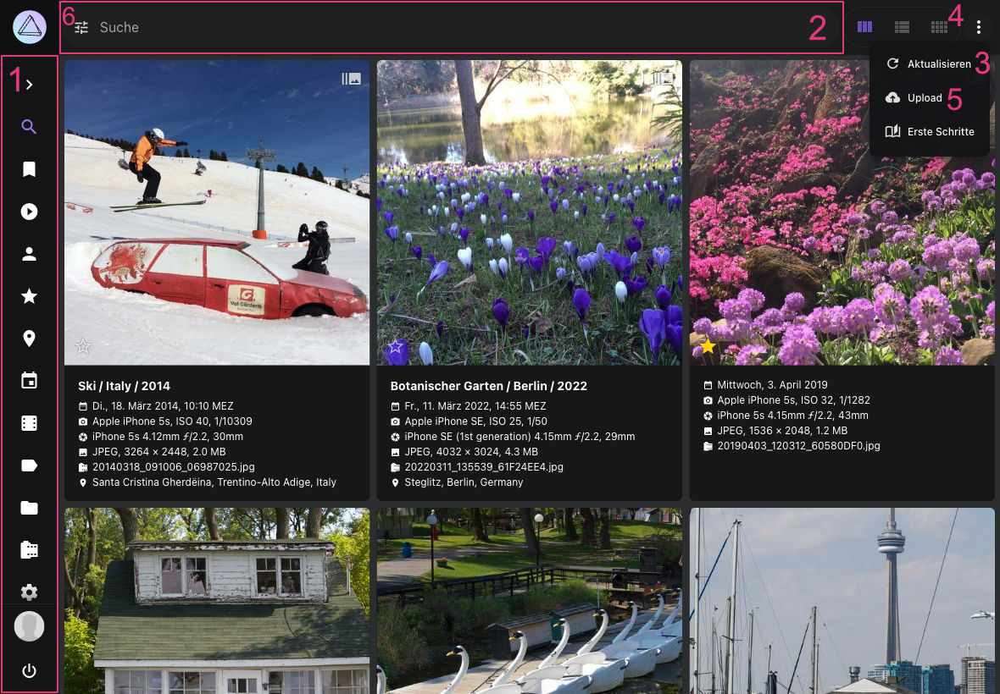
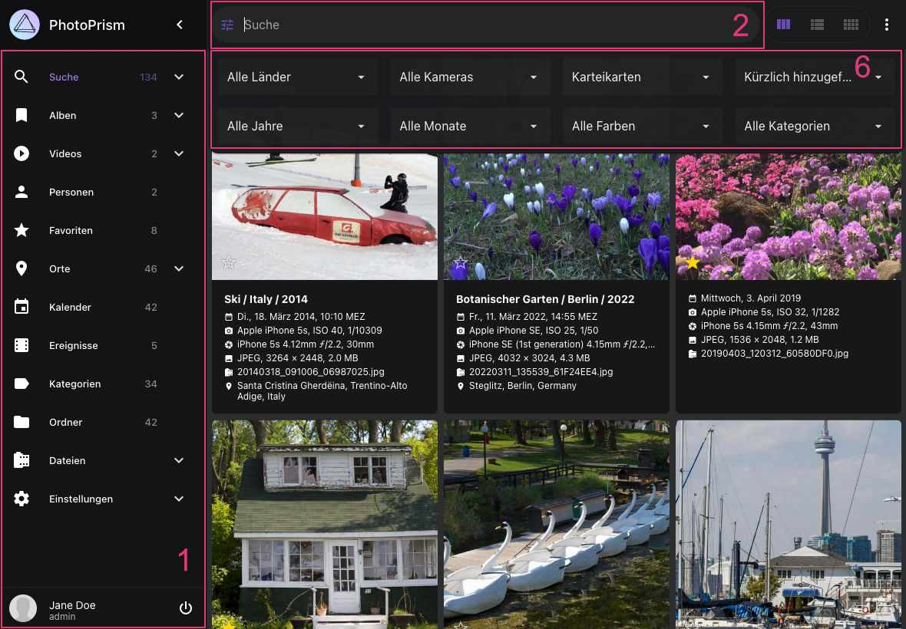
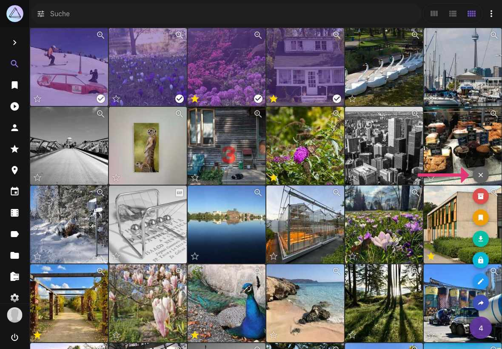

# Navigieren in der Benutzeroberfläche

Die Benutzeroberfläche zum Durchsuchen deiner Bilder basiert auf den folgenden Komponenten.

!!! info ""
    PhotoPrism ist auf alle Bildschirmgrößen angepasst. Unsere Screenshots zeigen die App in einem Desktop-Browser mit mittlerer Auflösung.

{ class="shadow" }

{ class="shadow" }

#### 1. Hauptnavigation

Befindet sich auf der linken Seite und ist auf mobilen Geräten minimiert. Klicke auf die Links, um zwischen verschiedenen Seiten wie Suche, Alben, Karten oder Einstellungen zu wechseln.

#### 2. Suchleiste

Befindet sich ganz oben. Finde Bilder oder Videos, indem du zum Beispiel nach `cats` oder `label:cat` suchst. Eine Übersicht über alle Suchfilter findest du [hier](organize/search.md).

!!! tip "Tastenkombination"
    Du kannst das Suchfeld schnell fokussieren, indem du **Strg + F** drückst.

#### 3. Reload-Funktion

:material-refresh: lädt die Suchergebnisse neu, ohne die komplette Seite neu zu laden.

!!! tip "Tastenkombination"
    Du kannst die Seite schnell neu laden, indem du **Strg + R** drückst.

#### 4. Ansicht wechseln

Klicke, um zu einer anderen Ansicht zu wechseln (Karten: :material-view-column:, Mosaik: :material-view-comfy:, oder Liste: :material-view-list:).

#### 5. Upload-Funktion

:material-cloud-upload: öffnet den Upload-Dialog. Diese Funktion ist auf den meisten Seiten verfügbar, sofern PhotoPrism nicht im read-only Modus (schreibgeschützt) betrieben wird und der Upload nicht in den  [Einstellungen](settings/general.md) deaktiviert wurde.

!!! tip "Tastenkombination"
    Du kannst den Upload-Dialog schnell öffnen, indem du **Strg + U** drückst.

#### 6. Filterleiste

Die Filterleise enthält zusätzliche Suchfilter wie Land, Jahr, Monat, Kamera, Farbe oder Kategorie.

!!! tip "Tastenkombination"
    Du kannst die erweiterte Symbolleiste öffnen, indem du **Umschalt + Strg + F** drückst.

#### 7. Kontext-Menü

Wenn Bilder oder Videos selektiert sind, erscheint das Kontext-Menü in der Ecke unten rechts. Die angezeigte Zahl ist die Anzahl der aktuell selektierten Ergebnisse. Das Menü bietet folgende Aktionen:

* :material-archive: Bilder archivieren
* :material-bookmark: Bilder zu Alben hinzufügen
* :material-cloud-download: Bilder herunterladen
* :material-lock: Bilder als privat markieren
* :material-pencil: Bearbeitungs-Dialog öffnen
* :material-share-variant: Bilder teilen

Um die aktuelle Selektion aufzuheben, klicke auf das x.

{ class="shadow" }

## Auswahlmodus und Mehrfachauswahl ##

### Desktop ###
Wähle das erste Bild aus, indem du auf :material-checkbox-blank-circle-outline: in der unteren rechten Ecke klickst.

PhotoPrism befindet sich jetzt im Auswahlmodus.

- Um zusätzlich einzelne Bilder auszuwählen, klicke irgendwo auf sie, außer auf die Symbole in der Ecke.
- Um mehrere Bilder auf einmal auszuwählen, drücke Umschalttaste+Klick. Alle Bilder zwischen dem zuletzt ausgewählten Bild und dem Bild, auf das du mit Umschalt+Klick klickst, werden ausgewählt.

### Tablet / Handy ###
Wähle das erste Bild mit einem langen Klick/Touch aus.

PhotoPrism befindet sich jetzt im Auswahlmodus.

- Um zusätzlich einzelne Bilder auszuwählen, klicke/touche irgendwo auf sie, außer auf die Symbole in der Ecke.
- Um mehrere Bilder auf einmal auszuwählen, verwende einen langen Klick/Touch. Alle Bilder zwischen dem zuletzt ausgewählten Bild und dem Bild, auf das du lange klickst, werden ausgewählt.