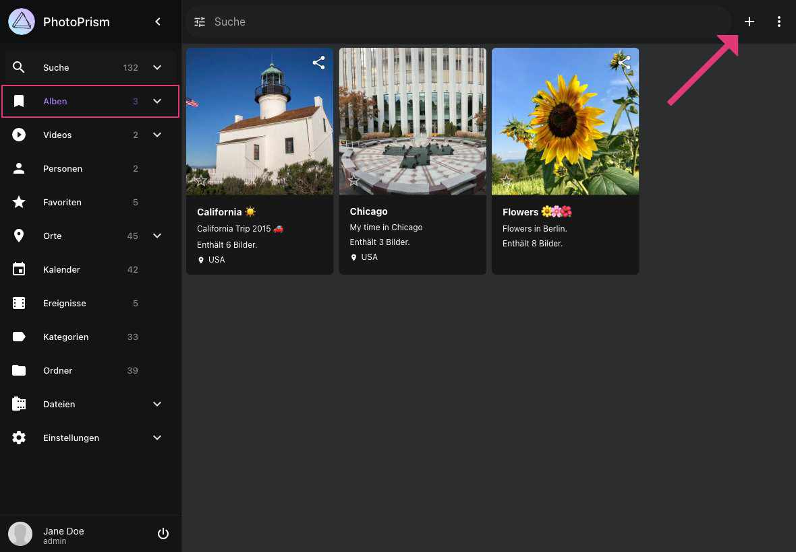
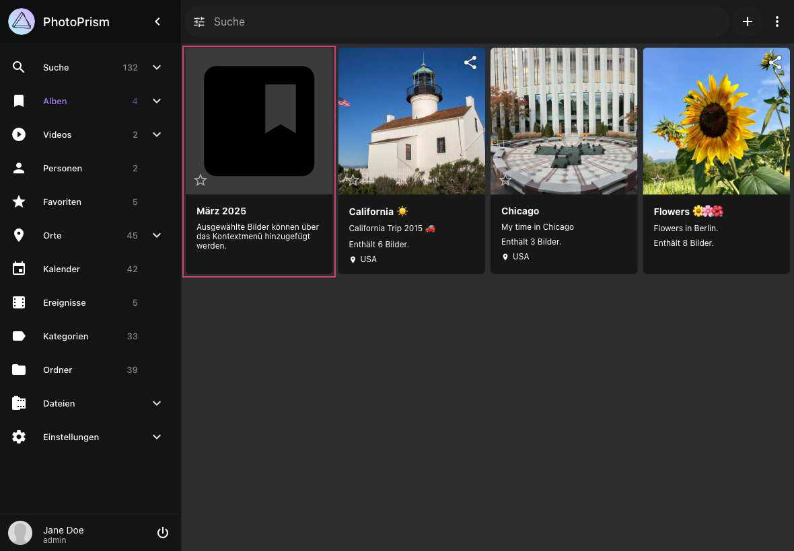
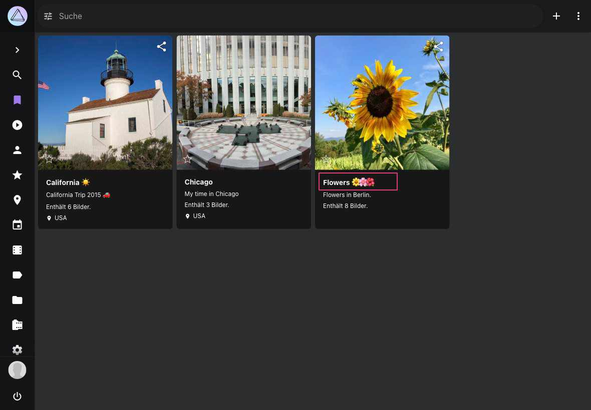
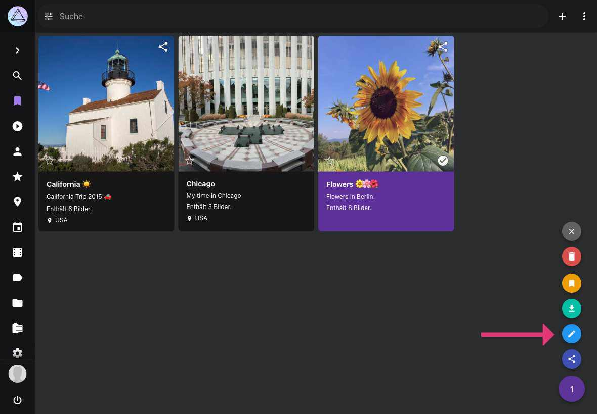
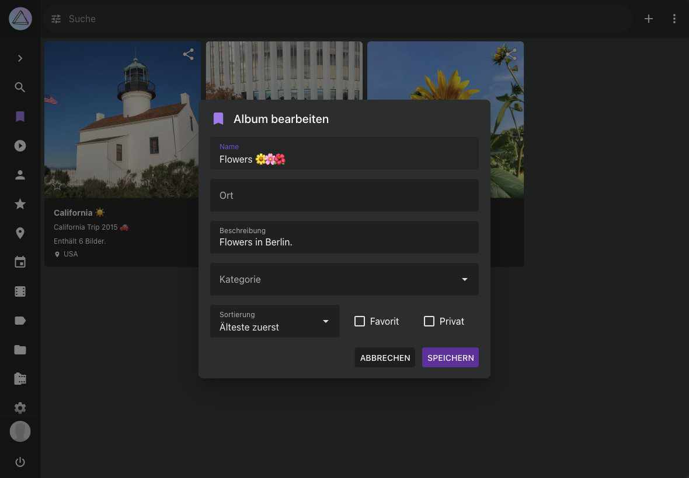
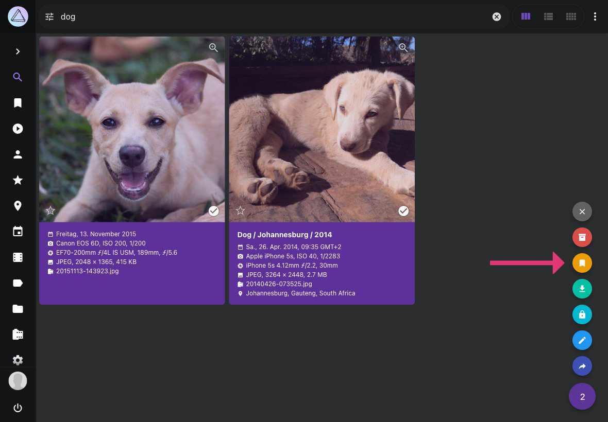
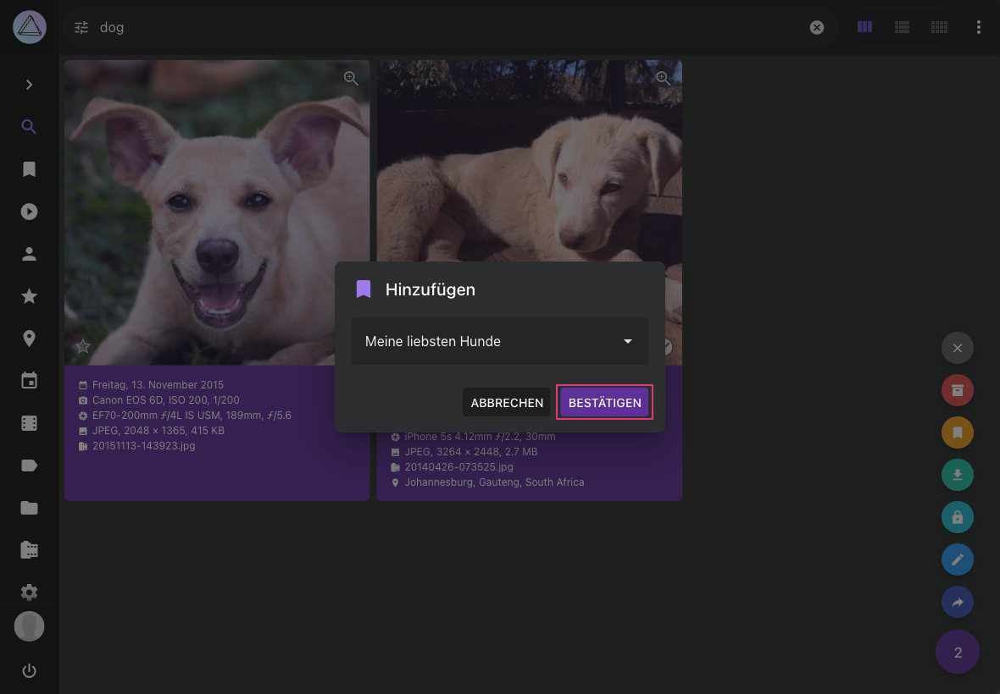
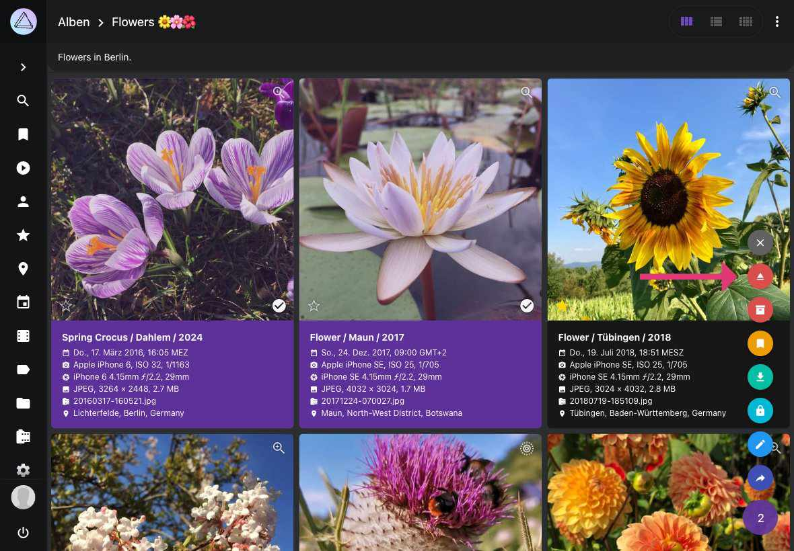

# Alben #
### Album erstellen ###

1. Gehe zu *Alben*
2. Klicke :material-plus: oben rechts

    { class="shadow" }
    
3. Ein neues Album mit Titel "Monat Jahr" ist nun erstellt

    { class="shadow" }

### Album bearbeiten ###
Gehe zu *Alben* und öffne den *Album-Bearbeitungs-Dialog*

=== "Titel"
    Klicke auf den *Album Titel*.
      { class="shadow" }

=== "Kontext-Menü"
    Selektiere ein Album, öffne das Kontext-Menü und klicke :material-pencil:.
    
    { class="shadow" }

=== "Album-Suchleiste"
    Öffne das Album und klicke :material-pencil: rechts oben.
    
    { class="shadow" }
    
Dann bearbeite die Album Details und klicke *Speichern*

{ class="shadow" }
    

### Bilder zu Album hinzufügen ###

1. Selektiere Bilder und Videos
2. Öffne das Kontext-Menü
3. Klicke :material-bookmark:

    { class="shadow" }
    
4. Wähle ein Album
5. Klicke *Bestätigen*

    { class="shadow" }

!!! tip ""
    Du kannst mehrere Bilder auf einmal selektieren, indem du die Shift Taste verwendest.

### Bilder aus Album entfernen ###

1. Gehe zu einem Album
3. Selektiere Bilder, die du entfernen möchtest
4. Öffne das Kontext-Menü
5. Klicke :material-eject:

    { class="shadow" }

