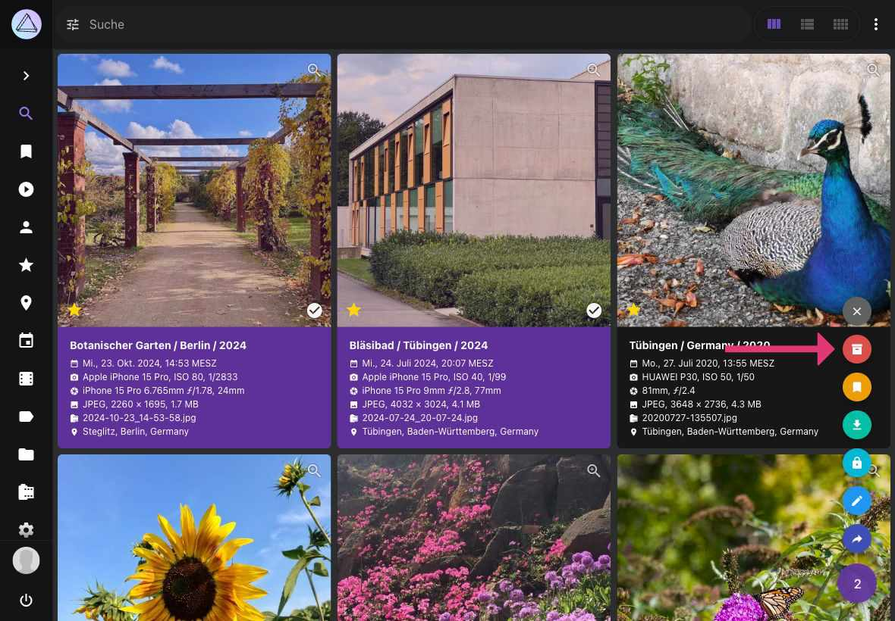
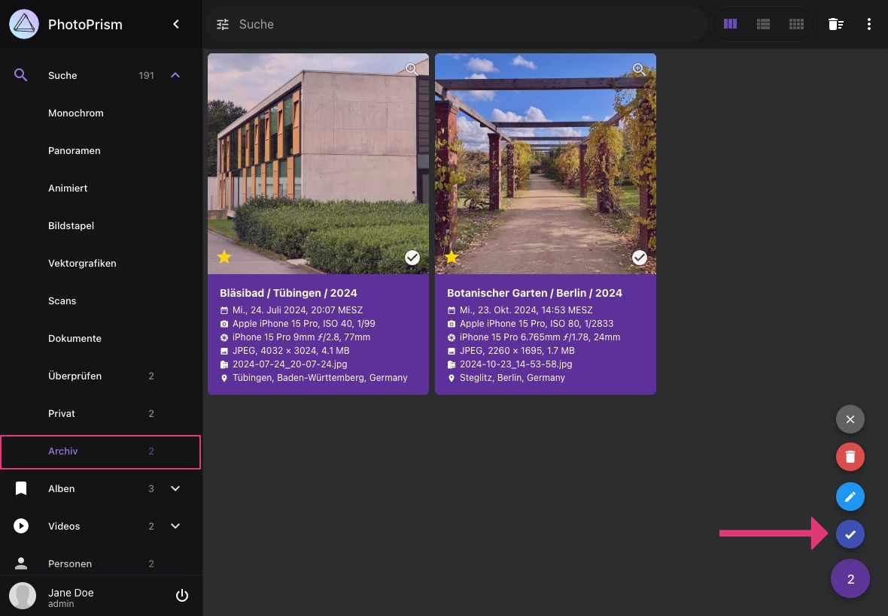

# Archiv #
Du kannst Dateien, die du nicht in deiner Sammlung behalten möchtest archivieren. 
Archivierte Dateien werden nicht gelöscht, sie werden allerdings ausschließlich im Bereich *Archiv* angezeigt.

### Bilder archivieren ###

1. Selektiere Bilder/Videos
2. Öffne das Kontext-Menü
3. Klicke :material-archive-arrow-down:

    { class="shadow" }
    
    <!---->

### Archivierte Bilder wieder herstellen ###

1. Gehe zu *Archiv*
2. Selektiere Bilder/Videos
3. Öffne das Kontext-Menü
4. Klicke :material-check:

    { class="shadow" }

