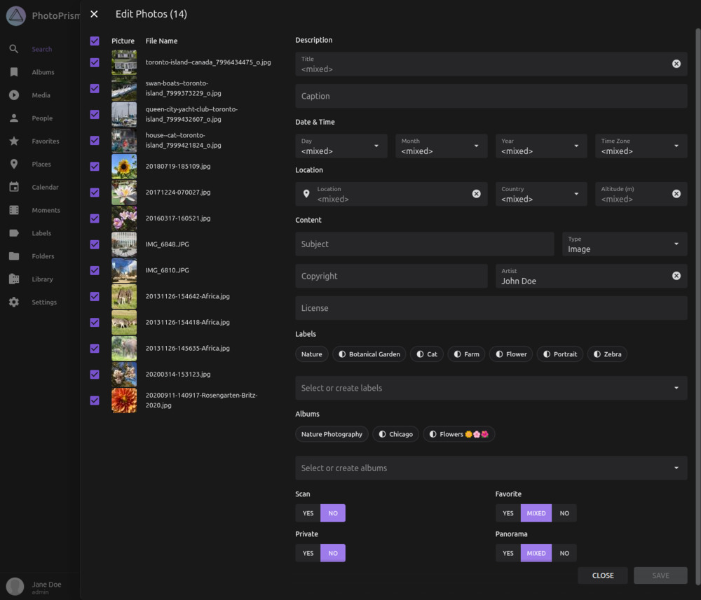
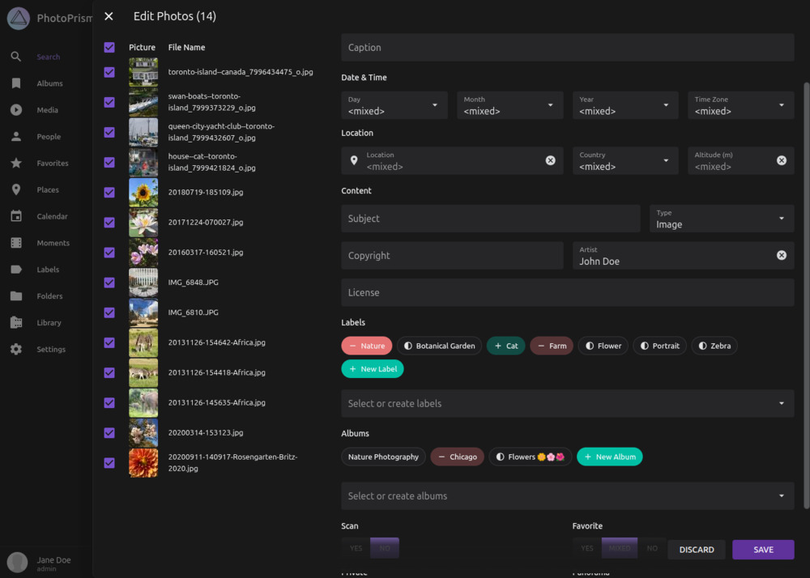

# Batch Edit #

Mit der Batch-Bearbeitung kannst du Metadaten, Alben und Labels für viele Bilder gleichzeitig ändern. Wenn diese Funktion aktiviert ist, kannst du bis zu **999** Bilder auswählen und dieselben Änderungen entweder auf die **gesamte Auswahl** oder nur auf einen Teil davon anwenden.

## Dialog öffnen ##

So öffnest du den **Batch Edit** Dialog:

1. Selektiere mehrere Bilder.
2. Öffne das Kontext-Menü.
3. Klicke auf das Stift-Symbol :material-pencil:.

Die Formularfelder im Dialog zeigen nur dann einen Wert an, wenn er für **alle** ausgewählten Bilder gleich ist. Unterscheiden sich die Werte, wird `<mixed>` angezeigt. Gibst du einen neuen Wert ein, ersetzt dieser die bestehenden Werte bei **allen** Bildern, auf die du die Änderung anwendest.

{ class="shadow" }

!!! note ""
    Im Dialog kannst du einzelne Bilder abwählen, um sie von den Änderungen auszuschließen. Die angezeigten Werte beziehen sich trotzdem immer auf die **ursprüngliche Auswahl**, auch wenn du Bilder abwählst.

## Labels und Alben ##

[{ class="shadow right" }](img/batch-edit-3-1125.jpg)
Einträge, die **allen** ausgewählten Bildern zugewiesen sind, werden zuerst aufgelistet. Jeder Eintrag wird als kleines Chip-Element dargestellt. Wenn ein [Label](labels.md) oder [Album](albums.md) nur einigen der ausgewählten Bilder zugewiesen ist, wird der Chip als *teilweise zugewiesen* dargestellt.

- Klicke einen teilweise zugewiesenen Label- oder Album-Chip **einmal**, um ihn **allen** ausgewählten Bildern zuzuweisen.
- Klicke denselben Chip **erneut**, um das Label oder Album bei **allen** ausgewählten Bildern zu entfernen.

Zusätzliche Labels oder Alben kannst du über das Eingabefeld hinzufügen:

- Beginne zu tippen, um in vorhandenen Labels und Alben zu suchen.
- Existiert der eingegebene Name noch nicht, wird automatisch ein neues Label oder Album angelegt.

