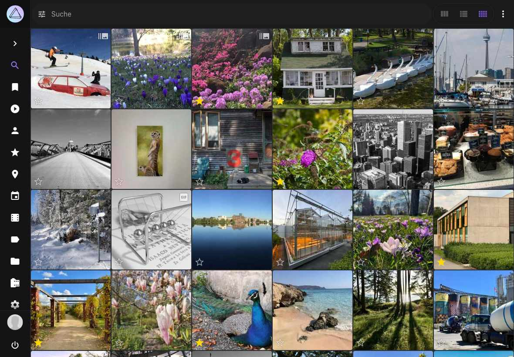
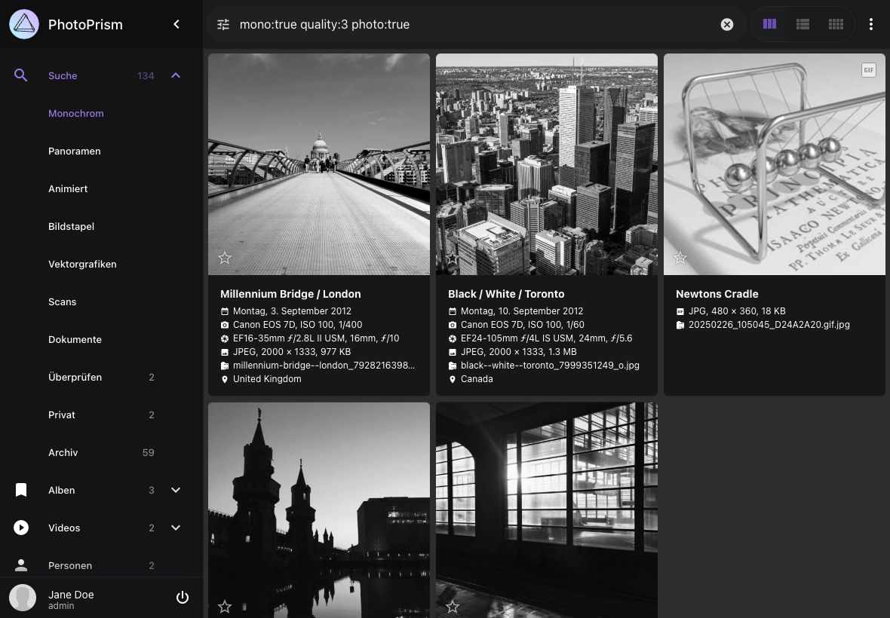
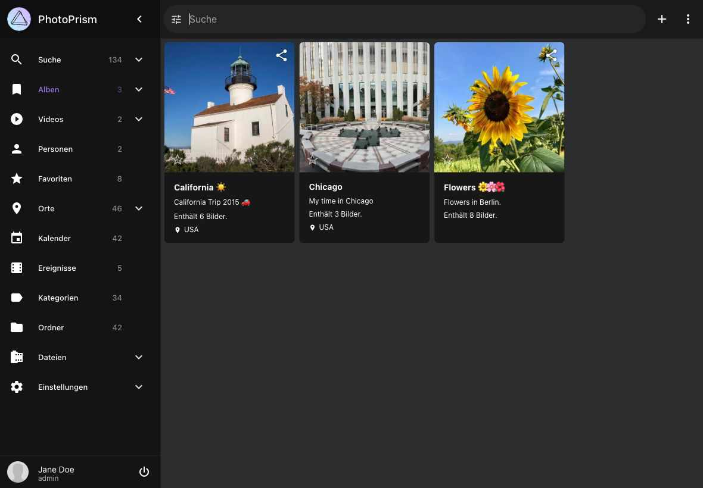
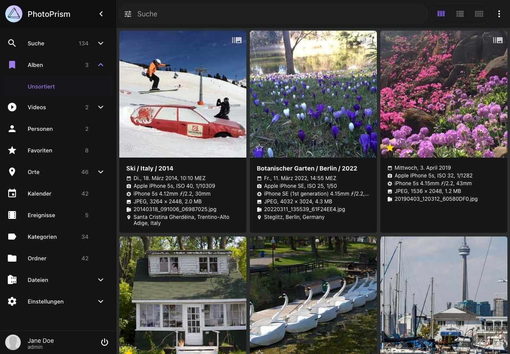
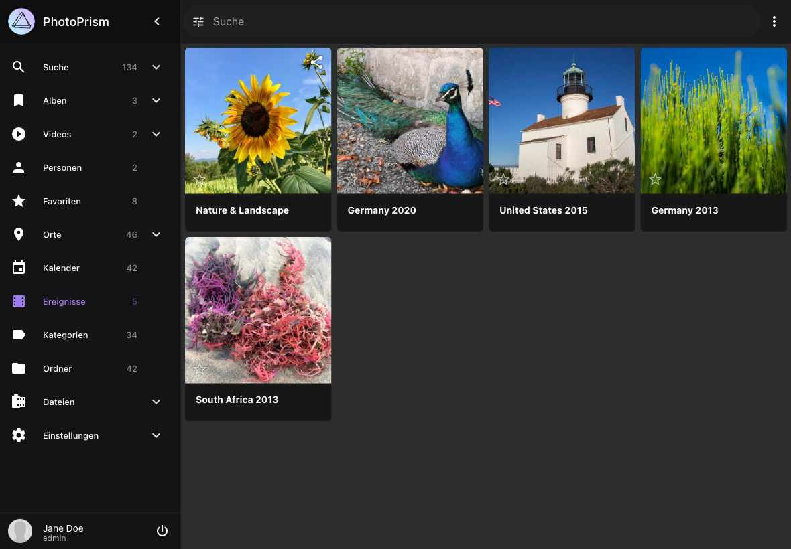
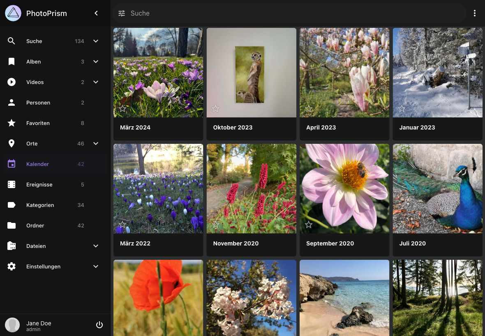
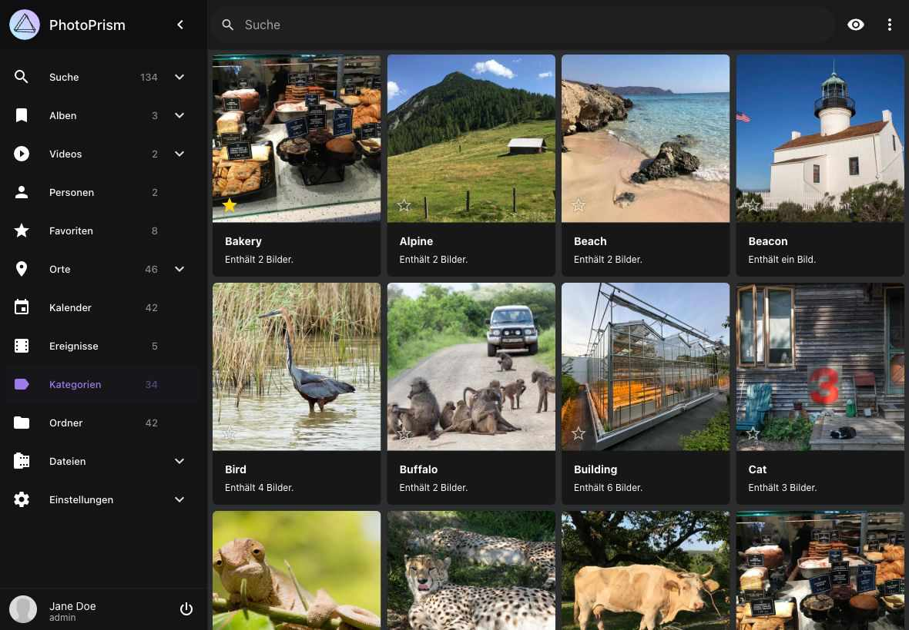

# Stöbern und Suchen in deiner Bibliothek
PhotoPrism bietet viele Ansichten und Suchfilter, damit du deine Fotosammlung in mehreren Dimensionen erkunden kannst, anstatt sie nur Tag für Tag durchzuscrollen.

So kannst du längst vergessene Aufnahmen wiederentdecken, bestimmte Bilder finden oder schnell Alben auf der Grundlage von Suchergebnissen erstellen.

## Bereiche und Filter
Über die Hauptnavigation erreichst du folgende Bereiche deiner Bildersammlung:

### :material-magnify: Suche ###
Hier findest du alle Bilder und Videos, die nicht in *Überprüfen*, *Archiv* oder *Privat* sind.

!!! hint ""
    Wenn die Funktionen Qualitätsfilter, Privat oder Archiv deaktiviert sind, findest du hier alle deine Bilder und Videos.
    
{ class="shadow" }

##### Monochrom #####
Zeigt alle einfarbigen Bilder und Videos.

{ class="shadow" }

##### [Panoramas](panoramas.md) #####
Zeigt alle Panoramas.

##### [Bildstapel](stacks.md) #####
Zeigt Bildstapel.

##### [Scans](scans.md) #####
Zeigt alle eingescannten Bilder.

##### [Überprüfen](review.md) #####
Zeigt all Bilder, die überprüft werden müssen.

##### [Archiv](archive.md) #####
Zeigt archivierte Bilder.

### :material-image-album: [Alben](albums.md) ###
Hier befinden sich deine Alben.

{ class="shadow" }

#### Unsortiert ####
Hier werden alle Bilder, die nicht Teil eines Albums sind, angezeigt.

{ class="shadow" }

### :material-movie: [Videos](video.md) ###
Hier findest du alle Videos, die nicht in *Überprüfen*, *Archiv* oder *Privat* sind.

#### Live Photos ####
Hier findest du alle Live Photos.

### :material-account: Personen ###
Zeigt deine Bilder gruppiert nach abgebildeten Personen.

### :material-heart: Favoriten ###
Hier befinden sich alle Bilder, die du als Favorit markiert hast.

### :material-compass: [Ereignisse](moments.md)  ###
Entdecke Alben von Ereignissen, die wir automatisch für dich erstellt haben.

{ class="shadow" }

### :material-calendar-range: [Kalender](calendar.md) ###
Hier sind deine Bilder nach Erstellungsdatum sortiert.

{ class="shadow" }

### :material-map-marker: [Karten](places.md) ###
Hier sind alle Bilder und Videos, die Geodaten haben, auf einer Weltkarte dargestellt.

{ class="shadow" }

{ class="shadow" }

#### Länder ####
Zeigt deine Bilder gruppiert nach Ländern.

{ class="shadow" }

### :material-label: [Kategorien](labels.md) ###
Zeigt deine Bilder und Videos gruppiert nach Kategorien wie *Katze*, *Hund* oder *Strand*.

{ class="shadow" }

### :material-folder: [Ordner](folders.md) ###
Hier werden automatisch die Unterordner deines *Originals* Verzeichnis angezeigt.

{ class="shadow" }

### :material-lock: [Privat](private.md) ###
Hier befinden sich alle Bilder, die du als privat markiert hast.

### :material-film: [Originale](../library/files.md) ###
Hier werden alle Dateien deines *Originals* Verzeichnis angezeigt

{ class="shadow" }

{ class="shadow" }

    
