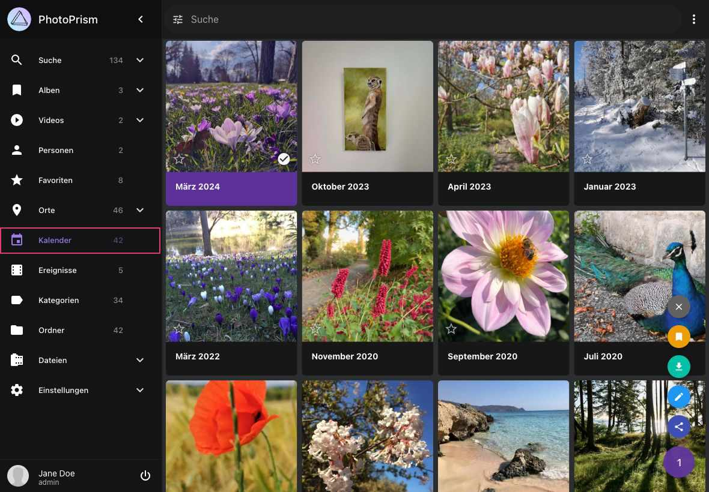

# Kalender #

Im Bereich *Kalender* findest du deine Bilder nach Jahr und Monat sortiert.

{ class="shadow" }

Das Kontext-Menü ermöglicht die folgenden Aktionen:

<!--## Monat löschen ##
1. Selektiere einen Monat 
2. Öffne das Kontext-Menü
3. Klicke :material-delete:
4. Bestätige

!!! hint ""
    Nur die Repräsentation des Monats in diesem Bereich wird gelöscht. Deine Dateien bleiben unberührt.-->

## Monat als ZIP-Archiv herunterladen ##
1. Selektiere einen Monat 
2. Öffne das Kontext-Menü
3. Klicke :material-download:

## Album aus Monat erstellen ##
1. Selektiere einen Monat 
2. Öffne das Kontext-Menü
3. Klicke :material-bookmark:
4. Wähle ein existierendes Album oder gib einen neuen Albumnamen ein
5. Klicke auf *Hinzufügen*

### Monats-Cover festlegen ###

Um ein Titelbild für einen Monat festzulegen:

1. Öffne den Monat, indem du im Kalender darauf klickst.
2. Klicke auf das Foto, das du als Cover verwenden möchtest.
3. Wenn das Foto geöffnet ist, klicke oben rechts auf :material-dots-vertical:.
4. Wähle im Menü **Als Albumcover verwenden** aus.

    { class="shadow" }

Dadurch wird das ausgewählte Foto als Titelbild für den Monat festgelegt.