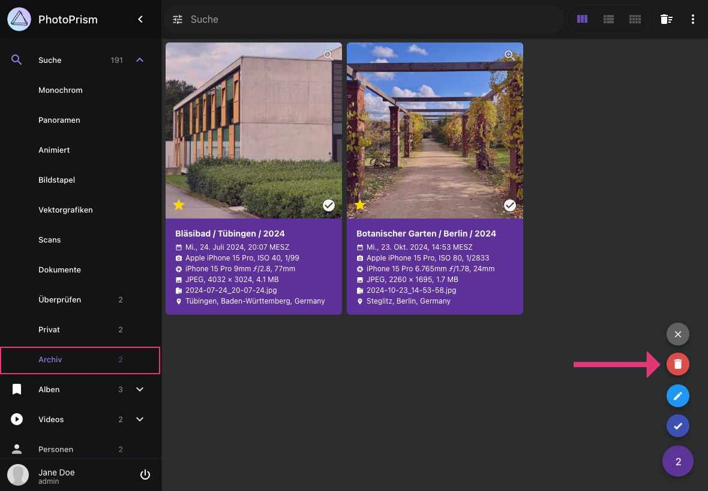
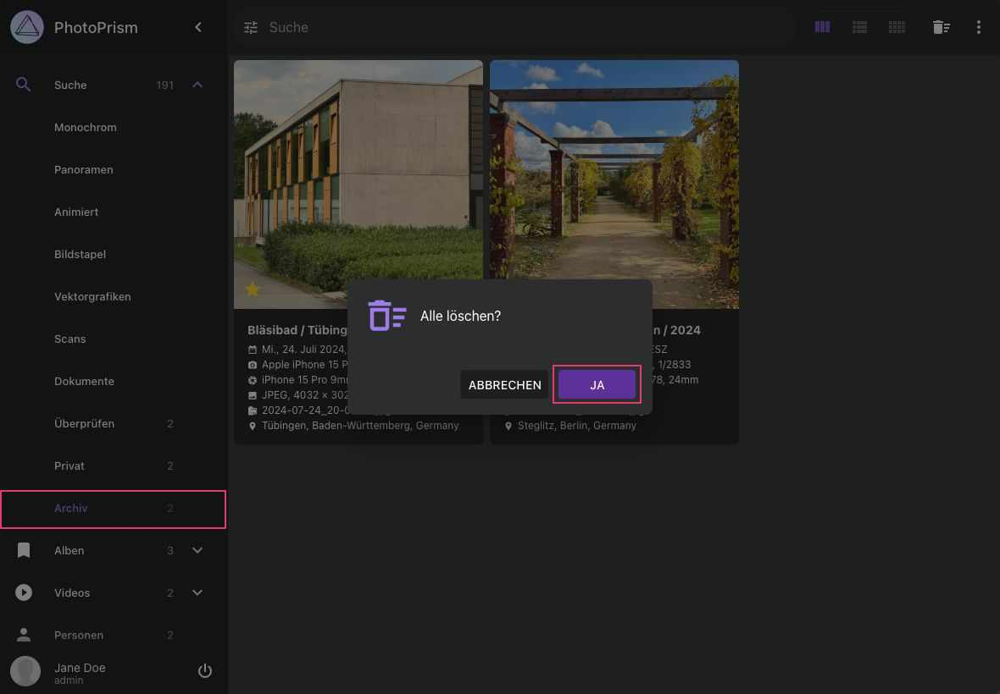

# Bilder löschen #
Du kannst Dateien, die du nicht behalten möchtest endgültig aus deinem Dateisystem löschen. 
Dateien, die du löschen möchtest, müssen zuvor [archiviert](./archive.md) werden.

### Bilder löschen ###

1. Gehe zu *Archiv*
2. Selektiere Bilder oder Videos
2. Öffne das Kontext-Menü
3. Klicke :material-delete:
4. Bestätige

   { class="shadow" }

### Alle archivierten Bilder löschen ###

1. Gehe zu *Archiv*
2. Klicke :material-delete-sweep:
3. Klicke *Alle Löschen*

   { class="shadow" }