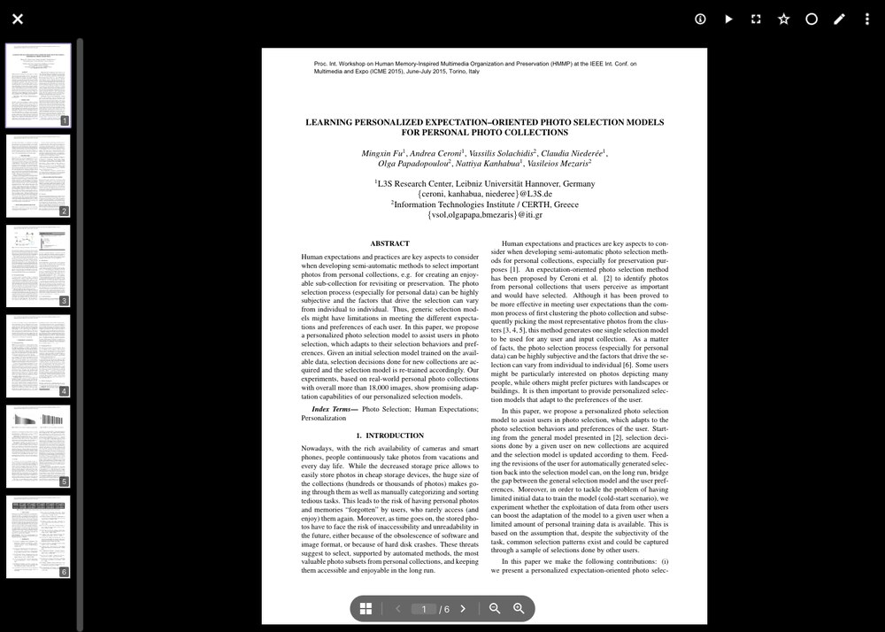

# Dokumente lesen #

PhotoPrism indexiert PDF-Dateien als *Dokumente* und erzeugt aus ihrer ersten Seite ein Titelbild, sodass sie in den
Suchergebnissen neben deinen Bildern und Videos erscheinen. Ein Klick auf ein Dokument öffnet es im integrierten
Betrachter, in dem du alle Seiten lesen kannst, ohne die Datei vorher herunterzuladen.

## Dokumente finden ##

Gehe zu *Suche > Dokumente*, um alle Dateien anzusehen, die als Dokument eingestuft wurden.
Du kannst außerdem jede Suche mit dem Filter `document:yes` oder dem allgemeineren Filter `type:document` auf
Dokumente einschränken. [Mehr erfahren ›](../search/filters.md)

## Den Betrachter verwenden ##

Öffne ein Dokument, indem du in den Suchergebnissen auf sein Titelbild klickst. Der Betrachter lädt alle Seiten und
bietet die folgenden Bedienelemente:

{ class="shadow" }

#### :material-view-grid: Seitenvorschau ####

Am linken Rand wird eine Leiste mit Vorschaubildern der Seiten angezeigt, sodass du den Aufbau eines Dokuments auf
einen Blick erfassen und direkt zu einer Seite springen kannst. Mit der Schaltfläche :material-view-grid: blendest du
die Leiste aus und schaffst mehr Platz für die Seite.
Auf Smartphones ist sie nicht verfügbar, da sie dort den größten Teil des Bildschirms einnehmen würde.

#### :material-chevron-right: Seiten ####

Scrolle, um dich durch das Dokument zu bewegen, oder nutze die Schaltflächen :material-chevron-left: und
:material-chevron-right: neben der Seitenzahl. Um direkt zu einer bestimmten Seite zu springen, gib ihre Nummer in das
Seitenfeld ein und drücke **Enter**.
Auf einer Tastatur scrollen **Auf**, **Ab** und **Bild ab** die aktuelle Seite.

#### :material-magnify-plus-outline: Zoom ####

Ein Dokument wird nach Möglichkeit so geöffnet, dass eine ganze Seite auf den Bildschirm passt, andernfalls wird die
Seitenbreite eingepasst. Mit den Schaltflächen :material-magnify-minus-outline: und :material-magnify-plus-outline:
änderst du die Vergrößerung, auf einem Touchscreen auch mit einer Zwei-Finger-Geste. Ist eine Seite größer als das
Fenster, kannst du sie mit der Maus verschieben.

#### :material-chevron-double-right: Weitere Dokumente ####

Um zum vorherigen oder nächsten Dokument zu wechseln, ohne den Betrachter zu verlassen, nutze die Pfeile am linken und
rechten Bildschirmrand, drücke die Pfeiltasten **Links** und **Rechts** oder wische auf einem Touchscreen vom linken
oder rechten Rand nach innen.

## Dokumente teilen ##

Dokumente können wie alle anderen Dateien zu Alben hinzugefügt und [geteilt](../share/index.md) werden. Alle, die den
Freigabe-Link öffnen, können die geteilten Dokumente im selben Betrachter lesen, ohne Zugriff auf Dokumente außerhalb
der geteilten Alben zu erhalten.
