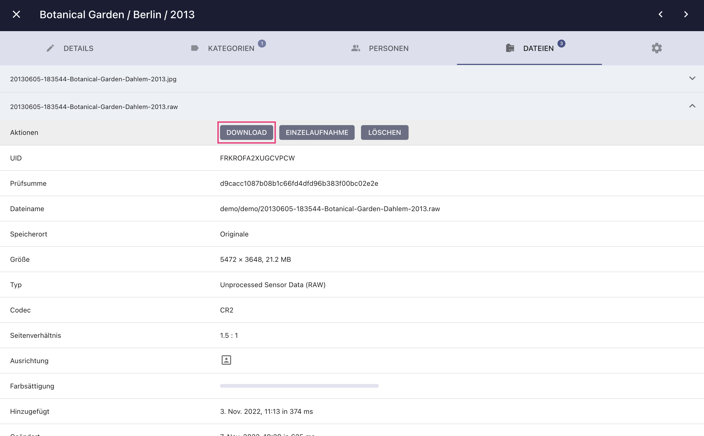

# Bilder herunterladen #

=== "Kontext-Menü"
     1. Selektiere Bilder und Videos
     2. Öffne das Kontext-Menü
     3. Klicke :material-cloud-download:

    { class="shadow" }
    
    !!! tip ""
        Du kannst mehrere Bilder auf einmal selektieren, indem du die Shift Taste verwendest.

=== "Vollbild-Modus"
     1. Klicke auf das Bild
     2. Im Vollbild Modus klicke :material-download:

      { class="shadow" }

=== "Bearbeitungs-Dialog"
     1. Öffne den [*Bearbeitungs-Dialog*](edit.md)
     2. Gehe zu *Dateien*
     3. Klicke *Download*

      { class="shadow" }
