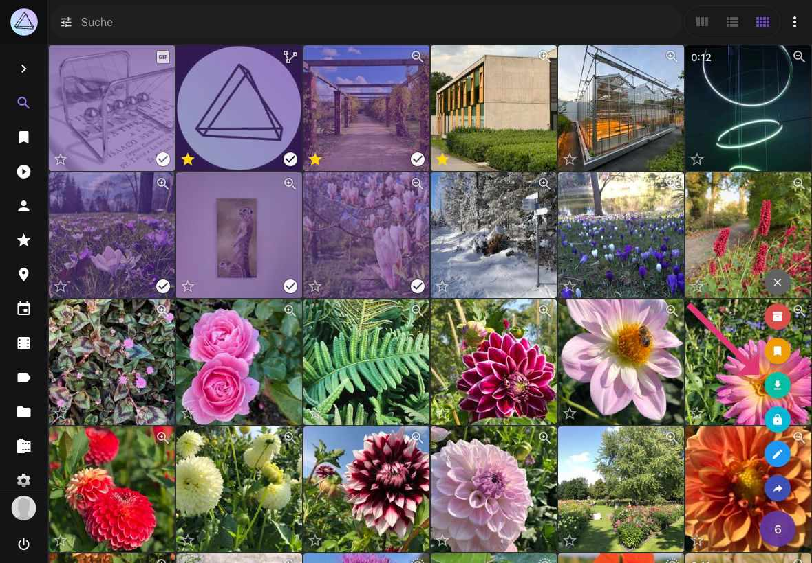
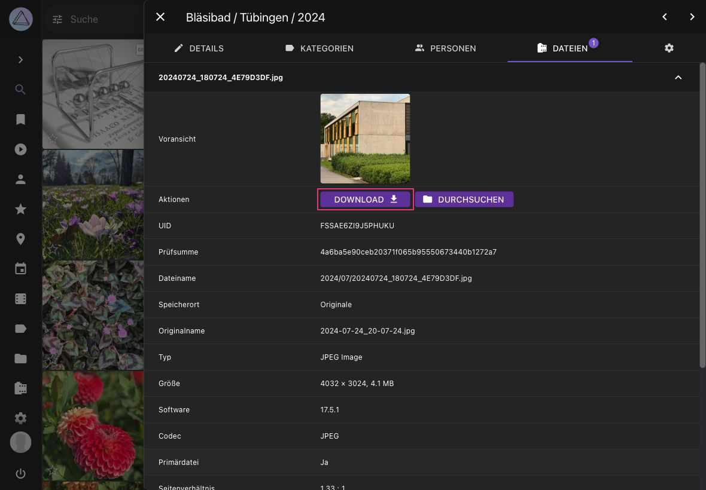

# Bilder herunterladen #

=== "Kontext-Menü"
     1. Selektiere Bilder und Videos
     2. Öffne das Kontext-Menü
     3. Klicke :material-cloud-download:

     { class="shadow" }
    
    !!! tip ""
        Du kannst [mehrere Bilder auf einmal selektieren](../navigate.md#auswahlmodus-und-mehrfachauswahl), indem du die Shift Taste verwendest.

    !!! info ""
        Du kannst [konfigurieren](../settings/general.md#downloads), welche Dateien jeweils heruntergeladen werden sollen.

=== "Vollbild-Modus"
     1. Klicke auf das Bild
     2. Im Vollbild Modus klicke :material-download:
     
     { class="shadow" }

    !!! info ""
        Du kannst [konfigurieren](../settings/general.md#downloads), welche Dateien jeweils heruntergeladen werden sollen.

=== "Bearbeitungs-Dialog"
     1. Öffne den [*Bearbeitungs-Dialog*](edit.md)
     2. Gehe zu *Dateien*
     3. Klicke *Download*

      { class="shadow" }
