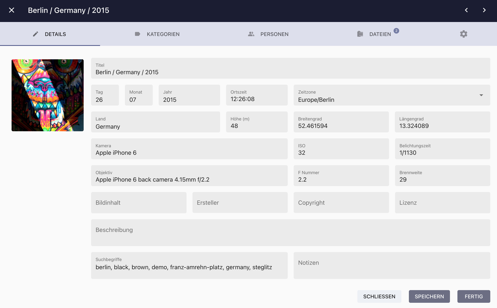
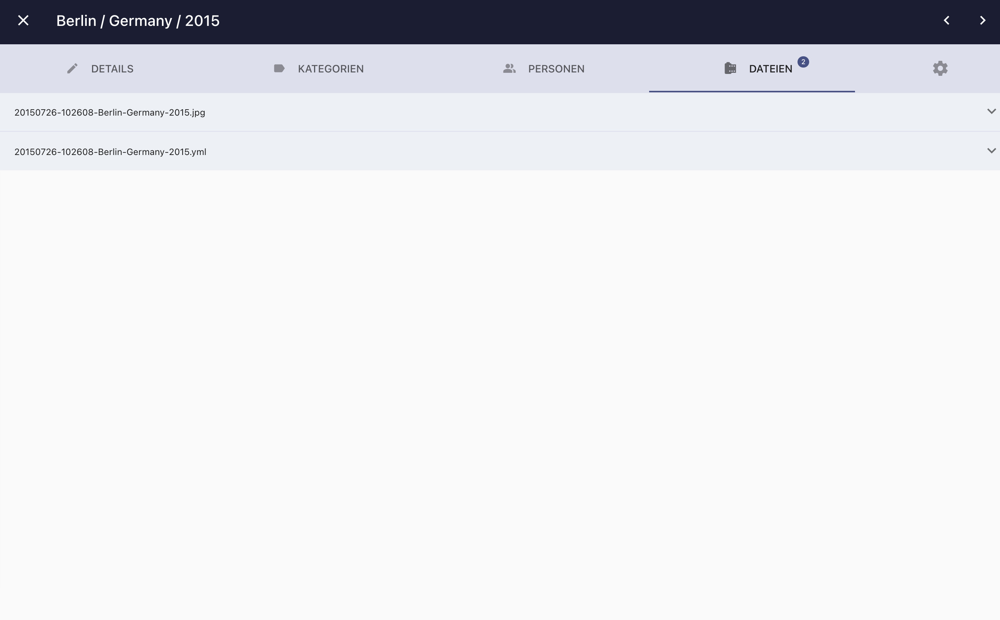
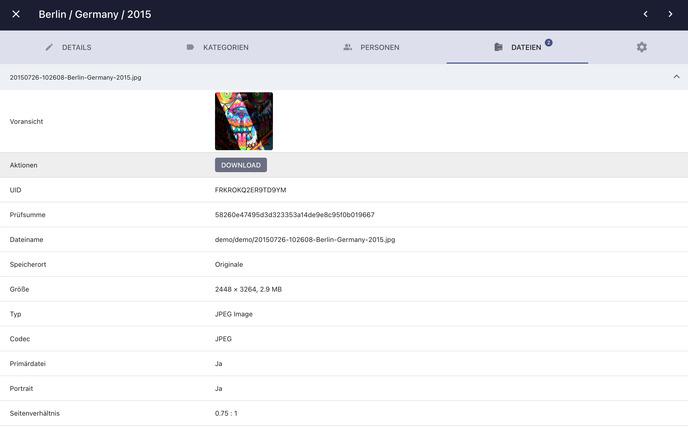

# Bild Details bearbeiten #
Der Bearbeitungs-Dialog ermöglicht es dir, Metadaten zu deinen Bildern hinzuzufügen oder vorhandene Metadaten zu bearbeiten.

Während der [*Indexierung*](../library/indexing.md) liest PhotoPrism so viele Daten wie möglich aus Sidecar-Dateien oder den Bildern selbst aus.

### Bearbeitungs-Dialog öffnen ###

=== "Karteikarten Ansicht"
     Klicke auf den Titel, den Aufnahmezeitpunkt oder die Kamerainformationen

     { class="shadow" }

=== "Vollbild-Modus"
      Klicke auf :material-pencil:, in der rechten oberen Ecke des Bildschirms
        { class="shadow" }

=== "Kontext-Menü"
     1. Selektiere ein oder mehrere Bilder
     2. Öffne das Kontext-Menü
     3. Klicke auf :material-pencil:

    { class="shadow" }

### Bilddetails bearbeiten ###
Im *Detail-Tab* des *Bearbeitungs-Dialogs* können die folgenden Daten angezeigt und verändert werden:

* Titel, Tag, Monat, Jahr, Zeit in UTC, Datum in UTC, Zeitzone, Breitengrad, Längengrad, Höhe über NN, Land, Kamera, ISO, Belichtungszeit, Objektiv, F Nummer, Brennweite, Thema, Künstler, Copyright, Lizenz, Beschreibung, Suchbegriffe, Notizen

{ class="shadow" }

*Speichern* speichert die aktuellen Änderungen.
*Fertig* speichert die Änderungen und schließt den Dialog.

!!! info ""
    Viele Metadaten, wie Suchbegriffe, Titel, Ort der Aufnahme oder Kameradetails werden von PhotoPrism während der [*Indexierung*](../library/indexing.md) automatisch hinzugefügt.
    Nimmst du manuell Änderungen an den Metadaten vor, werden diese von PhotoPrism bei einer erneuten Indexierung nicht überschrieben.

!!! tip ""
    Die Suchbegriffe können im Suchfeld verwendet werden, um Bilder und Videos zu finden.

#### Geolocation Plugin ####

Mit dem open source [Geolocation Plugin](https://github.com/andyvalerio/photoprism-geolocation) kann der Aufnahmeort auch auf einer Weltkarte eingetragen werden. Das Plugin kann [über den Chrome Webstore installiert werden](https://chrome.google.com/webstore/detail/geolocation-plugin-for-ph/oggmpodnbdcmfiognbkkeffacpeaifch).

{ class="shadow" }

### Kategorien bearbeiten ###
Im Tab *Kategorien* können die [*Kategorien*](labels.md) eines Bildes/Videos angesehen und verändert werden.

### Personen bearbeiten ###
Im Tab *Personen* kannst du abgebildete [Personen](people.md) ansehen und editieren.

### Dateien bearbeiten###
Im Tab *Dateien* werden alle Dateien angezeigt, die zu einem Bild gehören.
Ein Bild kann aus mehreren Dateien bestehen. Beispielsweise einer *RAW-Datei*, eine dazugehörige *JPEG-Version* sowie eine verknüpfte *XMP/JSON Datei*.

{ class="shadow" }

Um die Details einer Datei anzuzeigen, klicke auf :material-chevron-down:.

{ class="shadow" }

Falls du [*Bildstapel*](stacks.md) bearbeitest, kannst du in dieser Ansicht das Anzeigebild wechseln oder gruppierte Dateien trennen.

