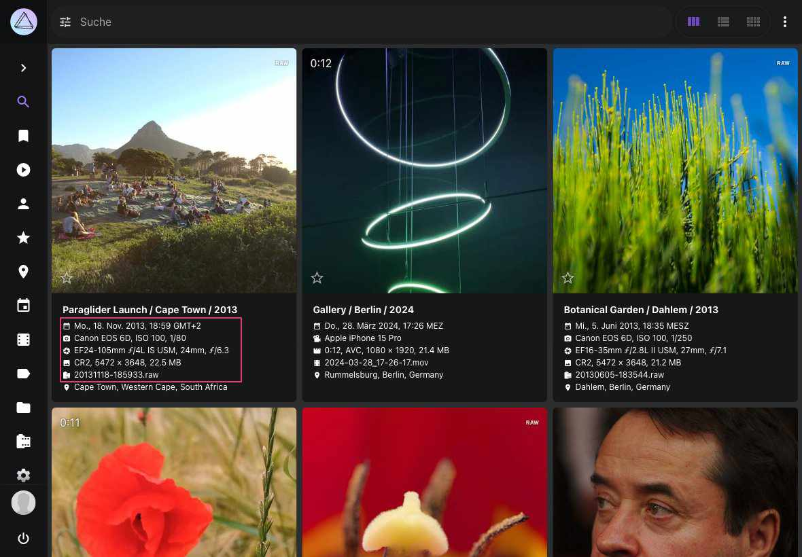

# Bild Details bearbeiten #
Der Bearbeitungs-Dialog ermöglicht es dir, Metadaten zu deinen Bildern hinzuzufügen oder vorhandene Metadaten zu bearbeiten.

Während der [*Indexierung*](../library/indexing.md) liest PhotoPrism so viele Daten wie möglich aus Sidecar-Dateien oder den Bildern selbst aus.

### Bearbeitungs-Dialog öffnen ###

=== "Karteikarten Ansicht"
     Klicke auf den Titel, den Aufnahmezeitpunkt oder die Kamerainformationen

     { class="shadow" }

=== "Vollbild-Modus"
      Klicke auf :material-pencil:, in der rechten oberen Ecke des Bildschirms
        { class="shadow" }

    !!! tip "Tastenkombination"
        Im Vollbild-Viewer kannst du den Bearbeitungs-Dialog schnell öffnen, indem du **Strg + E** drückst.

=== "Kontext-Menü"
     1. Selektiere ein oder mehrere Bilder
     2. Öffne das Kontext-Menü
     3. Klicke auf :material-pencil:

    { class="shadow" }

### Bilddetails bearbeiten ###

Im *Details*-Tab können Sie allgemeine Metadaten wie Titel, Datum, Ort, Kamera, Objektiv, Bildunterschrift und Copyright anzeigen und bearbeiten:

{ class="shadow" }

Viele dieser Informationen werden während der Indexierung automatisch erkannt und aktualisiert. Wenn Sie diese Felder bearbeiten, werden die geänderten Werte beibehalten und auch bei einer erneuten Indexierung Ihrer Bibliothek nicht überschrieben.

Um schnell neue Koordinaten zu setzen, können Sie diese in das *Ort*-Feld einfügen, wenn sie das Format *48.265684, 7.721380* haben. Alternativ können Sie auf das Standortmarkierungs-Symbol neben diesem Feld klicken, um die integrierte Standortkomponente zu öffnen und einen Ort visuell auszuwählen.

Durch Klicken auf die Schaltfläche *Anwenden* werden die vorgenommenen Änderungen gespeichert, ohne den Dialog zu schließen, während die Schaltfläche *Schließen* den Dialog schließt, ohne weitere Änderungen zu speichern.

!!! note ""
    Bei einer Suche kann Text in den Feldern *Titel*, *Bildunterschrift* und *Suchbegriffe* gefunden werden, während *Notizen* privat sind und ignoriert werden.
    
**Standortauswahl**

PhotoPrism enthält eine Standortkomponente, mit der Sie die Standortkoordinaten eines Bildes einfach ändern können, indem Sie seinen Standort auf einer Karte auswählen. Klicken Sie einfach auf das :material-map-marker: Symbol neben dem *Ort*-Feld, um die interaktive Kartenoberfläche zu öffnen. Sie können auch nach Standorten suchen, indem Sie Stadt- oder Straßennamen direkt in die Kartenkomponente eingeben.

{ class="shadow" }

!!! note ""
    Mit dieser integrierten Funktionalität wird das [externe Geolocation Plugin](https://github.com/andyvalerio/photoprism-geolocation) nicht mehr benötigt. Wir danken unserer Community für ihren wertvollen Beitrag, der diese Funktion inspiriert hat!

### Kategorien bearbeiten ###
Im Tab *Kategorien* können die [*Kategorien*](labels.md) eines Bildes/Videos angesehen und verändert werden.

### Personen bearbeiten ###
Im Tab *Personen* kannst du abgebildete [Personen](people.md) ansehen und editieren.

### Dateien bearbeiten###
Im Tab *Dateien* werden alle Dateien angezeigt, die zu einem Bild gehören.
Ein Bild kann aus mehreren Dateien bestehen. Beispielsweise einer *RAW-Datei*, eine dazugehörige *JPEG-Version* sowie eine verknüpfte *XMP/JSON Datei*.

{ class="shadow" }

Um die Details einer Datei anzuzeigen, klicke auf :material-chevron-down:.

{ class="shadow" }

Falls du [*Bildstapel*](stacks.md) bearbeitest, kannst du in dieser Ansicht das Anzeigebild wechseln oder gruppierte Dateien trennen.

