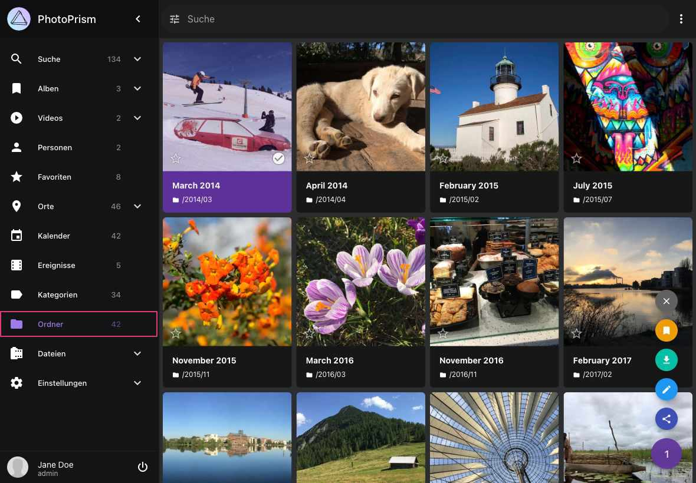
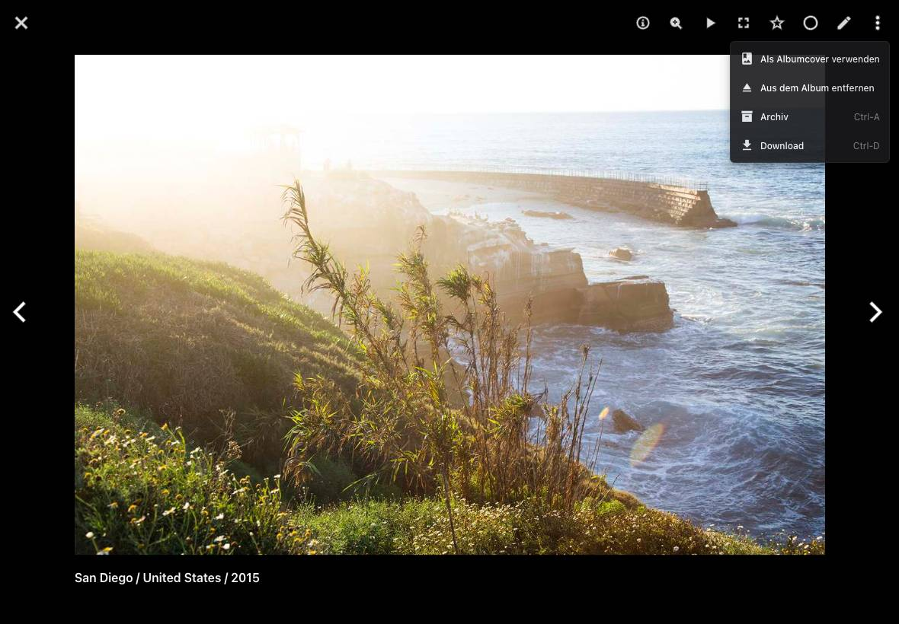

# Ordner #
Im Bereich *Ordner* werden automatisch die Unterordner deines *Originals* Verzeichnis angezeigt.
Falls neue Dateien hinzugefügt werden, aktualisiert PhotoPrism die Ansicht automatisch.

{ class="shadow" }

Das Kontext-Menü bietet die folgenden Aktionen:

## Ordner als ZIP-Archiv herunterladen ##
1. Wähle einen Ordner aus
2. Öffne das Kontext-Menü und klicke :material-download:

## Erstelle ein Album anhand eines Ordners ##
1. Wähle einen Ordner aus
2. Öffne das Kontext-Menü und klicke :material-bookmark:
3. Wähle ein existierendes Album aus oder gib einen neuen Albumnamen ein
5. Klicke auf *Hinzufügen*

## Cover ändern ##

Um ein Titelbild für einen Ordner festzulegen:

1. Öffne den Ordner, indem du im Bereich Ordner darauf klickst.
2. Klicke auf das Foto, das du als Cover verwenden möchtest.
3. Wenn das Foto geöffnet ist, klicke oben rechts auf :material-dots-vertical:.
4. Wähle im Menü **Als Albumcover verwenden** aus.

    { class="shadow" }

Dadurch wird das ausgewählte Foto als Titelbild für den Ordner festgelegt.

