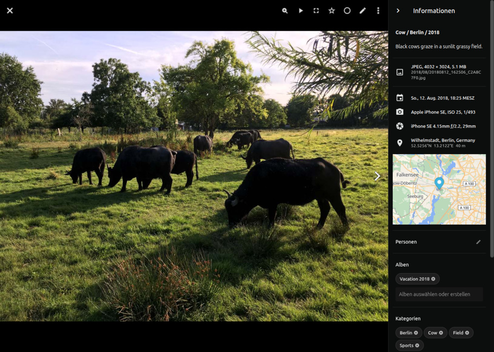
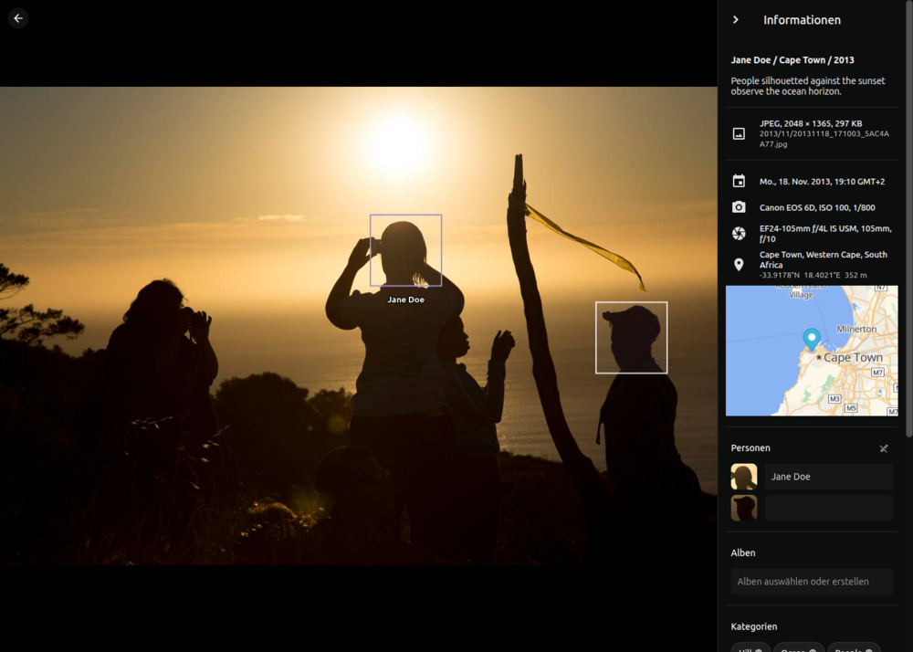

# Info-Seitenleiste

Die Info-Seitenleiste öffnet sich neben dem Vollbildbetrachter und zeigt die Metadaten des aktuell angezeigten Bildes oder Videos. Sie ist eine schlanke Alternative zum [Bearbeitungs-Dialog](edit.md), wenn du einzelne Felder prüfen oder schnell korrigieren möchtest, ohne den Betrachter zu verlassen.

{ class="shadow" }

!!! info "Berechtigungen"
    Benutzer ohne Bearbeitungsrechte, z.B. *Betrachter*, sehen eine schreibgeschützte Version der Seitenleiste, in der leere Felder ausgeblendet sind. *Gäste* und *Besucher*, die einen Freigabe-Link öffnen, sehen eine weiter eingeschränkte Auswahl der Metadaten.

## Seitenleiste öffnen

Drücke **Strg + I**, während ein Bild im Vollbildbetrachter geöffnet ist, oder wähle "Info-Seitenleiste umschalten" aus dem Betrachter-Menü. Mit derselben Tastenkombination schließt du sie wieder. Die Position der Seitenleiste bleibt über Seitenaufrufe hinweg erhalten, sie bleibt also so lange geöffnet, bis du sie ausdrücklich schließt.

## Was sie anzeigt

Die Seitenleiste enthält die am häufigsten verwendeten Metadatenfelder sowie zugewiesene [Alben](albums.md), [Kategorien](labels.md) und [Personen](#personen-und-gesichter-bearbeiten):

- **Datei:** Pfad und Dateiname der aktuell angezeigten Mediendatei.
- **Kamera:** Hersteller und Modell, Objektiv, ISO, Belichtungszeit, Brennweite und Blendenzahl.
- **Beschreibung:** Titel, Bildunterschrift, Künstler, Copyright und Lizenz.
- **Alben:** Anklickbare Chips, die zum jeweiligen Album führen.
- **Kategorien:** Anklickbare Chips, die zu den passenden Suchergebnissen führen.
- **Personen:** Anklickbare Chips, die zu den passenden Suchergebnissen führen.

Ein Klick auf einen Chip öffnet das passende Album oder die Suchergebnisse in einem neuen Tab, sodass du die Sammlung durchsuchen kannst, ohne den Kontext zu verlieren.

## Metadaten bearbeiten

Klicke auf ein Metadatenfeld wie *Bildunterschrift*, um es zu bearbeiten. Einige Felder lassen sich direkt an Ort und Stelle bearbeiten, andere öffnen einen Dialog.
Drücke Escape, um abzubrechen, oder bestätige, um deine Änderungen zu speichern. Beachte, dass ungültige Werte nicht gespeichert werden können und eine Fehlermeldung erscheint.

## Personen und Gesichter bearbeiten

Die Info-Seitenleiste bietet dieselben Aktionen zur Verwaltung von Gesichtern wie der *Personen*-Tab des [Bearbeitungs-Dialogs](edit.md#personen-bearbeiten) und ist der einzige Ort, an dem du ein Gesicht, das PhotoPrism bei der automatischen Erkennung übersehen hat, **manuell markieren** kannst.

Klicke auf :material-pencil-outline: neben *Personen*, um in den *Bearbeitungsmodus* zu wechseln. Dieser zeigt alle vorhandenen Gesichtsmarkierungen auf dem Bild an und schaltet die Aktionen zum Ändern, Entfernen und manuellen Markieren frei. Klicke auf :material-pencil-off-outline:, wenn du fertig bist. Für die Zuordnung eines Namens zu einem bereits erkannten, unbenannten Gesicht ist der Bearbeitungsmodus nicht erforderlich.

### Gesichter identifizieren

1. Öffne ein Bild im [Vollbildbetrachter](../search/views.md) und öffne die Info-Seitenleiste mit **Strg + I**.
2. Klicke auf das Namensfeld neben dem Gesicht, das du benennen möchtest.
3. Beginne, einen Namen einzugeben; vorhandene Personen werden während der Eingabe vorgeschlagen.
4. Drücke *Enter*, um zu bestätigen.

### Gesicht einer anderen Person zuordnen

1. Öffne ein Bild im [Vollbildbetrachter](../search/views.md) und öffne die Info-Seitenleiste mit **Strg + I**.
2. Klicke auf :material-pencil-outline: neben *Personen*, um in den Bearbeitungsmodus zu wechseln.
3. Klicke auf :material-eject: neben der Person, die du ändern möchtest.
4. Gib einen neuen Namen ein und drücke *Enter* oder lass das Feld leer.

### Gesicht manuell markieren

1. Öffne ein Bild im [Vollbildbetrachter](../search/views.md) und öffne die Info-Seitenleiste mit **Strg + I**.
2. Klicke auf :material-pencil-outline: neben *Personen*, um in den Bearbeitungsmodus zu wechseln.
3. Ziehe auf dem Bild ein Rechteck um das übersehene Gesicht.
4. Klicke auf :material-check: in der Bestätigungspille, um die neue Markierung zu übernehmen.
5. Gib einen Namen in der neuen Zeile unter *Personen* ein und drücke *Enter*, um eine Person zuzuordnen.

{ class="shadow" }
{ class="shadow" }

### Gesichter entfernen

Wie auf dem *Personen*-Tab des Bearbeitungs-Dialogs können nur Markierungen unbenannter Gesichter entfernt werden.

1. Öffne ein Bild im [Vollbildbetrachter](../search/views.md) und öffne die Info-Seitenleiste mit **Strg + I**.
2. Klicke auf :material-pencil-outline: neben *Personen*, um in den Bearbeitungsmodus zu wechseln.
3. Klicke auf die Gesichtsmarkierung im Bild.
4. Klicke auf :material-delete: in der Bestätigungspille, um sie zu entfernen.

{ class="shadow" }
