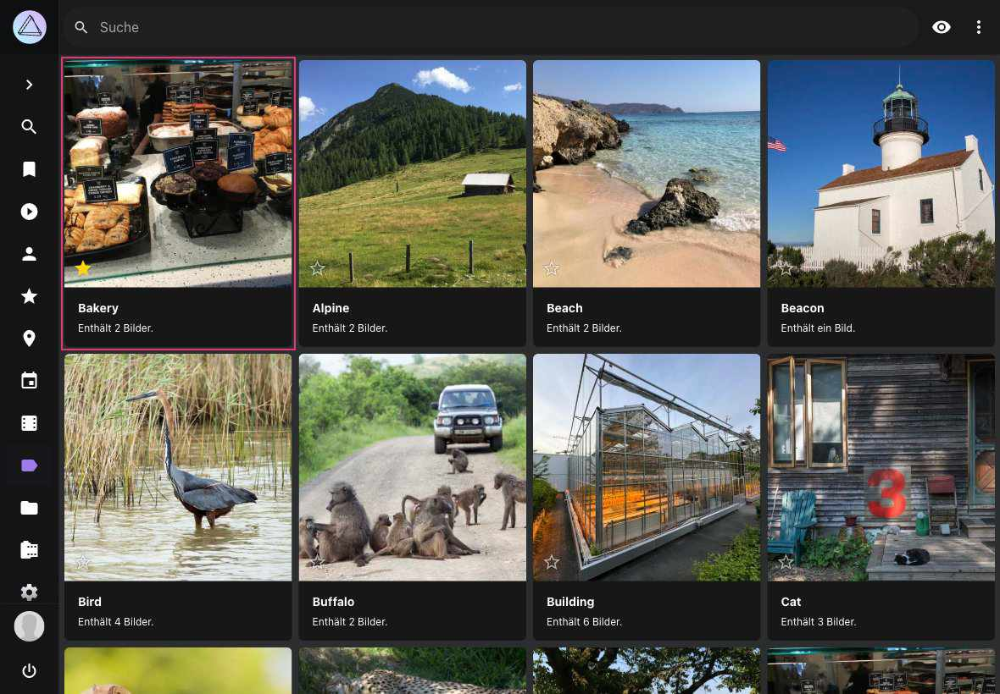
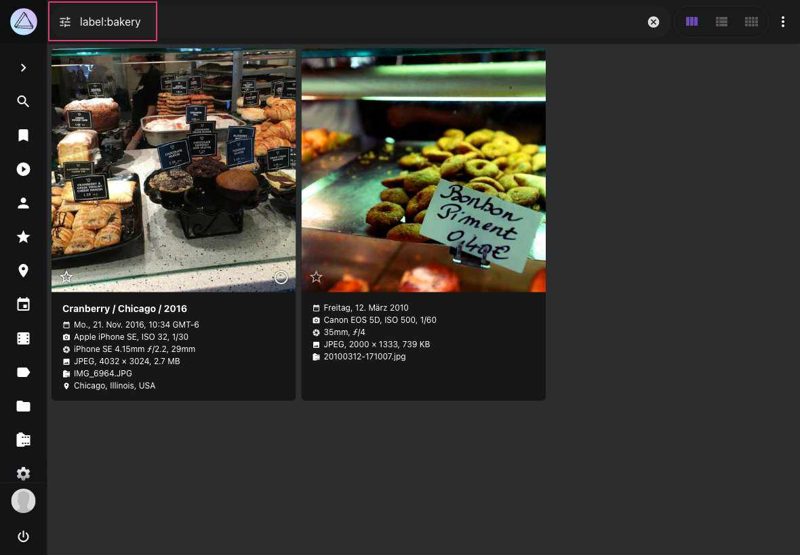
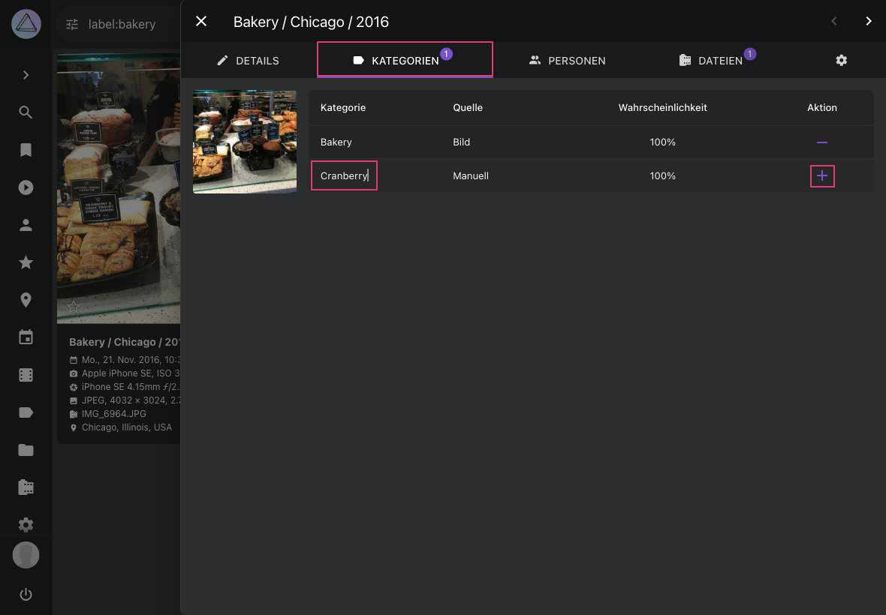
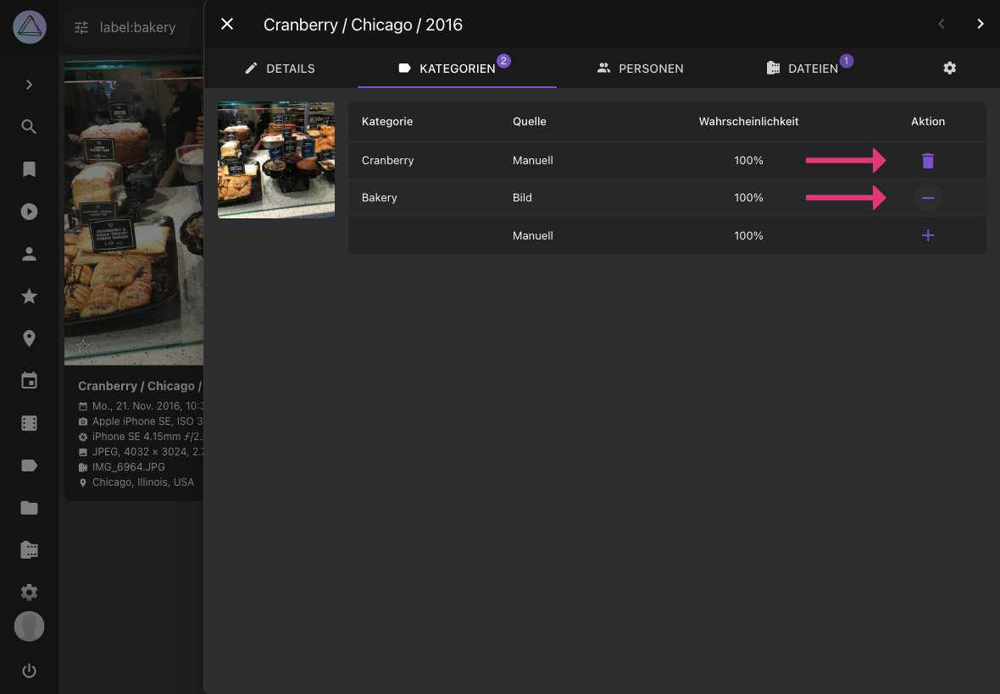
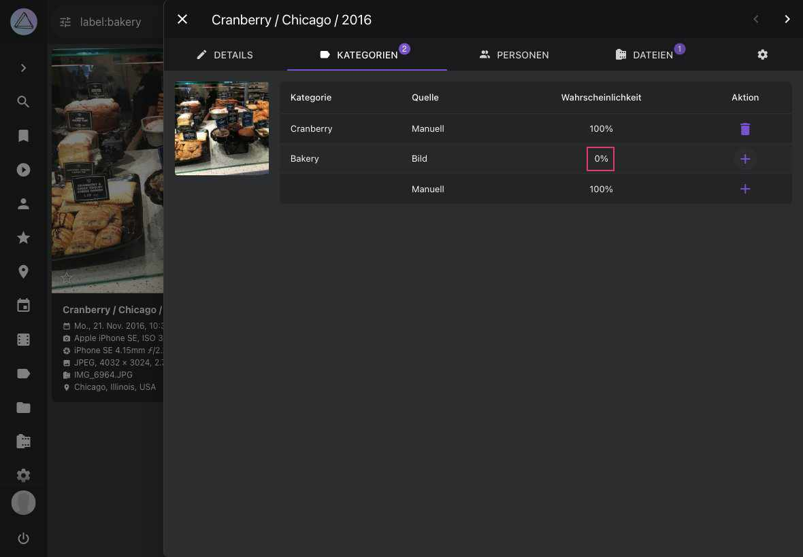
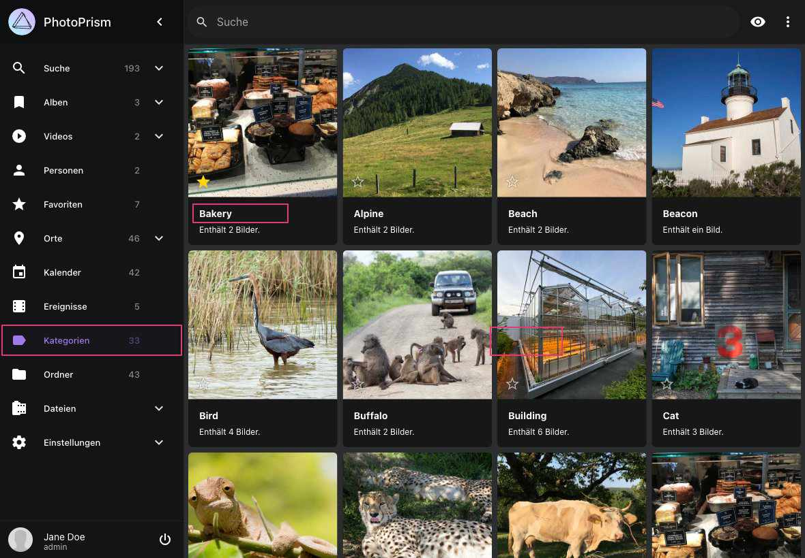
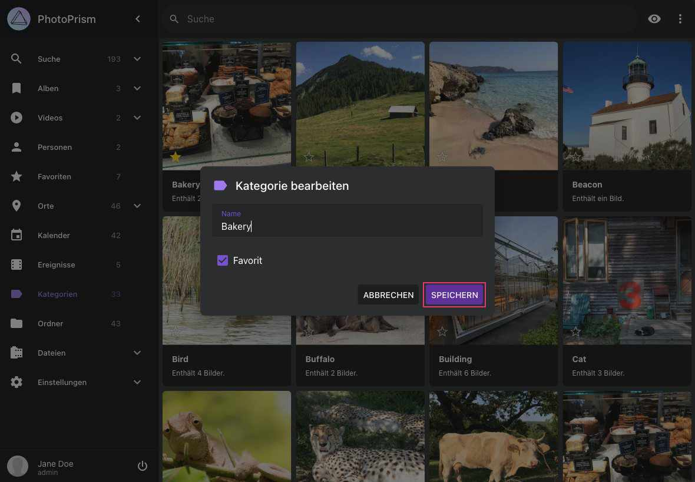
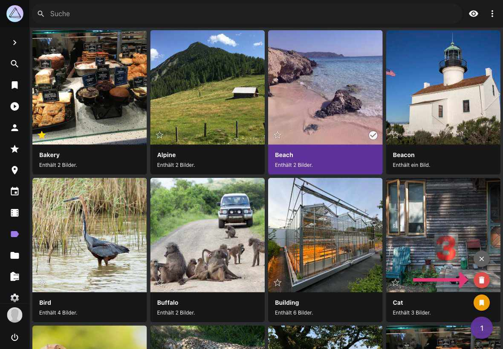
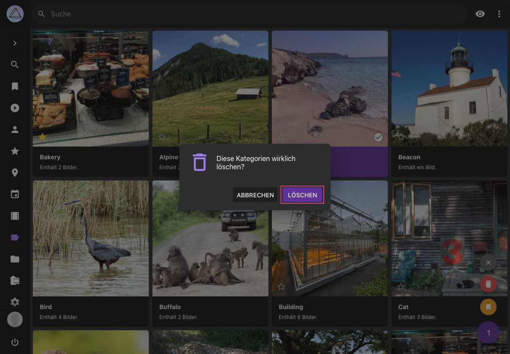

# Kategorien #
PhotoPrism nutzt *Kategorien* um Bilder und Videos zu kategorisieren. *Kategorien* werden automatisch gesetzt, wenn neue Bilder zu PhotoPrism hinzugefügt werden. 
Du kannst manuell neue *Kategorien* hinzufügen sowie bestehende *Kategorien* bearbeiten oder entfernen.

Im Bereich *Kategorien* werden alle Bilder nach Kategorien sortiert dargestellt.
Du kannst eine Kategorie hervorheben, indem du auf :material-star: klickst. 
Hervorgehobene *Kategorien* werden in der Ansicht ganz oben angezeigt.

Um auch *Kategorien* mit einer niedrigen Priorität angezeigt zu bekommen, klicke auf :material-eye:.

{ class="shadow" }

### Bilder einer bestimmten Kategorie anzeigen ###

1. Gehe zu *Kategorien*
2. Klicke auf eine *Kategorie*
    { class="shadow" }
    { class="shadow" }

!!! info ""
    Alternativ kannst du auch das Suchfeld verwenden. Um beispielsweise nach der *Kategorie* "Hund" zu suchen, verwende den Suchbegriff `label:dog`.

### Kategorie hinzufügen ###
1. Öffne den [*Bearbeitungs-Dialog*](edit.md) eines Bildes
2. Gehe zum Tab *Kategorien*
3. Klicke auf das *Kategorie-Feld* in der letzten Zeile der Tabelle 
4. Gib den Kategorienamen ein
5. Klicke auf :material-plus: in der rechten Spalte

    { class="shadow" }
    
### Kategorien von Bilder/Videos entfernen/löschen ###

Automatisch zugewiesene *Kategorien* können entfernt werden. Manuell hinzugefügte *Kategorien* können gelöscht werden.

1. Öffne den [*Bearbeitungs-Dialog*](edit.md) eines Bildes
2. Gehe zum Tab *Kategorien*
3. Klicke auf :material-minus: oder :material-delete: um die Kategorie zu entfernen oder zu löschen

    { class="shadow" }
    
!!! info ""
    Entfernte *Kategorien* bekommen die Wahrscheinlichkeit 0% zugewiesen. Sie können jederzeit durch klicken auf :material-plus: wieder aktiviert werden.
    
   { class="shadow" }

!!! info ""
    In den [Einstellungen](../settings/general.md) kann der Bereich *Kategorien* ausgeblendet werden.

### Kategorie umbenennen ###

1. Gehe zu *Kategorien*
2. Klicke auf den Namen der *Kategorie*, die geändert werden soll
{ class="shadow" }
3. Ändere den Namen
4. Klicke auf Speichern
{ class="shadow" }

!!! attention ""
    Beachte, dass diese Änderung alle Bilder betrifft, die mit dieser *Kategorie* verknüpft sind.

### Kategorie löschen ###
*Kategorien* können dauerhaft gelöscht werden. Eine gelöschte *Kategorie* wird bei der [*Indexierung*](../library/indexing.md) in Zukunft nicht mehr vergeben.

1. Gehe zu *Kategorien*
2. Selektiere die zu löschende *Kategorie*
3. Öffne das Kontext-Menü und klicke auf :material-delete:
4. Bestätige

!!! attention ""
    Wenn eine gelöschte *Kategorie* wieder hergestellt werden soll, muss diese einem Bild hinzugefügt sowie die [*Indexierung*](../library/indexing.md) gestartet werden.

{ class="shadow" }
    
{ class="shadow" }