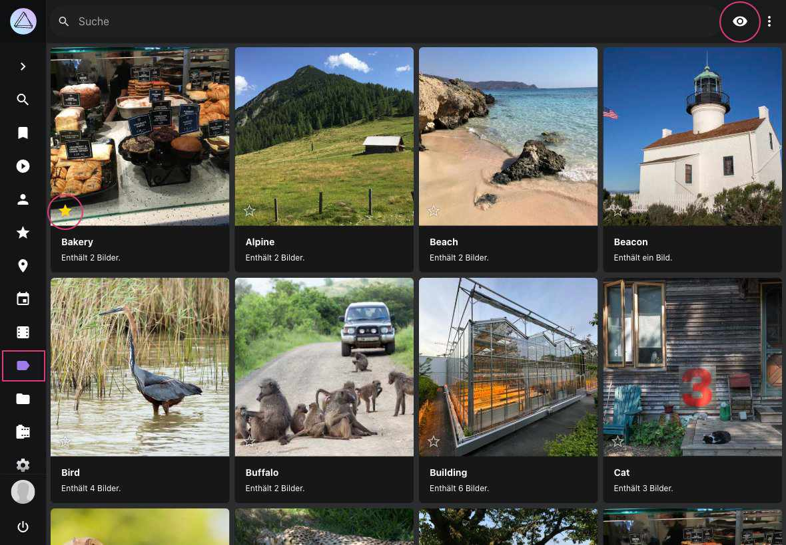
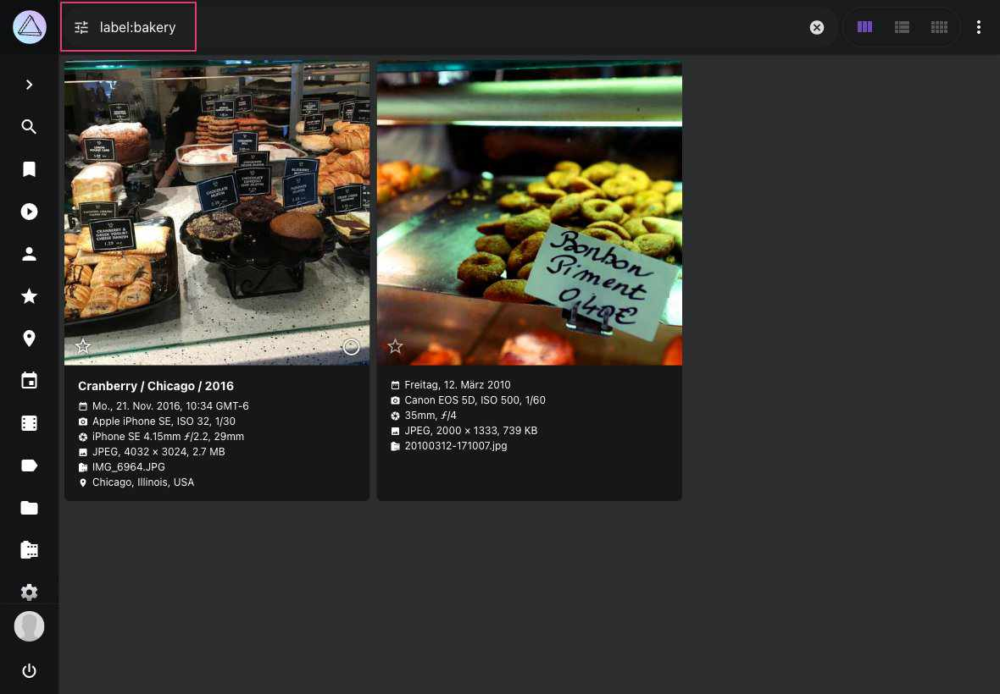
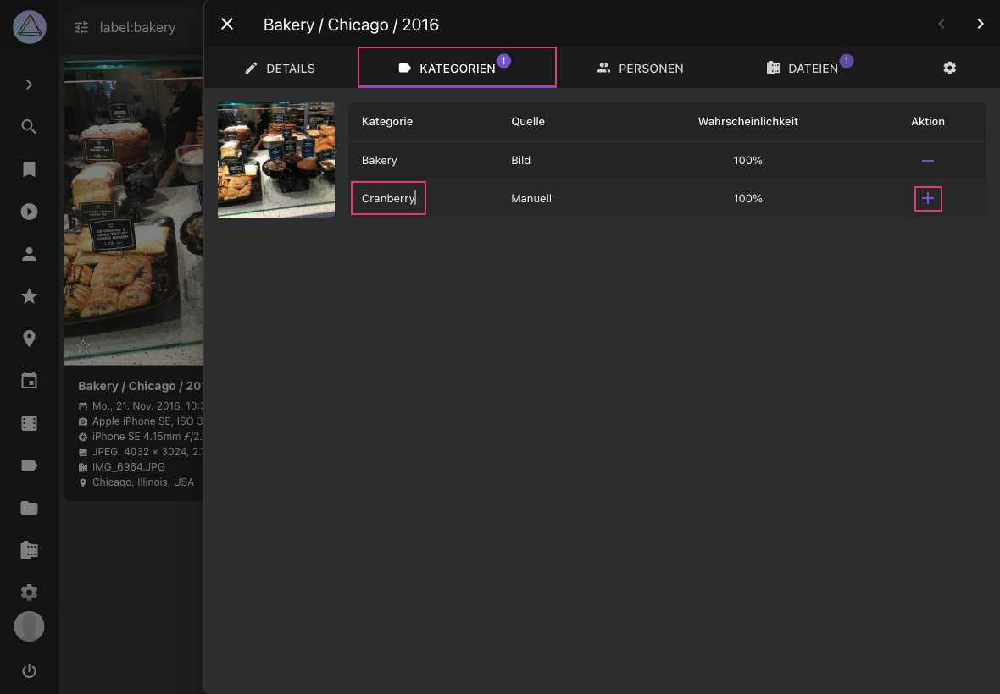
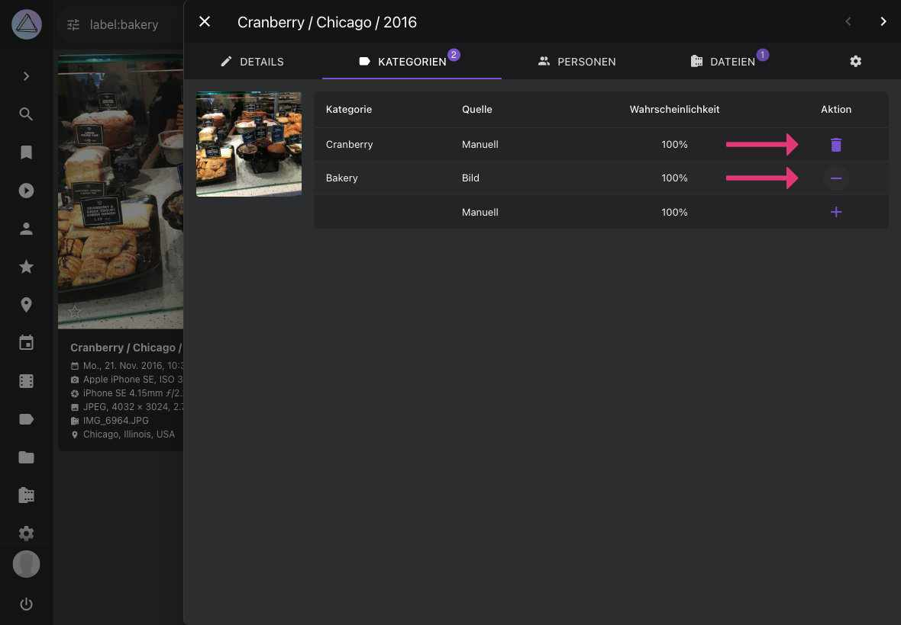
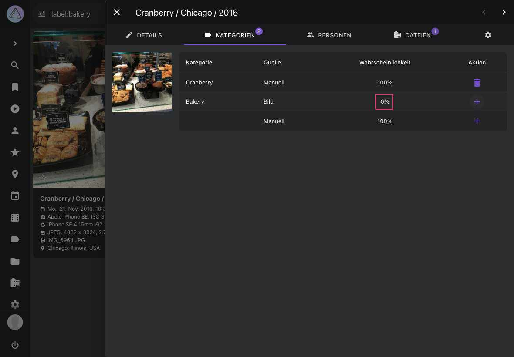
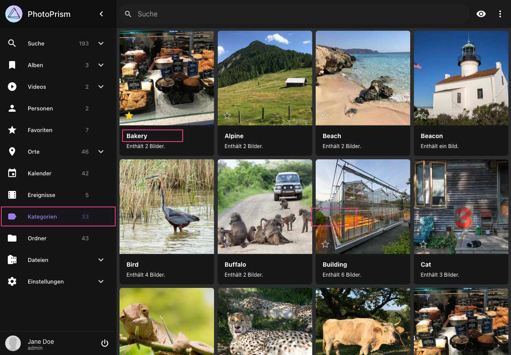
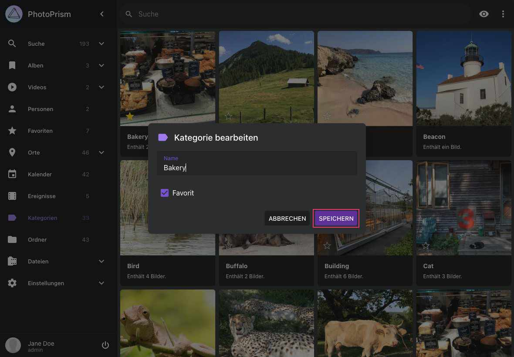
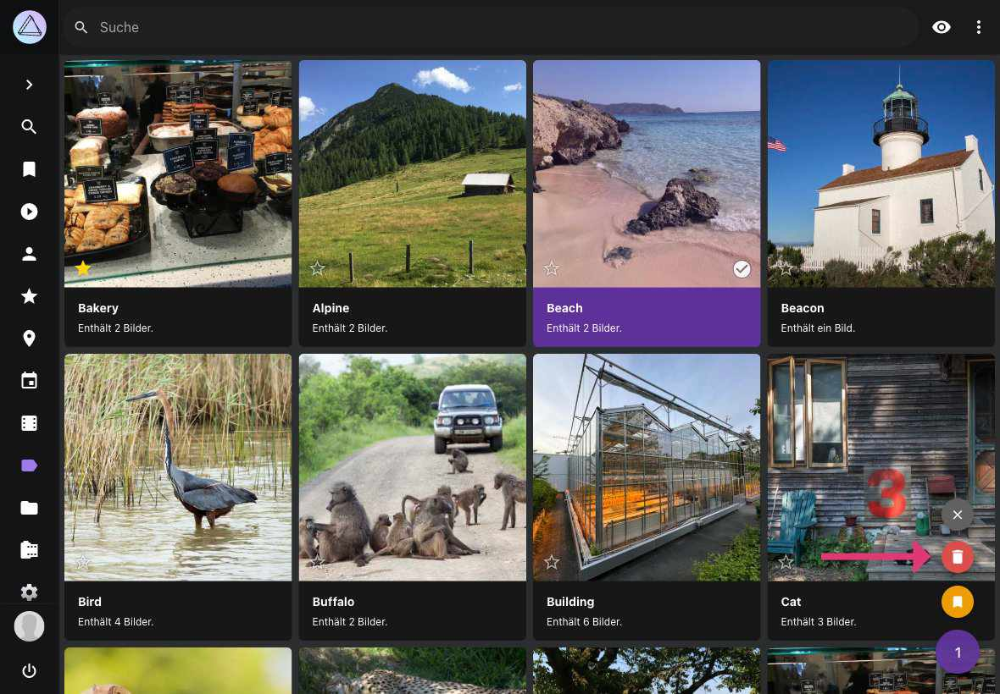
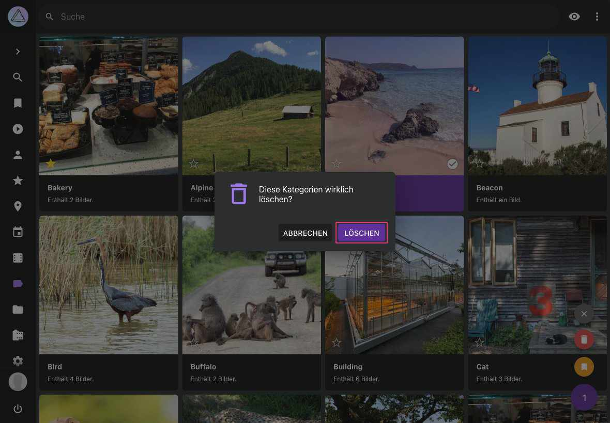

# Kategorien #

!!! tldr ""
    Du möchtest genauere KI-Labels? Probiere unsere [Ollama](../ai/using-ollama.md) oder [OpenAI](../ai/using-openai.md) Integration aus oder konfiguriere ein [leistungsstärkeres TensorFlow Modell](https://docs.photoprism.app/developer-guide/vision/tensorflow/custom-models/).

PhotoPrism nutzt *Kategorien* (Labels), um Bilder und Videos zu klassifizieren. Viele andere Tools verwenden dafür den Begriff *Tags*.
Kategorien werden automatisch gesetzt, wenn neue Bilder zu PhotoPrism hinzugefügt werden. Du kannst manuell neue Kategorien hinzufügen sowie bestehende Kategorien bearbeiten oder entfernen.

Im Bereich *Kategorien* werden alle Kategorien deiner Fotos und Videos angezeigt.
Du kannst eine Kategorie hervorheben, indem du auf :material-star: klickst. Hervorgehobene Kategorien werden in der Ansicht ganz oben angezeigt.

PhotoPrism ordnet jede automatisch erzeugte *Kategorie* zusätzlich einer übergeordneten Gruppe zu. So gibt es beispielsweise die übergeordnete Kategorie "Fahrzeug", zu der Kategorien wie "Taxi", "Katamaran", "Rettungsboot" und "Hochgeschwindigkeitszug" gehören. Diese übergeordneten Kategorien lassen sich nicht bearbeiten, können aber genau wie alle anderen Kategorien für die Suche verwendet werden.

Du kannst dir die übergeordneten Kategorien zusätzlich zu den gewohnten Kategorien im Bereich *Kategorien* anzeigen lassen. Über das Symbol in der oberen rechten Ecke blendest du sie ein :material-eye: und wieder aus :material-eye-off:. Außerdem lassen sie sich in komplexeren Suchfiltern verwenden – die übergeordneten Kategorien deiner Bilder erscheinen in der Suchfilterleiste als Auswahlliste unter *Alle Kategorien*.

{ class="shadow" }

### Bilder einer bestimmten Kategorie anzeigen ###

1. Gehe zu *Kategorien*
2. Klicke auf eine Kategorie
    { class="shadow" }
    { class="shadow" }

!!! info ""
    Alternativ kannst du auch das Suchfeld verwenden. Um beispielsweise nach der *Kategorie* "Hund" zu suchen, verwende den Suchbegriff `label:dog`.

### Kategorie hinzufügen ###
1. Öffne den [*Bearbeitungs-Dialog*](edit.md) eines Bildes
2. Gehe zum Tab *Kategorien*
3. Klicke auf das *Kategorie-Feld* in der letzten Zeile der Tabelle
4. Gib den Kategorienamen ein
5. Klicke auf :material-plus: in der rechten Spalte

    { class="shadow" }

### Kategorien von Bilder/Videos entfernen/löschen ###

Automatisch zugewiesene *Kategorien* können entfernt werden. Manuell hinzugefügte *Kategorien* können gelöscht werden.

1. Öffne den [*Bearbeitungs-Dialog*](edit.md) eines Bildes
2. Gehe zum Tab *Kategorien*
3. Klicke auf :material-minus: oder :material-delete: um die Kategorie zu entfernen oder zu löschen

    { class="shadow" }

!!! info ""
    Entfernte *Kategorien* bekommen die Wahrscheinlichkeit 0% zugewiesen. Sie können jederzeit durch klicken auf :material-plus: wieder aktiviert werden.

   { class="shadow" }

!!! info ""
    In den [Einstellungen](../settings/general.md) kann der Bereich *Kategorien* ausgeblendet werden.

### Kategorie umbenennen ###

1. Gehe zu *Kategorien*
2. Klicke auf den Namen der *Kategorie*, die geändert werden soll
{ class="shadow" }
3. Ändere den Namen
4. Klicke auf Speichern
{ class="shadow" }

!!! attention ""
    Beachte, dass diese Änderung alle Bilder betrifft, die mit dieser *Kategorie* verknüpft sind.

### Kategorie löschen ###
*Kategorien* können dauerhaft gelöscht werden. Eine gelöschte *Kategorie* wird bei der [*Indexierung*](../library/originals.md) in Zukunft nicht mehr vergeben.

1. Gehe zu *Kategorien*
2. Selektiere die zu löschende *Kategorie*
3. Öffne das Kontext-Menü und klicke auf :material-delete:
4. Bestätige

!!! attention ""
    Wenn eine gelöschte *Kategorie* wieder hergestellt werden soll, muss diese einem Bild hinzugefügt sowie die [*Indexierung*](../library/originals.md) gestartet werden.

{ class="shadow" }

{ class="shadow" }
