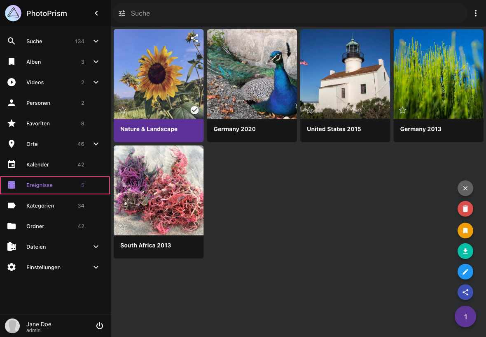

# Ereignisse #

PhotoPrism erstellt automatisch *Ereignisse* aus deinen Erinnerungen. 
Deine *Ereignisse* werden laufend aktualisiert, wenn neue Bilder hinzugefügt werden.

!!! info ""
    Ereignisse basieren auf Orts- und Zeitangaben z.B. *Germany 2020* oder auf Kategorien wie *Nature & Landscape* oder *Pets*

{ class="shadow" }

Mithilfe des Kontext-Menüs kannst du die folgenden Aktionen durchführen:

## Ereignis löschen ##
1. Selektiere ein *Ereignis*
2. Öffne das Kontext-Menü und klicke :material-delete:
3. Bestätige

!!! hint ""
    Nur das Ereignis wird gelöscht. Deine Dateien werden nicht gelöscht oder verändert.

## Ereignis als ZIP-Archiv herunterladen ##
1. Wähle ein *Ereignis* aus
2. Öffne das Kontext-Menü und klicke auf :material-download:

## Album aus einem Ereignis erstellen##
1. Selektiere ein *Ereignis*
2. Öffne das Kontext-Menü und klicke auf :material-bookmark:
3. Wähle ein existierendes Album oder gib einen neuen Albumnamen ein
4. Klicke auf *Hinzufügen*

## Cover ändern ##

Um ein Titelbild für ein Ereignis festzulegen:

1. Öffne das Ereignis, indem du darauf klickst.
2. Klicke auf das Foto, das du als Cover verwenden möchtest.
3. Wenn das Foto geöffnet ist, klicke oben rechts auf :material-dots-vertical:.
4. Wähle im Menü **Als Albumcover verwenden** aus.

    { class="shadow" }

Dadurch wird das ausgewählte Foto als Titelbild für das Ereignis festgelegt.