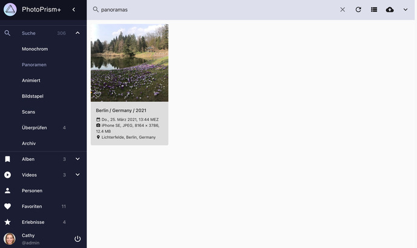
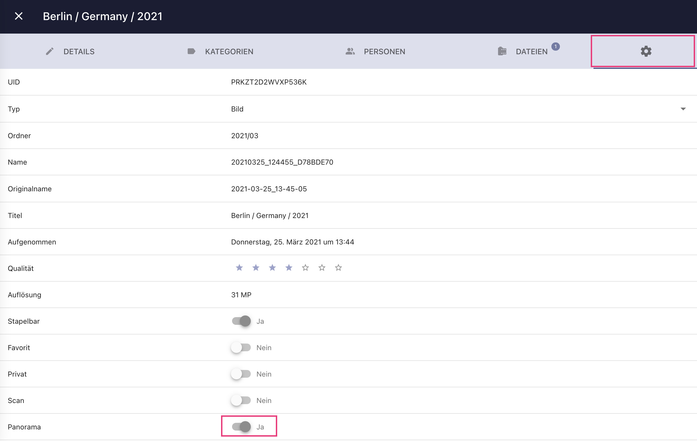

# Panorama Aufnahmen #
Bilder, ab einem Größenverhältnis von 2:1, werden von PhotoPrism automatisch als *Panorama* markiert und im Bereich
*Panoramas* angezeigt.

{ class="shadow" }

## Panorama Status bearbeiten ##

1. Öffne den [*Bearbeitungs-Dialog*](edit.md)
2. Klicke :material-cog:
3. Setze oder entferne den Panorama-Status

{ class="shadow" }