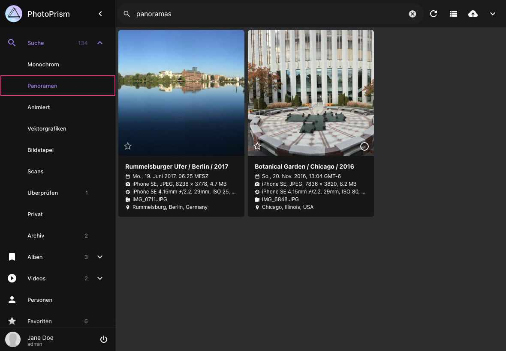
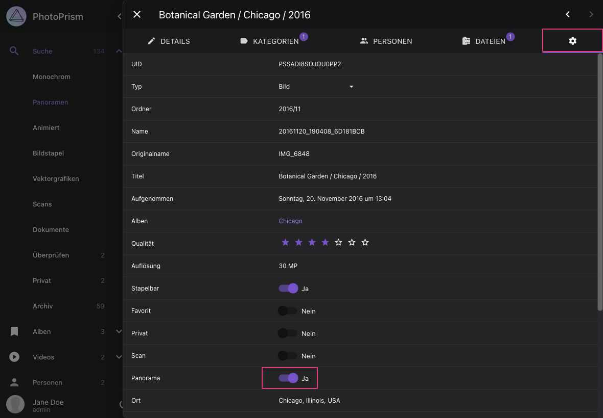

# Panorama-Aufnahmen #
Bilder mit einem Seitenverhältnis von mindestens 1,9:1 werden von PhotoPrism automatisch als *Panorama* markiert und im Bereich *Panoramen* angezeigt.

{ class="shadow" }

## Panorama Status bearbeiten ##

1. Öffne den [*Bearbeitungs-Dialog*](edit.md)
2. Klicke :material-cog:
3. Setze oder entferne den Panorama-Status

{ class="shadow" }
