# Gesichtserkennung

PhotoPrism enthält eine Gesichtserkennung, mit der du Bilder deiner Familie und Freunde wiederfindest. Freue dich darauf, längst vergessene Aufnahmen neu zu entdecken! Neue Gesichter werden während des Indexierens deiner Sammlung erkannt und anschließend nach Ähnlichkeit gruppiert, sodass du sie schnell Personen zuordnen kannst.

!!! note ""
    Die Erkennung beginnt erst, wenn deine Sammlung vollständig indexiert wurde. Das Suchen und Aktualisieren von Gesichtern verursacht vorübergehend eine hohe CPU-Belastung und kann je nach Hardware und Anzahl der Bilder eine Weile dauern.

!!! tldr ""
    Vorhandene Cluster werden automatisch im Hintergrund optimiert, z.B. wenn neue Gesichter erkannt werden, du eine falsche Zuordnung gemeldet hast oder neue Dateien zu deiner Sammlung hinzugefügt werden.

Unter [KI Modelle > Gesichtserkennung](https://docs.photoprism.app/user-guide/ai/face-recognition/) wird erklärt, wie Erkennung, Embedding und Gruppierung funktionieren; dort sind auch die Konfigurationsoptionen aufgeführt, die du anpassen kannst.

## Erkannte und neue Personen ##

Der Bereich Personen zeigt dir bereits erkannte Personen sowie neue Gesichts-Cluster.

Klicke :material-star:, um eine Person als Favorit zu markieren. Favoriten werden ganz oben angezeigt.

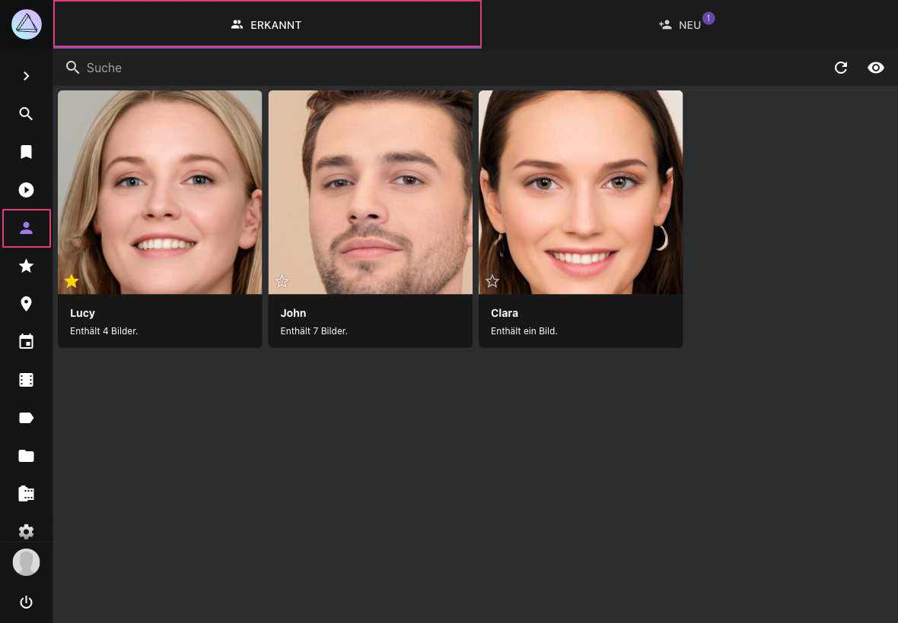{ class="shadow" }
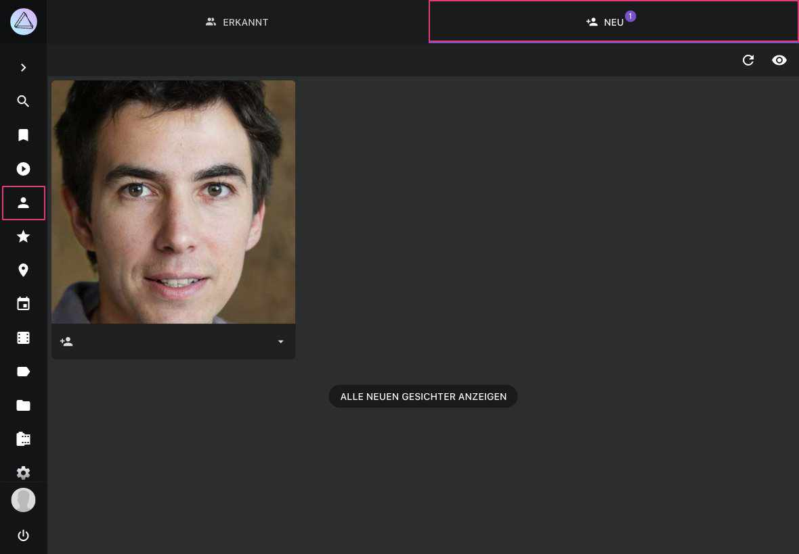{ class="shadow" }

### Warum werden im Bereich NEU nicht alle erkannten Gesichter angezeigt?

Im Bereich *NEU* werden nur erkannte Gesichts-Cluster angezeigt. In deiner Sammlung kann es noch tausende weitere, nicht gruppierte Gesichter geben, wie z. B. Gesichter auf Shampooflaschen
oder im Fernsehen.

Du kannst diese Bilder finden, indem du nach `face:new` suchst. Falls du bestimmte Bilder suchst, empfehlen wir, die Suche mit anderen Filtern wie `year` oder `country` zu kombinieren. Im *Personen*-Tab des [Bearbeitungs-Dialogs](edit.md) werden alle Gesichter angezeigt, sodass du sie benennen oder eine falsche Zuordnung über die Schaltfläche :material-eject: melden kannst.

### Wenn ein Gesicht nicht erkannt wurde... ###

Gesichter können aus mehreren Gründen nicht erkannt werden:

- Unsere [neueste Version](https://docs.photoprism.app/release-notes/#november-30-2025) beinhaltet eine verbesserte Gesichtserkennung. Nach einem Update solltest du einen [kompletten Rescan](../library/originals.md#index-vollstandig-aktualisieren) durchführen oder `photoprism faces index` [im Terminal ausführen](https://docs.photoprism.app/getting-started/docker-compose/#opening-a-terminal), um weitere zuvor übersehene Gesichter zu finden
- Möglicherweise musst du warten, bis die Indexierung abgeschlossen ist, da die Gesichtserkennung erst danach beginnt
- Bei Bildstapeln wird nur die Primärdatei nach Gesichtern durchsucht
- Gesichter können kleiner als die konfigurierte Mindestgröße sein
- Unsere Gesichtserkennung hat das Bild nicht gründlich genug gescannt
- Eine reduzierte Auflösung sowie Qualität von generierten [Vorschaubildern](../settings/advanced.md) führt zu schlechteren Gesichtserkennungs-Ergebnissen
- Der Kontrast spielt eine große Rolle, so dass ein helles Gesicht mit grauen Haaren auf einem grauen Hintergrund für unsere Gesichtserkennung weniger auffällig sein kann als für dich
- In sehr seltenen Fällen kann ein Gesicht als falsch-positiv eingestuft und daher ignoriert werden

!!! tldr ""
    Die Gesichtserkennung vergleicht die Ähnlichkeit von Gesichtern. Der Ähnlichkeits‑Schwellwert für ein Gesicht
    wird reduziert, wenn du ein Gesicht aus einem Cluster entfernst.

## Gesichter identifizieren ##
=== "Unter Personen"
     1. Gehe zu *Personen*
     2. Gehe zu *Neu*
     3. Klicke in das Eingabefeld
     4. Beginne einen Namen einzugeben
     5. Drücke *Enter*

    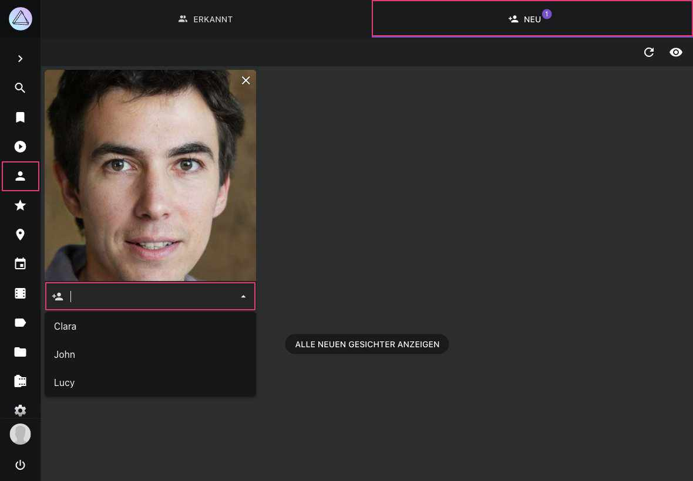{ class="shadow" }

=== " Im Bearbeitungs-Dialog"

     1. Öffne den [*Bearbeitungs-Dialog*](edit.md)
     2. Gehe zu *Personen*
     3. Klicke in das Eingabefeld
     4. Beginne einen Namen einzugeben
     5. Drücke *Enter*

    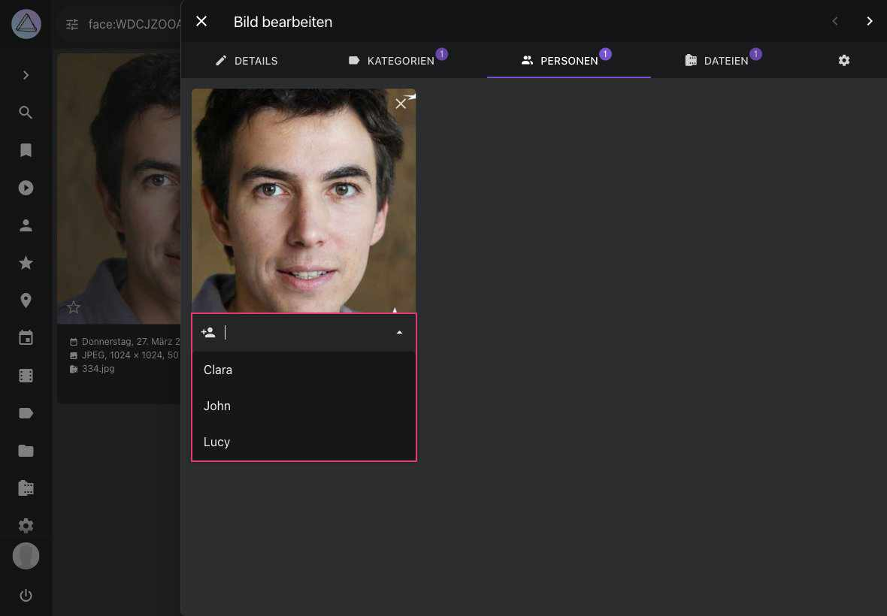{ class="shadow" }

     Du kannst Namen auch direkt aus der [Info-Seitenleiste](info-sidebar.md) des Vollbildbetrachters zuweisen. Sie ist außerdem der einzige Ort, an dem du ein Gesicht **manuell markieren** kannst, das PhotoPrism bei der automatischen Erkennung übersehen hat.

!!! note ""
    Passt der eingegebene Name zu niemandem in deiner Bibliothek, fragt PhotoPrism nach, bevor eine neue Person angelegt wird. So entsteht durch einen Tippfehler nicht unbemerkt ein zweiter Eintrag für jemanden, den du bereits benannt hast.

Die Person wird nun unter *Erkannt* angezeigt

!!! tip ""
    Wenn du Gesichter bereits in einer anderen Anwendung wie Adobe Bridge, Lightroom, digiKam, ACDSee oder Windows benannt hast, kann PhotoPrism diese Namen beim Indexieren aus den XMP-Metadaten übernehmen, sodass du sie nicht erneut eingeben musst. Aktiviere dafür [*Gesichter aus XMP importieren*](../settings/advanced.md#gesichter-aus-xmp-importieren).

## Cover für eine Person ändern ##
1. Gehe zum Tab [Personen](./edit.md#personen-bearbeiten) im Bearbeitungs-Dialog des Bildes, auf dem das Gesicht zu sehen ist, das du als Titelbild verwenden möchtest
2. Fahre mit der Maus über :material-dots-vertical: in der oberen rechten Ecke des Gesichts
3. Klicke auf *Als Titelbild festlegen*

## Personen ausblenden ##
Du kannst Personen im Bereich *Erkannt* ausblenden, indem du :material-close: klickst.
Eine Person auszublenden hält ihren Namen außerdem von Konten zurück, die keine privaten Inhalte
sehen dürfen — siehe [Privat & Verborgen](#private-hidden-people).

!!! attention ""
    Bilder von ausgeblendeten Personen tauchen weiterhin in Suchergebnissen auf.

{ class="shadow" }

Um alle Personen, inklusive ausgeblendete, zu sehen klicke :material-eye:.

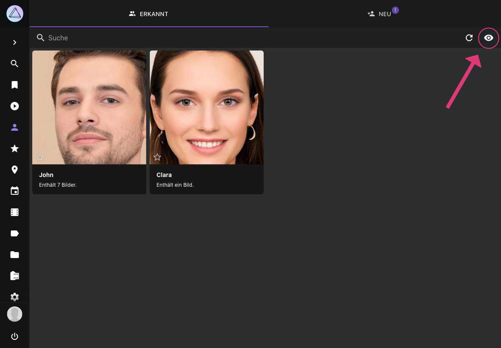{ class="shadow" }

Ausgeblendete Personen werden wieder angezeigt, wenn du :material-eye-off: klickst.

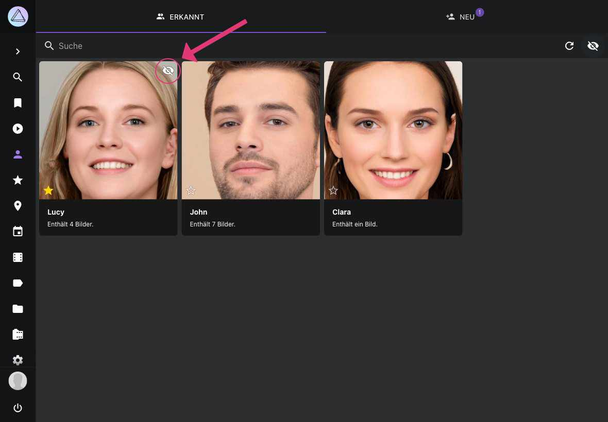{ class="shadow" }

## Gesichter ausblenden ##
Du kannst Gesichts-Cluster im Bereich *Neu* auf die gleiche Weise wie [Personen](#personen-ausblenden) ausblenden.

## Privat & Verborgen { #private-hidden-people }

Nicht jede Person in einer geteilten Bibliothek soll für jedes Konto namentlich sichtbar sein.
Öffne den Dialog *Bearbeiten* einer Person, um sie als **Privat** oder **Verborgen** zu markieren:

| Option        | Wirkung                                                                     |
|---------------|-----------------------------------------------------------------------------|
| **Privat**    | Hält die Person von Konten zurück, die keine privaten Inhalte sehen dürfen. |
| **Verborgen** | Dasselbe, und nimmt die Person zusätzlich für alle aus *Erkannt* heraus.    |

**Verborgen** zu setzen entspricht dem [Ausblenden einer Person](#personen-ausblenden) mit
:material-close:. *Betrachter* sowie *Gäste* und *Besucher*, die einen Freigabe-Link öffnen, sehen
die Namen von Personen nicht, die als privat oder verborgen markiert sind; *Admins* und *Benutzer*
sehen sie wie gewohnt und können beide Optionen ändern.
[Mehr erfahren ›](../users/roles.md)

Für ein Konto, das sie nicht sehen darf, erscheint eine zurückgehaltene Person nicht unter
*Personen*, wird in der *Personen*-Liste eines Bildes nicht genannt und ihre Gesichtsregion wird dort
nicht angezeigt. Ihr Name bleibt außerdem aus automatisch erzeugten Titeln und Bildunterschriften
heraus, und eine Suche danach findet ihre Bilder nicht; bereits vorhandene Bilder werden beim
nächsten Wartungsdurchlauf aktualisiert, plane dafür einige Minuten ein.

!!! note ""
    **Die Bilder bleiben sichtbar.** Nur der Name und die Gesichtsregion werden zurückgehalten — wer
    die Bibliothek durchsehen darf, sieht die Bilder weiterhin. Das ist keine Verschlüsselung und
    keine Passwortabfrage.

## Alle Bilder einer Person ansehen ##
=== "Unter Personen"
     1. Gehe zu *Personen*
     2. Gehe zu *Erkannt*
     3. Klicke auf eine Person

    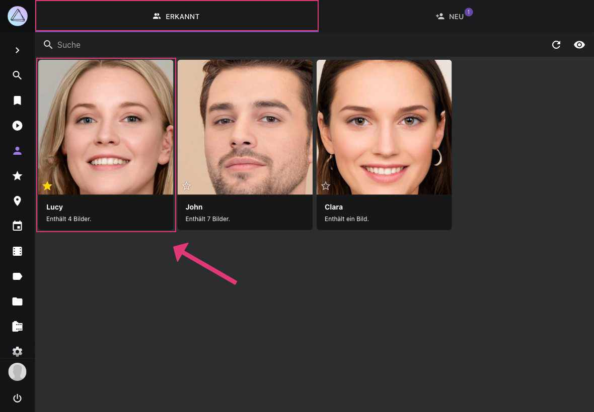{ class="shadow" }

=== "Über die Suche"
     1. Gehe zu *Suche*
     2. Suche nach person:"jane-doe"

    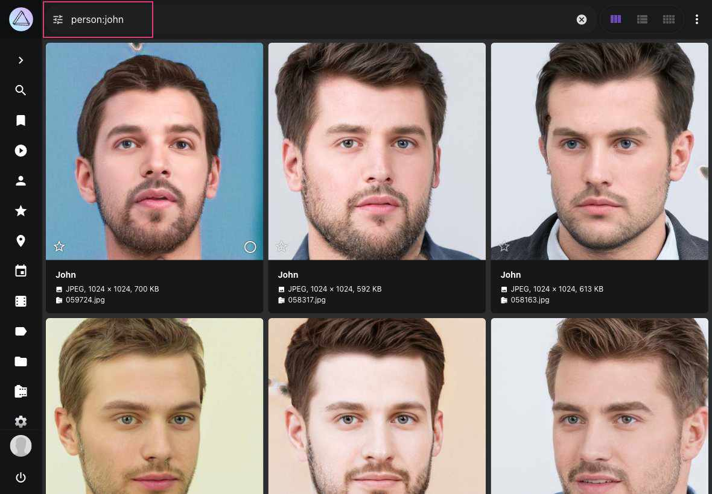{ class="shadow" }

## Personen umbenennen ##

1. Gehe zu *Personen*
2. Gehe zu *Erkannt*
3. Klicke auf den Namen
4. Gib einen neuen Namen ein
5. Klicke auf *Speichern*

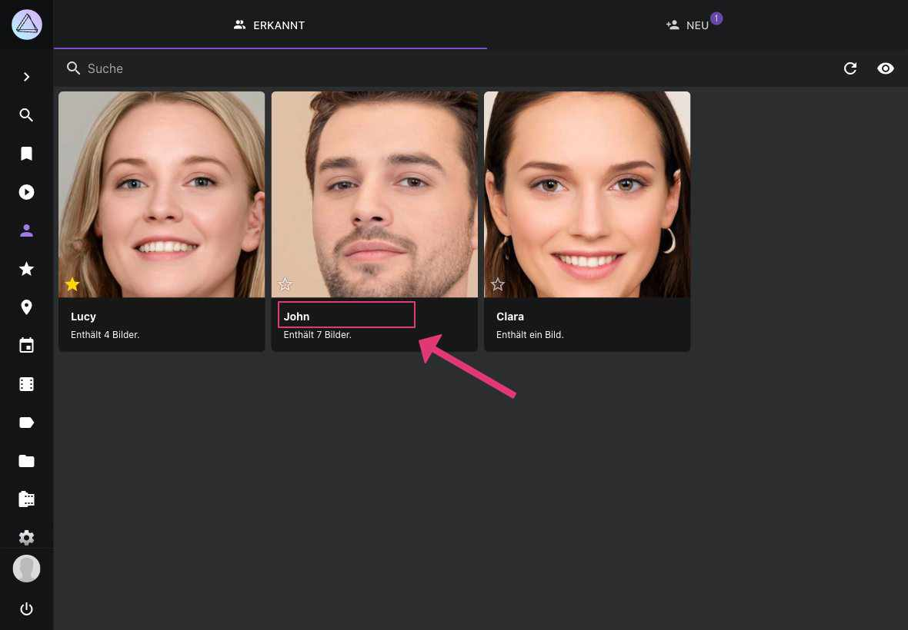{ class="shadow" }

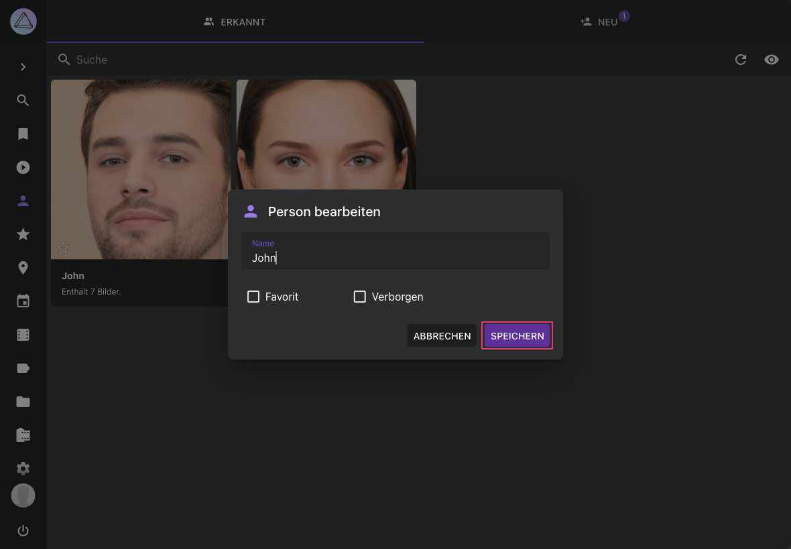{ class="shadow" }

## Gesicht einer anderen Person zuordnen ##
Wenn einem Gesicht die falsche Person zugeordnet ist, kannst du dies ändern.

!!!attention ""
    Jedes Mal, wenn du ein Gesicht aus einem Cluster aussortierst, werden die Gesichts-Cluster im Hintergrund aktualisiert.

1. Öffne den [*Bearbeitungs-Dialog*](edit.md)
2. Gehe zu *Personen*
3. Klicke :material-eject:
4. Nun kannst du einen neuen Namen eingeben, oder das Feld leer lassen

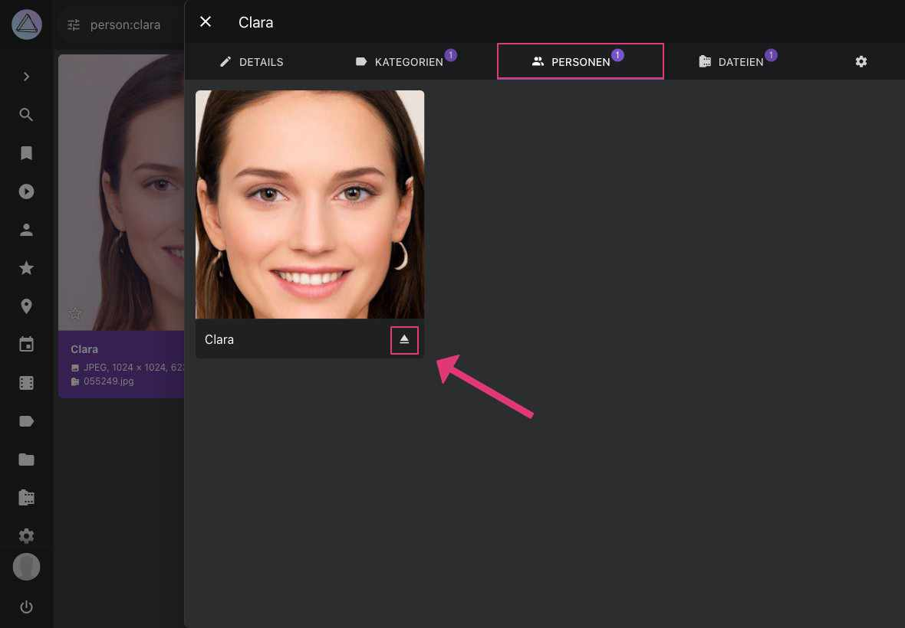{ class="shadow" }

Du kannst Zuordnungen auch über die [Info-Seitenleiste](info-sidebar.md) des Vollbildbetrachters ändern.

## Gesichter entfernen ##
Falls etwas Falsches als Gesicht erkannt wurde, oder dich ein Gesicht nicht interessiert, kannst du es entfernen.

1. Öffne den [*Bearbeitungs-Dialog*](edit.md)
2. Gehe zu *Personen*
3. Klicke :material-close:

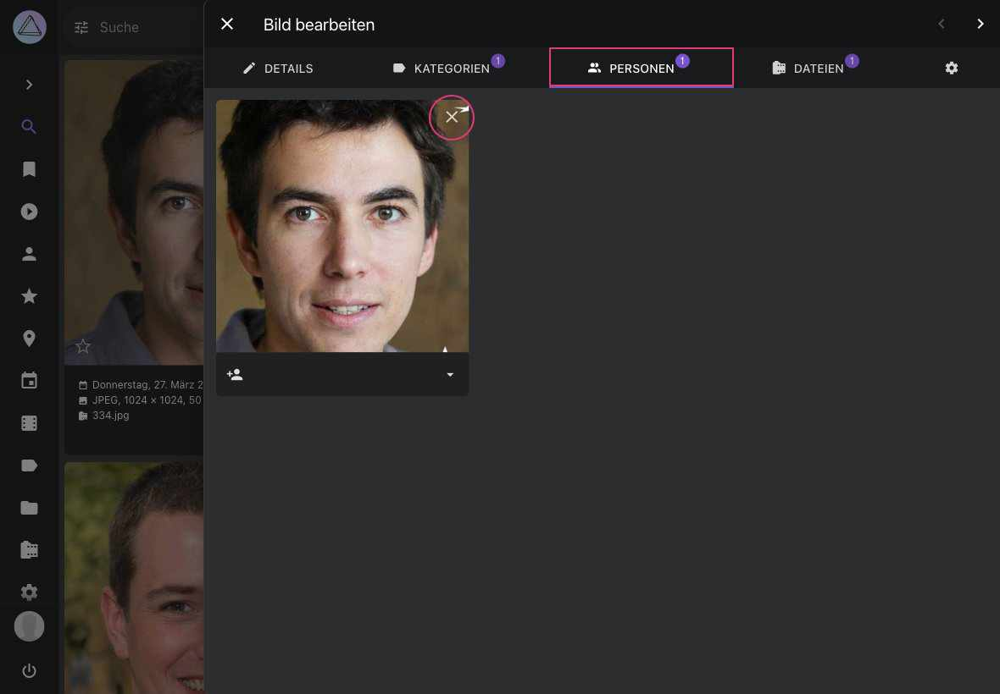{ class="shadow" }

Bevor die Seite neu geladen wird kannst du diese Aktion rückgängig machen.

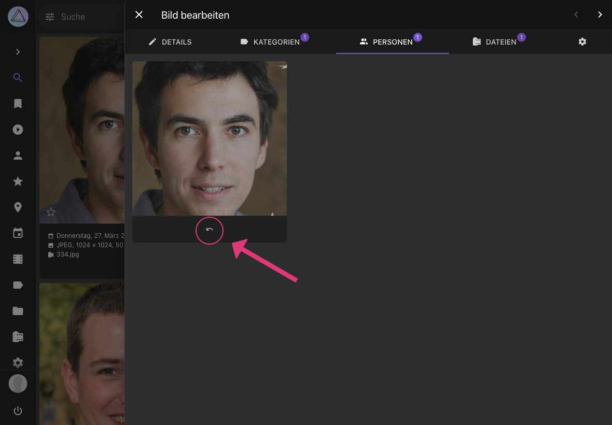{ class="shadow" }

Gesichter können auch über die [Info-Seitenleiste](info-sidebar.md) des Vollbildbetrachters entfernt werden.

## Alle Bilder einer Person herunterladen ##
1. Gehe zu *Personen*
2. Selektiere eine Person
3. Öffne das Kontext-Menü
4. Klicke :material-download:

{ class="shadow" }

## Album aus Personen erstellen ##
1. Gehe zu *Personen*
2. Selektiere eine Person
3. Öffne das Kontext-Menü
4. Klicke :material-bookmark:
5. Wähle ein existierendes Album oder gib einen neuen Albumnamen ein
6. Klicke auf *Hinzufügen*

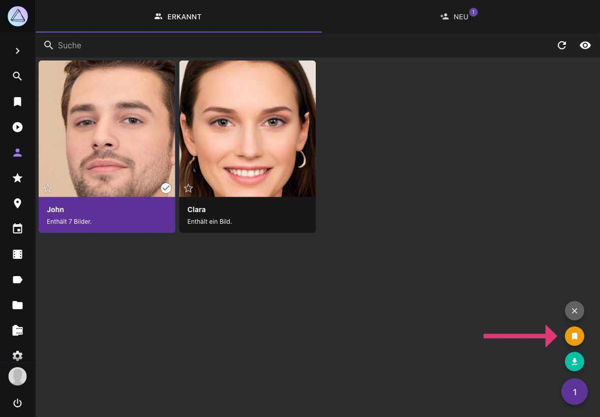{ class="shadow" }

## Suche ##
Du kannst Bilder von bestimmten Personen mit Hilfe der folgenden Suchanfragen finden

- `people`, `faces` oder `faces:true` findet alle Bilder mit Gesichtern
- `faces:false` findet alle Bilder ohne Gesichter
- `faces:3` findet alle Bilder mit mindestens 3 Personen
- `person:"John Doe"` oder `subject:"John Doe"` findet alle Bilder der Person John Doe
- `people:"John"` oder `subjects:"John"` findet alle Bilder von Personen, deren Namen John enthält

Der person/subject sowie der people/subjects Filter kann in Kombination mit & und | verwendet werden (siehe [Suche](../search/filters.md)).
Suchfilter können auch kombiniert werden.

`person:"John Doe&Jane Doe" faces:3` findet alle Bilder auf denen John und Jane Doe und mindestens eine weitere Person abgebildet sind.

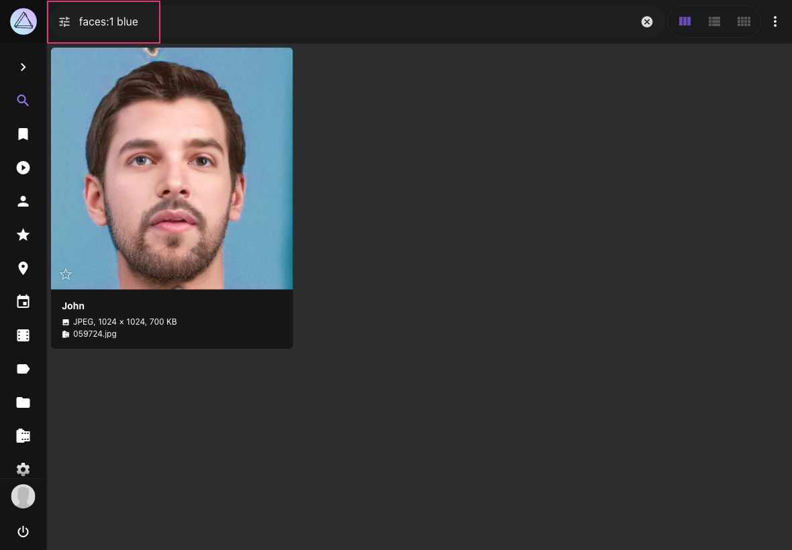{ class="shadow" }

## Bekannte Probleme ##

Die automatische Erkennung hat Grenzen: Bei kleinen Kindern und bei Bildern derselben Person, die viele Jahre auseinanderliegen, ist sie weniger zuverlässig, nicht aufrecht abgebildete Gesichter werden oft gar nicht erkannt, und auf älterer Hardware kann sie langsam sein. Die vollständige Liste und die Gründe dafür findest du unter [Bekannte Probleme > Gesichtserkennung](https://docs.photoprism.app/known-issues/#face-recognition).

Wenn Gesichter fehlen, Personen falsch gruppiert werden, Namen nicht erhalten bleiben oder das Zuordnen langsam ist, arbeite die Checklisten unter [Fehlerbehebung > Gesichtserkennung](https://docs.photoprism.app/getting-started/troubleshooting/face-recognition/) durch.

!!! info "Geplante Funktionen"
    - automatische Sicherung benannter Personen in YAML-Dateien

*[Gesichts-Cluster]: Ein Cluster ist eine Gruppe von Gesichtern, die aufgrund ihrer Ähnlichkeit derselben Person zugeordnet werden.
