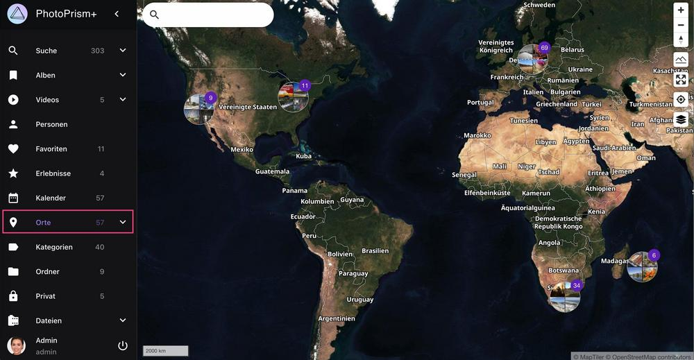
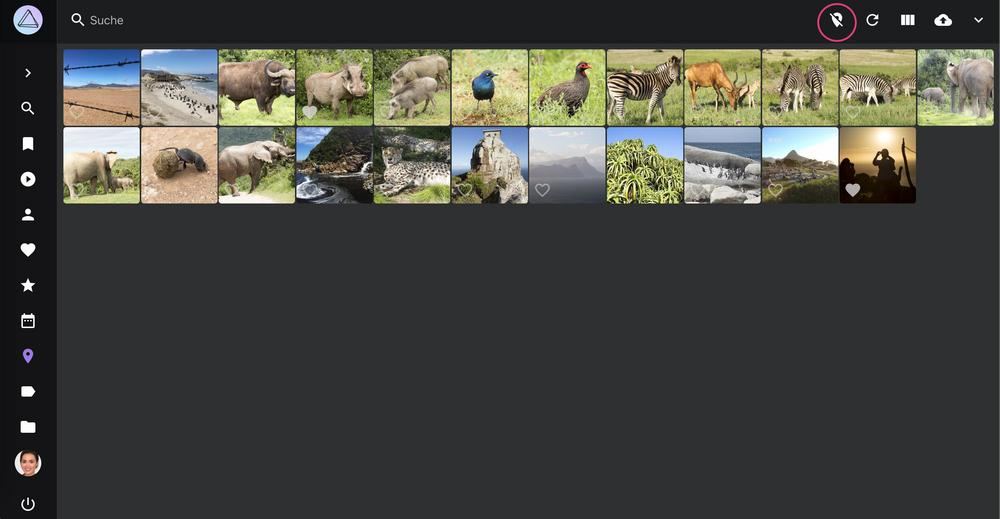

# Karten #
Im Bereich *Karten* werden alle mit GPS-Daten versehenen Bilder auf einer Weltkarte dargestellt.

{ class="shadow" }

Du kannst einen Standard-Kartenstil in [Einstellungen](../settings/general.md) festlegen oder zwischen verschiedenen Stilen wählen, indem du auf :material-layers-triple: klickst.

Um alle Fotos eines Cluster anzuzeigen, klicke auf das Cluster.

{ class="shadow" }

{ class="shadow" }

Um die Bilder dieses Standorts in der Suche zu öffnen klicke :material-tab:.

Um den Standort-Suchfilter zu entfernen klicke :material-map-marker-off-outline:.

{ class="shadow" }

## Suche 

Bei der Nutzung der Suche werden nur Fotos auf der Karte angezeigt, die dem Suchbegriff entsprechen. Du kannst die meisten unserer [Suchfilter](./search.md) auch auf der Karte verwenden.

{ class="shadow" }

## 3D Modus aktivieren

Die Karten "Satellit", "Outdoor" und "Topographisch" können auch in 3D betrachtet werden.

Um den 3D Modus zu aktivieren klicke auf :material-image-filter-hdr-outline:. Um die Perspektive zu ändern, kannst du die rechte Maustaste gedrückt halten und bewegen.

{ class="shadow" }

!!! tip ""
    Um von der *Karteikarten Ansicht* im Bereich *Bilder* zu einem bestimmten Bild auf der Weltkarte zu wechseln, klicke auf den Aufnahmeort dieses Bilder.

{ class="shadow" }
{ class="shadow" }
