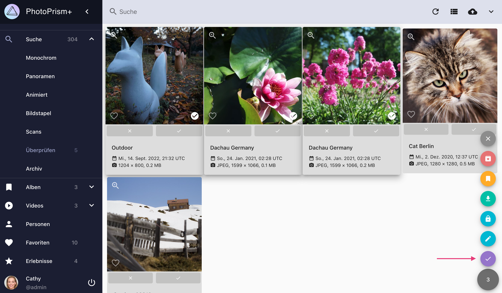
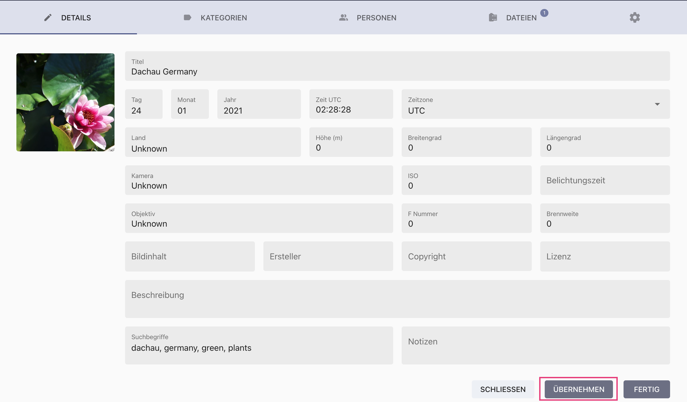

# Überprüfe Bilder mit geringer Qualität oder nicht fotografischem Inhalt #
Wenn neue Bilder hinzugefügt werden, wird automatisch die Qualität auf einer Skala von 1 bis 5 bewertet. Bilder, die mit weniger als 3 bewertet sind, werden erst nach einer manuellen Überprüfung in den Bereich *Suche* übernommen.

Die Qualität wird anhand der folgenden Kriterien bestimmt:

* Vorhandensein von Datum und/oder GPS-Koordinaten
* Für Aufnahmen nach 2012 sollte die Auflösung größer als 2 Megapixel sein
* Bild ist nicht als *Info* oder *Screenshot* eingestuft
* Bild ist ein Favorit, wurde editiert oder bestätigt.

!!! info ""
    In den [Einstellungen](../settings/general.md) kann der Qualitätsfilter und somit auch der Überprüfungs-Prozess deaktiviert werden.

### Bilder übernehmen ###

=== "Kontext-Menü"
    1. Gehe zu *Überprüfen*
    2. Selektiere Bilder und öffne das Kontext-Menu
    3. Klicke :material-check:

    { class="shadow" }

=== "Bearbeitungs-Dialog"
     1. Öffne den [*Bearbeitungs-Dialog*](edit.md) des Bildes
     2. Klicke auf *Übernehmen*

     { class="shadow" }

=== "Karteikarten Ansicht"
     1. Gehe zu *Überprüfen*     
     2. Öffne die *Karteikarten Ansicht*
     3. Klicke :material-check:

     { class="shadow" }

!!! attention ""
    Die Qualitätsbewertung wird automatisch aktualisiert.
    Wenn Datums- oder Ortsinformationen zu einem Bild hinzugefügt werden oder ein Bild als Favorit markiert wird, erhöht sich die Bewertung automatisch.
    Falls dadurch der Qualitätswert größer oder gleich 3 ist, wird das Bild automatisch übernommen.