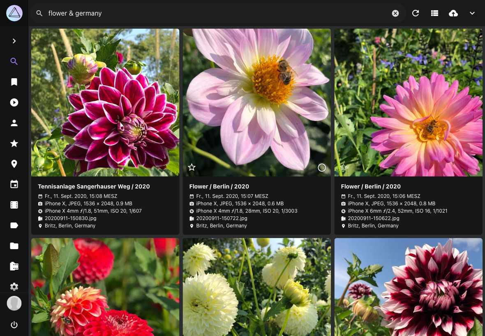

# Suchfilter benutzen #

Mit den leistungsstarken Suchfiltern von PhotoPrism kannst du ganz einfach bestimmte Fotos und Videos finden:

* Bilder von bestimmten Personen
* Bilder von bestimmten Motiven, z.B. Blume oder Katze
* Bilder mit einer bestimmten Hauptfarbe
* Bilder mit bestimmten Datei- oder Verzeichnisnamen
* Bilder von bestimmten Orten 
* Andere Metadaten wie Kamera, Linse oder Chroma...

Probier es einfach aus!

   { class="shadow" }

## Einleitung ##
Folgende Filter können auf der Filterleiste gesetzt werden:

* Land, Jahr, Monat, Reihenfolge, Kamera, Farbe, Kategorie

Sind mehrere Filter gesetzt, werden nur Bilder von der Suche berücksichtigt, die allen Filterkriterien entsprechen.

 { class="shadow" }

Darüber hinaus können diese und viele andere Filter wie folgt in das Suchfeld der Toolbar eingegeben werden:

    `label:cat color:green type:live`

Die komplette Liste der Filter findest du weiter [unten](#suchfilter-ubersicht).

   { class="shadow" }

### UND Suche ###
Um verschiedene Filter zu kombinieren, verwende ein Leerzeichen als Trennzeichen:
```
mono:true review:false
```

Gefunden werden alle Bilder, die monochrom **UND** nicht in Überprüfen sind.

Manche Suchfilter können mit & verwendet werden:

```bigquery
keywords:buffalo&water
```

Oder:

```bigquery
keywords:"buffalo & water"
```

Diese Suche resultiert in allen Bildern, die die Suchbegriffe buffalo **UND** water haben.

& funktioniert in Kombination mit folgenden Suchfiltern:

* albums, keywords, subject/person, subjects/people.

!!!info ""
    Der label Suchfilter funktioniert nicht mit &. Du kannst alternativ den keywords Filter verwenden, da 
    alle Labels auch Suchbegriffe sind.

### ODER Suche ###
Für eine ODER Suche verwende |:

```
label:cat|dog
```

Hier werden alle Bilder mit Kategorie Katze **ODER** Hund angezeigt.

Folgende Suchfilter unterstützen |:

* albums, color, country, state, city, day, month, year, keywords, label, path, subject/person, subjects/people, title, type, name, filename, original, hash


### Wildcard ###
Das `*` fungiert in der Suche als Wildcard:

```
name:"IMG_23*"
```

Gefunden werden alle Bilder, deren Namen mit `IMG_23` starten.


```
name:"*_23*"
```

Hier werden alle Bilder gefunden, die  `_23` im Namen enthalten, beispielsweise `IMG_2356.MOV` , `2021_02_23.jpg`, etc.

!!!info ""
    Wildcards können mit & oder | verwendet werden : `filename:"*IMG123*|*_22F6FC19.jpg"`

## Suchfilter Übersicht ##
Dies ist eine vollständige Liste der unterstützten Suchfilter mit Beispielen. Filter können in der Regel kombiniert werden, es sei denn, sie widersprechen sich, z.B. können die Ergebnisse nicht gleichzeitig einfarbig sein und eine hohe Farbsättigung haben.

|  Filter   |   Type    |               Examples                |                                                                   Notes                                                                    |
|-----------|-----------|---------------------------------------|--------------------------------------------------------------------------------------------------------------------------------------------|
| dist      | decimal   | dist:50                               | Distance to Position (km)                                                                                                                  |
| lat       | decimal   | lat:41.894043                         | GPS Position (Latitude)                                                                                                                    |
| lng       | decimal   | lng:-87.62448                         | GPS Position (Longitude)                                                                                                                   |
| chroma    | number    | chroma:70                             | Chroma (0-100)                                                                                                                             |
| diff      | number    | diff:-1 diff:2                        | Differential Perceptual Hash (000000-FFFFFF)                                                                                               |
| quality   | number    | quality:0 quality:3                   | Minimum quality score (1-7)                                                                                                                |
| album     | string    | album:berlin                          | Album UID or Name, supports * wildcards                                                                                                    |
| albums    | string    | albums:"South Africa & Birds"         | Album Names (combinable with & and \|)                                                                                                     |
| alt       | string    | alt:300-500                           | GPS Altitude (m)                                                                                                                           |
| camera    | string    | camera:canon                          | Camera Make/Model Name                                                                                                                     |
| category  | string    | category:airport                      | Location Category                                                                                                                          |
| city      | string    | city:"Berlin"                         | Location City (separate with \|)                                                                                                           |
| color     | string    | color:"red\|blue"                     | Color Name (purple, magenta, pink, red, orange, gold, yellow, lime, green, teal, cyan, blue, brown, white, grey, black) (separate with \|) |
| country   | string    | country:"de\|us"                      | Location Country Code (separate with \|)                                                                                                   |
| day       | string    | day:3\|13                             | Day of Month (1-31, separate with \|)                                                                                                      |
| f         | string    | f:2.8-4.5                             | Aperture (f-number)                                                                                                                        |
| face      | string    | face:PN6QO5INYTUSAATOFL43LL2ABAV5ACZG | Face ID, yes, no, new, or kind                                                                                                             |
| faces     | string    | faces:yes faces:3                     | Minimum number of Faces (yes = 1)                                                                                                          |
| favorite  | string    | favorite:true favorite:false          | Finds images by favorite status                                                                                                            |
| filename  | string    | filename:"2021/07/12345.jpg"          | File Name with path and extension (separate with \|)                                                                                       |
| folder    | string    | folder:"*/2020"                       | Path Name (separate with \|), supports * wildcards                                                                                         |
| geo       | string    | geo:yes                               | Finds pictures with or without coordinates                                                                                                 |
| hash      | string    | hash:2fd4e1c67a2d                     | SHA1 File Hash (separate with \|)                                                                                                          |
| id        | string    | id:123e4567-e89b-...                  | Finds pictures by Exif UID, XMP Document ID or Instance ID                                                                                 |
| iso       | string    | iso:200-400                           | ISO Number (light sensitivity)                                                                                                             |
| keywords  | string    | keywords:"sand&water"                 | Keywords (combinable with & and \|)                                                                                                        |
| label     | string    | label:cat\|dog                        | Label Names (separate with \|)                                                                                                             |
| latlng    | string    | latlng:"name"                         | GPS Bounding Box (Lat N, Lng E, Lat S, Lng W)                                                                                              |
| lens      | string    | lens:ef24                             | Lens Make/Model Name                                                                                                                       |
| mm        | string    | mm:28-35                              | Focal Length (35mm equivalent)                                                                                                             |
| mp        | string    | mp:3-6                                | Resolution in Megapixels (MP)                                                                                                              |
| month     | string    | month:7\|10                           | Month (1-12, separate with \|)                                                                                                             |
| name      | string    | name:"IMG_9831-112*"                  | File Name without path and extension (separate with \|)                                                                                    |
| near      | string    | near:pqbcf5j446s0futy                 | Finds nearby pictures (UID)                                                                                                                |
| olc       | string    | olc:8FWCHX7W+                         | OLC Position (Open Location Code)                                                                                                          |
| original  | string    | original:"IMG_9831-112*"              | Original file name of imported files (separate with \|)                                                                                    |
| path      | string    | path:2020/Holiday                     | Path Name (separate with \|), supports * wildcards                                                                                         |
| people    | string    | people:"Jane & John"                  | Subject Names (combinable with & and \|)                                                                                                   |
| person    | string    | person:"Jane Doe & John Doe"          | Subject Names, exact matches (combinable with & and \|)                                                                                    |
| s2        | string    | s2:4799e370ca54c8b9                   | S2 Position (Cell ID)                                                                                                                      |
| scan      | string    | scan:true scan:false                  | Finds scanned photos and documents                                                                                                         |
| state     | string    | state:"Baden-Württemberg"             | Location State (separate with \|)                                                                                                          |
| subject   | string    | subject:"Jane Doe & John Doe"         | Alias for person                                                                                                                           |
| subjects  | string    | subjects:"Jane & John"                | Alias for people                                                                                                                           |
| title     | string    | title:"Lake*"                         | Title (separate with \|)                                                                                                                   |
| type      | string    | type:raw                              | Media Type (image, video, raw, live, animated); separate with \|                                                                           |
| uid       | string    | uid:pqbcf5j446s0futy                  | Limits results to the specified internal unique IDs                                                                                        |
| year      | string    | year:1990\|2003                       | Year (separate with \|)                                                                                                                    |
| animated  | switch    | animated:yes                          | Finds animated GIFs                                                                                                                        |
| archived  | switch    | archived:yes                          | Finds archived pictures                                                                                                                    |
| error     | switch    | error:yes                             | Finds pictures with errors                                                                                                                 |
| hidden    | switch    | hidden:yes                            | Finds hidden pictures (broken or unsupported)                                                                                              |
| landscape | switch    | landscape:yes                         | Finds pictures in landscape format                                                                                                         |
| live      | switch    | live:yes                              | Finds Live Photos and short videos                                                                                                         |
| mono      | switch    | mono:yes                              | Finds pictures with few or no colors                                                                                                       |
| panorama  | switch    | panorama:yes                          | Finds pictures with an aspect ratio > 1.9:1                                                                                                |
| photo     | switch    | photo:yes                             | Finds only photos, no videos                                                                                                               |
| portrait  | switch    | portrait:yes                          | Finds pictures in portrait format                                                                                                          |
| primary   | switch    | primary:yes                           | Finds primary JPEG files only                                                                                                              |
| private   | switch    | private:yes                           | Finds private pictures                                                                                                                     |
| public    | switch    | public:yes                            | Excludes private pictures                                                                                                                  |
| raw       | switch    | raw:yes                               | Finds pictures with RAW image file                                                                                                         |
| review    | switch    | review:yes                            | Finds pictures in review                                                                                                                   |
| square    | switch    | square:yes                            | Finds images with an aspect ratio of 1:1                                                                                                   |
| stack     | switch    | stack:yes                             | Finds pictures with more than one media file                                                                                               |
| stackable | switch    | stackable:yes                         | Finds pictures that can be stacked with additional media files                                                                             |
| unsorted  | switch    | unsorted:yes                          | Finds pictures not in an album                                                                                                             |
| unstacked | switch    | unstacked:yes                         | Finds pictures with a file that has been removed from a stack                                                                              |
| vector    | switch    | vector:yes                            | Finds vector graphics only                                                                                                                 |
| video     | switch    | video:yes                             | Finds video files only                                                                                                                     |
| after     | timestamp | after:"2022-01-30"                    | Finds pictures taken after this date                                                                                                       |
| before    | timestamp | before:"2022-01-30"                   | Finds pictures taken before this date                                                                                                      |


!!! question "Warum kann ich Live Fotos nicht abspielen oder Bildstapel finden, wenn ich nach bestimmten Bildern suche?"
    Unsere Such-API und die Benutzeroberfläche führen eine Dateisuche durch. Dies ist beabsichtigt, da "Bildstapel" Dateien unterschiedlichen Typs und unterschiedlicher Eigenschaften, wie z. B. Farbe, enthalten können.

    So kann es beispielsweise Farb- und Schwarzweißversionen geben. Wenn nach diesen gesucht wird oder Bilder nach Farbe sortiert werden, muss die Benutzeroberfläche nun einzelne Dateien anzeigen. Andernfalls würden die Ergebnisse, die ein Farbbild/Video anzeigen, wenn nach Schwarzweiß gefiltert wird, keinen Sinn ergeben.    
    
    Ebenso finden Sie bei der Suche nach `Dateiname.mp4.*` nur JPEGs ohne Video, da die Videodateierweiterung `.mp4` nicht mit einem Punkt endet.

    Wir empfehlen die Verwendung der Filter `path:` und/oder `name:` mit Wildcards, wenn die Suche nach einzelnen Dateien die Suchergebnisse zu sehr einschränkt. Die meisten Nutzer werden alle zusammengehörigen Dateien finden wollen, damit sie zusammen angezeigt werden können, z. B. als Live-Fotos, die aus einem Video und einem Bild bestehen.    
    Sie können diese Filter mit anderen Filtern wie `live` kombinieren, um sicherzustellen, dass die Ergebnisse nur Bilder mit einem bestimmten Medientyp enthalten. Alternativ können Sie auch den Filter "filename:" mit einem freizügigeren Platzhalter verwenden, der die Dateierweiterung ausschließt.