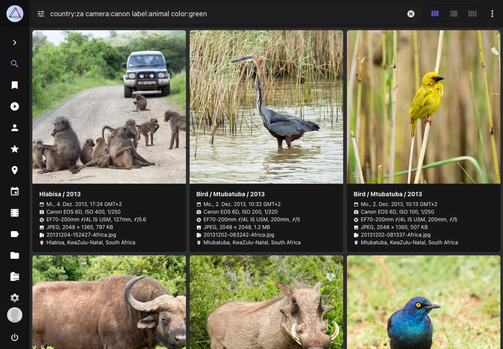

# Suchfilter benutzen #

Mit den leistungsstarken Suchfiltern von PhotoPrism kannst du ganz einfach bestimmte Fotos und Videos finden:

* Bilder von bestimmten Personen
* Bilder von bestimmten Motiven, z.B. Blume oder Katze
* Bilder mit einer bestimmten Hauptfarbe
* Bilder mit bestimmten Datei- oder Verzeichnisnamen
* Bilder von bestimmten Orten 
* Andere Metadaten wie Kamera, Linse oder Chroma...

Probier es einfach aus!

   { class="shadow" }

## Einleitung ##
Folgende Filter können auf der Filterleiste gesetzt werden:

* Land, Jahr, Monat, Reihenfolge, Kamera, Farbe, Kategorie

Sind mehrere Filter gesetzt, werden nur Bilder von der Suche berücksichtigt, die allen Filterkriterien entsprechen.

 { class="shadow" }

Darüber hinaus können diese und viele andere Filter wie folgt in das Suchfeld der Toolbar eingegeben werden:

    `label:cat color:green type:live`

Die komplette Liste der Filter findest du weiter [unten](#suchfilter-ubersicht).

   { class="shadow" }

### UND Suche ###
Um verschiedene Filter zu kombinieren, verwende ein Leerzeichen als Trennzeichen:
```
mono:true review:false
```

Gefunden werden alle Bilder, die monochrom **UND** nicht in Überprüfen sind.

Manche Suchfilter können mit & verwendet werden:

```bigquery
keywords:buffalo&water
```

Oder:

```bigquery
keywords:"buffalo & water"
```

Diese Suche resultiert in allen Bildern, die die Suchbegriffe buffalo **UND** water haben.

& funktioniert in Kombination mit folgenden Suchfiltern:

* albums, keywords, subject/person, subjects/people.

!!!info ""
    Der label Suchfilter funktioniert nicht mit &. Du kannst alternativ den keywords Filter verwenden, da 
    alle Labels auch Suchbegriffe sind.

### ODER Suche ###
Für eine ODER Suche verwende |:

```
label:cat|dog
```

Hier werden alle Bilder mit Kategorie Katze **ODER** Hund angezeigt.

Folgende Suchfilter unterstützen |:

* albums, color, country, state, city, day, month, year, keywords, label, path, subject/person, subjects/people, title, type, name, filename, original, hash


### Wildcard ###
Das `*` fungiert in der Suche als Wildcard:

```
name:"IMG_23*"
```

Gefunden werden alle Bilder, deren Namen mit `IMG_23` starten.


```
name:"*_23*"
```

Hier werden alle Bilder gefunden, die  `_23` im Namen enthalten, beispielsweise `IMG_2356.MOV` , `2021_02_23.jpg`, etc.

!!!info ""
    Wildcards können mit & oder | verwendet werden : `filename:"*IMG123*|*_22F6FC19.jpg"`

## Suchfilter Übersicht ##
Dies ist eine vollständige Liste der unterstützten Suchfilter mit Beispielen. Filter können in der Regel kombiniert werden, es sei denn, sie widersprechen sich, z.B. können die Ergebnisse nicht gleichzeitig einfarbig sein und eine hohe Farbsättigung haben.

| Filter      | Type      | Examples                              | Notes                                                                                                                                          |
|:------------|:----------|:--------------------------------------|:-----------------------------------------------------------------------------------------------------------------------------------------------|
| dist        | decimal   | dist:50                               | Maximum distance to position in km                                                                                                             |
| lat         | decimal   | lat:41.894043                         | Position latitude (-90.0 to 90.0 deg)                                                                                                          |
| lng         | decimal   | lng:-87.62448                         | Position longitude (-180.0 to 180.0 deg)                                                                                                       |
| chroma      | number    | chroma:70                             | Chroma (0-100)                                                                                                                                 |
| diff        | number    | diff:-1 diff:2                        | Differential Perceptual Hash (000000-FFFFFF)                                                                                                   |
| quality     | number    | quality:0 quality:3                   | Minimum quality score (1-7)                                                                                                                    |
| album       | string    | album:berlin                          | Album UID or name, supports * wildcards                                                                                                        |
| albums      | string    | albums:"South Africa & Birds"         | Album names, combinable with & or \|                                                                                                           |
| alt         | string    | alt:300-500                           | Altitude (m)                                                                                                                                   |
| camera      | string    | camera:canon                          | Camera make or model                                                                                                                           |
| caption     | string    | caption:"Lake*"                       | Searches text in captions separated by \|, or specify false to find content without a caption                                                  |
| category    | string    | category:airport                      | Location category type                                                                                                                         |
| city        | string    | city:"Berlin"                         | City names, separated by \|                                                                                                                    |
| codec       | string    | codec:avc1                            | Media codec types separated by \|, e.g. jpeg, avc1, or hvc1                                                                                    |
| color       | string    | color:"red\|blue"                     | Color name separated by \|, e.g. purple, magenta, pink, red, orange, gold, yellow, lime, green, teal, cyan, blue, brown, white, grey, or black |
| country     | string    | country:"de\|us"                      | Country codes, separated by \|                                                                                                                 |
| day         | string    | day:3\|13                             | Days 1-31, separated by \|                                                                                                                     |
| description | string    | description:"Lake*"                   | Searches text in titles or captions separated by \|, or specify false to find content without a title or caption                               |
| f           | string    | f:2.8-4.5                             | Aperture (F-Number)                                                                                                                            |
| face        | string    | face:PN6QO5INYTUSAATOFL43LL2ABAV5ACZG | Find pictures with a specific face ID, you can also specify yes, no, new, or a face type                                                       |
| faces       | string    | faces:yes faces:3                     | Minimum number of detected faces (yes means 1)                                                                                                 |
| favorite    | string    | favorite:true favorite:false          | Finds favorite content                                                                                                                         |
| filename    | string    | filename:"2021/07/12345.jpg"          | File names including path and extension, separated by \|                                                                                       |
| folder      | string    | folder:"*/2020"                       | Alias for the path filter                                                                                                                      |
| geo         | string    | geo:yes                               | Finds content with or without latitude and longitude                                                                                           |
| hash        | string    | hash:2fd4e1c67a2d                     | SHA1 file hashes, separated by \|                                                                                                              |
| id          | string    | id:123e4567-e89b-...                  | Finds content with the specified Image, Document or Instance IDs, separated by \|                                                              |
| iso         | string    | iso:200-400                           | ISO number (light sensitivity)                                                                                                                 |
| keywords    | string    | keywords:"sand&water"                 | Keywords, combinable with & and \|                                                                                                             |
| label       | string    | label:cat\|dog                        | Label names, separated by \|                                                                                                                   |
| latlng      | string    | latlng:49.4,13.41,46.5,2.331          | Position bounding box (Lat N, Lng E, Lat S, Lng W)                                                                                             |
| lens        | string    | lens:ef24                             | Lens make or model                                                                                                                             |
| mm          | string    | mm:28-35                              | Focal length (35mm equivalent)                                                                                                                 |
| month       | string    | month:7\|10                           | Months from 1-12, separated by \|                                                                                                              |
| mp          | string    | mp:3-6                                | Resolution in Megapixels (MP)                                                                                                                  |
| name        | string    | name:"IMG_9831-112*"                  | File names without path and extension, separated by \|                                                                                         |
| near        | string    | near:pqbcf5j446s0futy                 | Finds nearby pictures (UID)                                                                                                                    |
| olc         | string    | olc:8FWCHX7W+                         | Open Location Code (OLC)                                                                                                                       |
| original    | string    | original:"IMG_9831-112*"              | Original file names of imported files, separated by \|                                                                                         |
| path        | string    | path:2020/Holiday                     | Path names separated by \|, supports * wildcards                                                                                               |
| people      | string    | people:"Jane & John"                  | Subject names, combinable with & or \|                                                                                                         |
| person      | string    | person:"Jane Doe & John Doe"          | Subject names, will be matched exactly and can be combined using & or \|                                                                       |
| s2          | string    | s2:4799e370ca54c8b9                   | Position, specified as S2 Cell ID                                                                                                              |
| scan        | string    | scan:true scan:false                  | Finds scanned photos and documents                                                                                                             |
| state       | string    | state:"Baden-Württemberg"             | State or province names, separated by \|                                                                                                       |
| subject     | string    | subject:"Jane Doe & John Doe"         | Alias for person                                                                                                                               |
| subjects    | string    | subjects:"Jane & John"                | Alias for people                                                                                                                               |
| title       | string    | title:"Lake*"                         | Searches text in titles separated by \|, or specify false to find content without a title                                                      |
| type        | string    | type:image\|raw\|live                 | Finds specific media types, such as image, raw, live, video, animated, audio, vector, or document, separated by \|                             |
| uid         | string    | uid:pqbcf5j446s0futy                  | Finds content with the specified internal UIDs, separated by \|                                                                                |
| year        | string    | year:1990\|2003                       | Years, separated by \|                                                                                                                         |
| animated    | switch    | animated:yes                          | Finds animated images only                                                                                                                     |
| archived    | switch    | archived:yes                          | Finds archived content                                                                                                                         |
| audio       | switch    | audio:yes                             | Finds audio content only                                                                                                                       |
| document    | switch    | document:yes                          | Finds PDF documents only                                                                                                                       |
| error       | switch    | error:yes                             | Finds content with errors                                                                                                                      |
| hidden      | switch    | hidden:yes                            | Finds hidden content (broken or unsupported)                                                                                                   |
| image       | switch    | image:yes                             | Finds regular photos and images only                                                                                                           |
| landscape   | switch    | landscape:yes                         | Finds landscape pictures only                                                                                                                  |
| live        | switch    | live:yes                              | Finds Motion and Live Photos only                                                                                                              |
| media       | switch    | media:yes                             | Finds live, video, audio, and animated content only                                                                                            |
| mono        | switch    | mono:yes                              | Pictures with few or no colors                                                                                                                 |
| panorama    | switch    | panorama:yes                          | Finds panorama pictures only (aspect ratio 1.9:1 or more)                                                                                      |
| photo       | switch    | photo:yes                             | Finds regular photos and images, as well as RAW and Live Photos                                                                                |
| portrait    | switch    | portrait:yes                          | Finds portrait pictures only                                                                                                                   |
| primary     | switch    | primary:yes                           | Finds primary JPEG or PNG files only                                                                                                           |
| private     | switch    | private:yes                           | Finds private content                                                                                                                          |
| public      | switch    | public:yes                            | Excludes private content                                                                                                                       |
| raw         | switch    | raw:yes                               | Finds RAW images only                                                                                                                          |
| review      | switch    | review:yes                            | Finds content in review                                                                                                                        |
| square      | switch    | square:yes                            | Finds square pictures only (aspect ratio 1:1)                                                                                                  |
| stack       | switch    | stack:yes                             | Finds content with more than one media file                                                                                                    |
| stackable   | switch    | stackable:yes                         | Finds content that can be stacked with additional files                                                                                        |
| unsorted    | switch    | unsorted:yes                          | Finds content that is not in an album                                                                                                          |
| unstacked   | switch    | unstacked:yes                         | Finds content with a file that has been removed                                                                                                |
| vector      | switch    | vector:yes                            | Finds vector graphics only                                                                                                                     |
| video       | switch    | video:yes                             | Finds video content only                                                                                                                       |
| added       | timestamp | added:"2006-01-02T15:04:05Z"          | Finds content added at or after this time                                                                                                      |
| after       | timestamp | after:"2022-01-30"                    | Finds content created on or after this date                                                                                                    |
| before      | timestamp | before:"2022-01-30"                   | Finds content created on or before this date                                                                                                   |
| edited      | timestamp | edited:"2006-01-02T15:04:05Z"         | Finds content edited at or after this time                                                                                                     |
| taken       | timestamp | taken:"2022-01-30"                    | Finds content created on the specified date                                                                                                    |
| updated     | timestamp | updated:"2006-01-02T15:04:05Z"        | Finds content updated at or after this time                                                                                                    |
                                                                                                   |

!!! question "Warum kann ich Live Fotos nicht abspielen oder Bildstapel finden, wenn ich nach bestimmten Bildern suche?"
    Unsere Such-API und die Benutzeroberfläche führen eine Dateisuche durch. Dies ist beabsichtigt, da "Bildstapel" Dateien unterschiedlichen Typs und unterschiedlicher Eigenschaften, wie z. B. Farbe, enthalten können.

    So kann es beispielsweise Farb- und Schwarzweißversionen geben. Wenn nach diesen gesucht wird oder Bilder nach Farbe sortiert werden, muss die Benutzeroberfläche nun einzelne Dateien anzeigen. Andernfalls würden die Ergebnisse, die ein Farbbild/Video anzeigen, wenn nach Schwarzweiß gefiltert wird, keinen Sinn ergeben.    
    
    Ebenso finden Sie bei der Suche nach `Dateiname.mp4.*` nur JPEGs ohne Video, da die Videodateierweiterung `.mp4` nicht mit einem Punkt endet.

    Wir empfehlen die Verwendung der Filter `path:` und/oder `name:` mit Wildcards, wenn die Suche nach einzelnen Dateien die Suchergebnisse zu sehr einschränkt. Die meisten Nutzer werden alle zusammengehörigen Dateien finden wollen, damit sie zusammen angezeigt werden können, z. B. als Live-Fotos, die aus einem Video und einem Bild bestehen.    
    Sie können diese Filter mit anderen Filtern wie `live` kombinieren, um sicherzustellen, dass die Ergebnisse nur Bilder mit einem bestimmten Medientyp enthalten. Alternativ können Sie auch den Filter "filename:" mit einem freizügigeren Platzhalter verwenden, der die Dateierweiterung ausschließt.