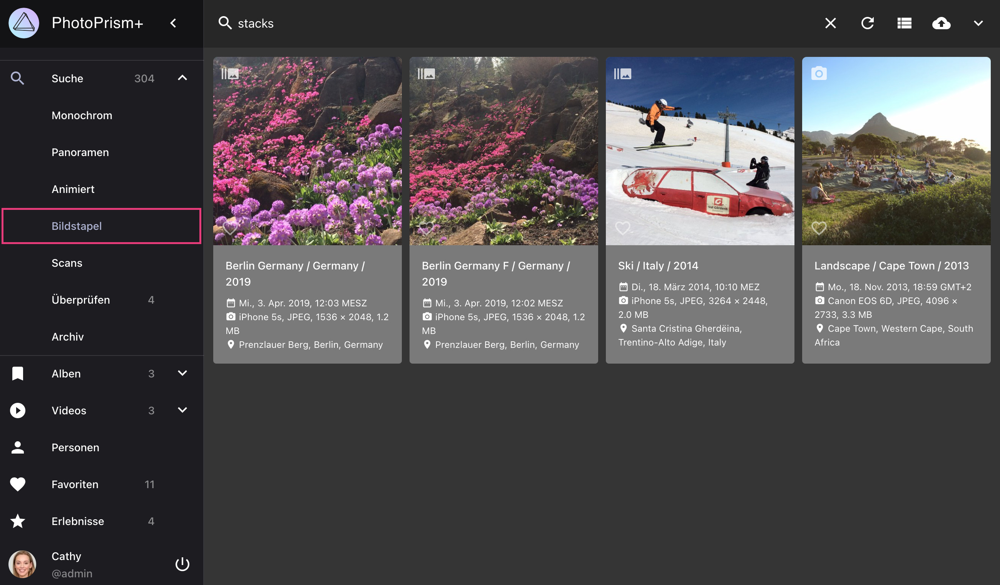
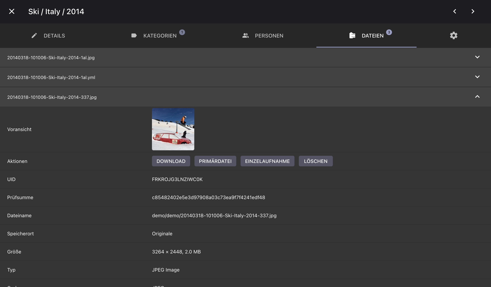

# Bildstapel #

Zusammengehörige Dateien werden gruppiert, wenn in den [*Einstellungen*](../settings/general.md) die Option "Bildstapel" aktiviert ist.

Gruppierte Dateien werden im Bereich *Bildstapel* dargestellt.

{ class="shadow" }

## Unter welchen Bedingungen können Dateien gruppiert werden? ##

1. Gleichnamige Dateien, die sich im selben Ordner befinden, z.B. `/2018/IMG_1234.jpg` und  `/2018/IMG_1234.avi`, werden immer gruppiert
2. Dateien mit fortlaufenden Namen, wie `/2018/IMG_1234 (2).jpg` und `/2018/IMG_1234 (3).jpg`, können gruppiert werden (optional)
3. Dateien, deren Metadaten zeigen, dass sie am selben Ort und in der selben Sekunde aufgenommen wurden, können gruppiert werden (optional)
4. Dateien mit der gleichen *Unique Image ID* oder *XMP Instance ID* können gruppiert werden (optional)

Du kannst das Verhalten der Punkte 2-4 in den [*Einstellungen*](../settings/general.md) konfigurieren.

!!! attention ""
      Das Ändern der Bildstapel-Einstellungen führt nicht dazu, dass bereits gruppierte Dateien wieder getrennt werden.

## Gruppierte Bilder anschauen ##

1. Klicke auf :material-camera-burst:

    { class="shadow" }

2. Mit Hilfe der Pfeile kannst du durch alle Bilder der Sequenz wechseln

    { class="shadow" } { class="shadow" }

## Das Anzeigebild wechseln ##
Das als *Primärdatei* ausgewählte Bild wird in den Bild-Ansichten verwendet. 
Es wird als erster Eintrag im Tab *Dateien* angezeigt.

Um die Primärdatei zu ändern:

1. Öffne den [*Bearbeitungs-Dialog*](edit.md) des Bildes
2. Gehe zu *Dateien*
3. Klicke auf :material-chevron-down: der Datei, die du als primär markieren willst
4. Klicke *Primärdatei*

      { class="shadow" } 

## Gruppierung von Dateien aufheben ##
1. Öffne den [*Bearbeitungs-Dialog*](edit.md) des Bildes
2. Gehe zu *Dateien*
3. Klicke auf :material-chevron-down: der Datei, die nicht als primär markiert ist
4. Klicke *Einzelaufnahme*

      { class="shadow" }

Das Bild wird nun separat von der anderen Datei in den Ansichten angezeigt.

{ class="shadow" }

## Nicht primäre Dateien endgültig löschen ##
1. Öffne den [*Bearbeitungs-Dialog*](edit.md) des Bildes
2. Gehe zu *Dateien*
3. Klicke auf :material-chevron-down: der Datei, die nicht als primär markiert ist
4. Klicke *Löschen*
5. Bestätige, dass du das Bild wirklich löschen möchtest

      { class="shadow" }