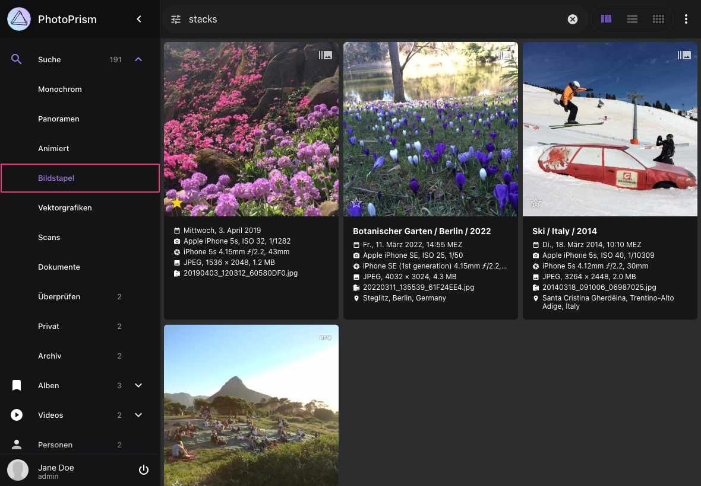
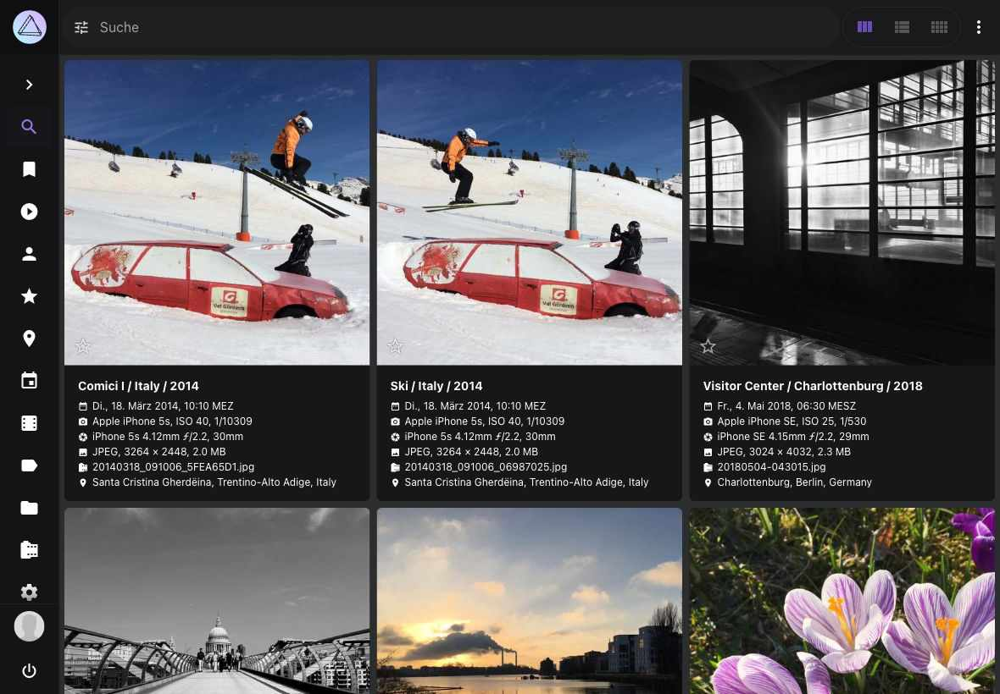

# Bildstapel #

Bildstapel sind Gruppen von Dateien, die den gleichen Ursprung haben, sich aber in Qualität, Format, Größe oder Farbe unterscheiden. Gehe zu *[Einstellungen > Inhalte](../settings/library.md)*, um die Stacking-Einstellungen für deine Bibliothek zu ändern.

Bildstapel werden im Bereich *Bildstapel* dargestellt.

{ class="shadow" }

Beachte, dass *[Videos](./video.md)* und *[Live-Fotos](video.md#live-fotos)*, die immer mit einem Vorschaubild gruppiert sind, nicht auf der Seite *Bildstapel* angezeigt werden.

## Unter welchen Bedingungen können Dateien gruppiert werden? ##

1. Gleichnamige Dateien, die sich im selben Ordner befinden, z.B. `/2018/IMG_1234.jpg` und  `/2018/IMG_1234.avi`, werden immer gruppiert
2. Dateien mit fortlaufenden Namen, wie `/2018/IMG_1234 (2).jpg` und `/2018/IMG_1234 (3).jpg`, können gruppiert werden (optional)
3. Dateien, deren Metadaten zeigen, dass sie am selben Ort und in der selben Sekunde aufgenommen wurden, können gruppiert werden (optional)
4. Dateien mit der gleichen *Unique Image ID* oder *XMP Instance ID* können gruppiert werden (optional)

Du kannst das Verhalten der Punkte 2-4 in *[Einstellungen > Inhalte](../settings/library.md#bildstapel)* konfigurieren.

!!! note ""
    Beachte, dass es **nicht möglich ist, die Gruppierung von Dateien mit demselben Namen zu deaktivieren**, da sonst wichtige Funktionen nicht mehr funktionieren würden. Beipsielsweise die Unterstützung von Apple [Live Photos](video.md#live-fotos) (die aus einer Foto- und einer Videodatei bestehen) sowie anderen Multidatei-/Hybridformaten wie RAW/JPEG und die Indexierung von Metadaten aus XMP/JSON Sidecar-Dateien.

## Werden gruppierte Dateien automatisch getrennt, wenn die ich Einstellungen ändere?

Wenn du die Bildstapel-Einstellungen unter *[Einstellungen > Inhalte](../settings/library.md#bildstapel)* änderst, werden Dateien, die bereits gruppiert sind, **nicht automatisch voneinander getrennt**. Das liegt daran, dass das Entstapeln ein ressourcenintensiver Vorgang ist, bei dem jede Datei neu indexiert werden muss.

Das Ergebnis hängt auch von der genauen Reihenfolge ab, in der du die Dateien entstapelst, da z. B. Nicht-Medien-Sidecar-Dateien an die verbleibende Mediendatei in einem Stapel gebunden bleiben. Wir denken darüber nach, in einer zukünftigen Version einen entsprechenden Befehl bereitzustellen.
 
!!! note ""
    Wenn du PhotoPrism zum ersten Mal verwendest und deine Bibliothek mit anderen Einstellungen neu indexieren möchtest, kannst du den Befehl `photoprism reset` [in einem Terminal](https://docs.photoprism.app/getting-started/docker-compose/#command-line-interface) ausführen, um den Index zurückzusetzen und von vorne zu beginnen. [Mehr erfahren >](https://docs.photoprism.app/getting-started/docker-compose/#examples)

## Welche fortlaufenden Dateinamen werden unterstützt?
Dateien mit folgenden Namen werden mit `/2018/IMG_1234.jpg` gruppiert, falls Gruppieren bei **fortlaufenden Dateinamen** aktiviert ist.

- `/2018/IMG_1234 (2).jpg` `/2018/IMG_1234 (3).jpg`
- `/2018/IMG_1234 copy.jpg` `/2018/IMG_1234 copy 1.jpg` `/2018/IMG_1234 copy 2.jpg`
- `/2018/IMG_1234 (-2.7)` `/2018/IMG_1234 (+3.3).jpg` `/2018/IMG_1234(-2.7).jpg`  `/2018/IMG_1234(+3.3).jpg`

## Gruppierte Bilder anschauen ##

1. Klicke auf :material-camera-burst:

    { class="shadow" }

2. Mit Hilfe der Pfeile kannst du durch alle Bilder der Sequenz wechseln

    { class="shadow" } { class="shadow" }

## Das Anzeigebild wechseln ##
Das als *Primärdatei* ausgewählte Bild wird in den Bild-Ansichten verwendet. 
Es wird als erster Eintrag im Tab *Dateien* angezeigt.

Um die Primärdatei zu ändern:

1. Öffne den [*Bearbeitungs-Dialog*](edit.md) des Bildes
2. Gehe zu *Dateien*
3. Klicke auf :material-chevron-down: der Datei, die du als primär markieren willst
4. Klicke *Primärdatei*

      { class="shadow" } 

## Gruppierung von Dateien aufheben ##
1. Öffne den [*Bearbeitungs-Dialog*](edit.md) des Bildes
2. Gehe zu *Dateien*
3. Klicke auf :material-chevron-down: der Datei, die nicht als primär markiert ist
4. Klicke *Einzelaufnahme*

      { class="shadow" }

Das Bild wird nun separat von der anderen Datei in den Ansichten angezeigt.

{ class="shadow" }

## Nicht primäre Dateien endgültig löschen ##
1. Öffne den [*Bearbeitungs-Dialog*](edit.md) des Bildes
2. Gehe zu *Dateien*
3. Klicke auf :material-chevron-down: der Datei, die nicht als primär markiert ist
4. Klicke *Löschen*
5. Bestätige, dass du das Bild wirklich löschen möchtest

      { class="shadow" }