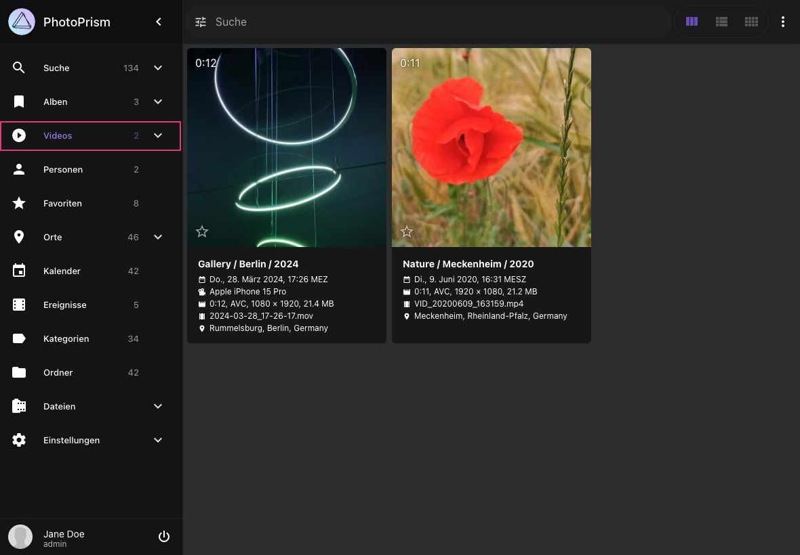

### Videos ###
Im Bereich *Videos* findest du alle Videos deiner Sammlung. Um ein Video abzuspielen, klicke auf das Video.

Beachte, dass nicht alle [Video- und Audioformate](https://caniuse.com/?search=video%20format) von jedem [Browser abgespielt](https://docs.photoprism.app/getting-started/troubleshooting/browsers/) werden können. 
So wird beispielsweise [AAC](https://caniuse.com/aac) - der Standard-Audiocodec für [MPEG-4 AVC / H.264](https://caniuse.com/mpeg4) - in Chrome, Safari und Edge nativ unterstützt, 
während er in Firefox und Opera nur optional vom Betriebssystem unterstützt wird.

{ class="shadow" }

!!! tldr ""
    Wenn [FFmpeg deaktiviert](../settings/advanced.md#ffmpeg-deaktivieren) oder nicht installiert ist, können Videos nicht indexiert werden, da keine Standbilder erstellt werden können.
    Außerdem solltest du [Exiftool](../settings/advanced.md#exiftool-deaktivieren) aktiviert haben, um Metadaten wie Dauer, Auflösung und Codec zu extrahieren.

### Live-Fotos ###
Kurze Videos von bis zu 3 Sekunden, werden unabhängig vom Handy-Model als Live Foto kategorisiert.
Sie sind mit :material-adjust: in der linken oberen Ecke markiert.

Um nach Live-Fotos zu filtern, nutze den Filter `type:live`. Um ein Live-Foto abzuspielen, bewege den Mauszeiger auf das Bild.

{ class="shadow" }

### Transkodierung ###

Für maximale Browserkompatibilität kann PhotoPrism Videocodecs und Container [unterstützt von FFmpeg](https://www.ffmpeg.org/documentation.html) in [MPEG-4 AVC](https://en.wikipedia.org/wiki/MPEG-4) transkodieren und Standbilder für die Erstellung von Vorschaubildern extrahieren:

- wenn [FFmpeg deaktiviert](../settings/advanced.md#ffmpeg-deaktivieren) oder nicht installiert ist, ist das Indexieren und Importieren von Videos nicht möglich, da keine Standbilder erstellt werden können
- wenn [Exiftool deaktiviert](../settings/advanced.md#exiftool-deaktivieren) oder nicht installiert ist, ist das Indexieren und Importieren von Videos nur teilweise möglich, da die Video-Metadaten nicht extrahiert werden können und somit die Dauer, die Auflösung und der Codec unbekannt sind
- [MPEG-4 AVC](https://en.wikipedia.org/wiki/MPEG-4) muss nicht transcodiert werden, da es von den meisten modernen Browsern nativ abgespielt werden kann, siehe https://caniuse.com/mpeg4
- OGV-, VP8-, VP9-, AV1-, WebM- und HEVC-Videos können direkt gestreamt werden, wenn sie von deinem Browser unterstützt werden und die [konfigurierte Bitratengrenze](https://docs.photoprism.app/getting-started/advanced/transcoding/#bitrate-limiting) nicht überschreiten.
- andere Formate müssen immer transcodiert werden


**Falls erforderlich, werden Videos bei Bedarf transkodiert. Das kann zu unerwünschten Verzögerungen führen, wenn große Videodateien zum ersten Mal abgespielt werden.**

In diesem Fall kannst du [den folgenden Befehl in einem Terminal ausführen](https://docs.photoprism.app/getting-started/docker-compose/#command-line-interface), um alle Videodateien vorzutranskodieren:

```
docker compose exec photoprism photoprism convert
```

In unserer Setup-Anleitung für fortgeschrittene Nutzer wird erklärt, wie du die [Hardware-Videotranskodierung](https://docs.photoprism.app/getting-started/advanced/transcoding/) konfigurieren kannst .

!!! note ""
    Vergewissere dich, dass dein Server genug freien Speicherplatz zur verfügung hat, bevor du deine Videos transkodierst. 

!!! tldr ""
    HEVC-Videodateien können auch die Dateiendung `.mp4` haben, die normalerweise mit AVC assoziiert wird. Dies liegt daran, dass MP4 ein
    *Container*-Format ist, was bedeutet, dass der eigentliche Videoinhalt mit H.264, H.265 oder etwas anderem komprimiert sein kann.
    Die Dateiendung sagt eigentlich nichts anderes aus, als dass es sich wahrscheinlich um eine Videodatei handelt.