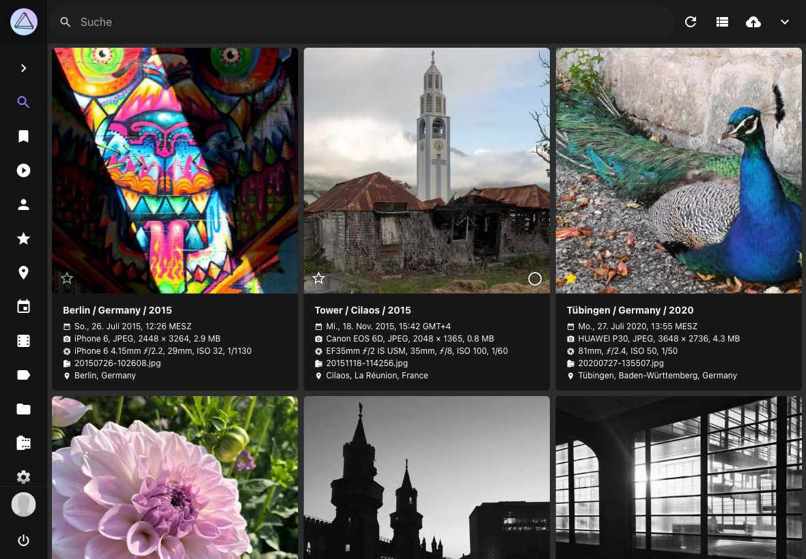

# Ansichten #
PhotoPrism bietet dir drei verschiedene Ansichten zum Betrachten deiner Fotos und Videos:

=== "Karteikarten Ansicht"

    In der *Karteikarten Ansicht* findest du unter jedem Bild wichtige Metadaten wie Titel, Aufnahmezeit und -Ort.

    { class="shadow" }

=== "Mosaik Ansicht"

    Die *Mosaik Ansicht* zeigt dir deine Bilder ohne Ablenkung.

    { class="shadow" }

=== "Listen Ansicht"

    Die *Listen Ansicht* stellt Bilder und Metadaten in einer übersichtlichen Liste dar.

    { class="shadow" }

Um zwischen den Ansichten zu wechseln, kannst du den entsprechenden Filter in der Filterleiste oder einen der Ansicht-Schalter (:material-view-column:, :material-view-comfy:, :material-view-list:) in der Ecke oben rechts nutzen.

Alternativ kannst du dir Bilder und Videos auch in der *Vollbild Ansicht* anzeigen lassen. Um eine Diashow zu starten, klicke auf :material-play:.

{ class="shadow" }
