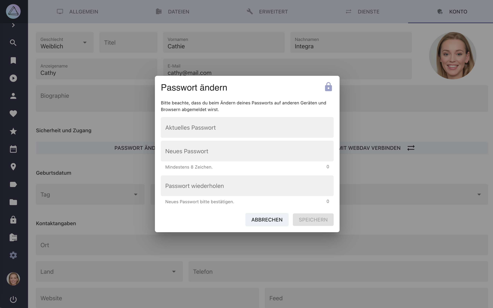
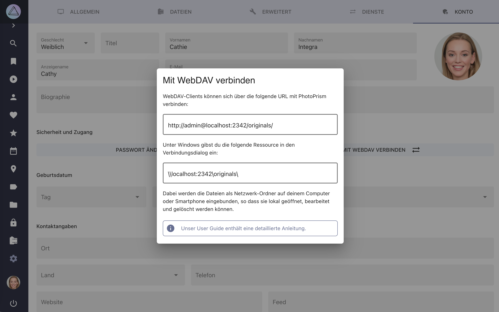

# Konto Einstellungen #

{ class="shadow" }

!!! tldr ""
    Da sie nicht benötigt werden, sind diese Einstellungen nicht verfügbar, wenn du PhotoPrism im [public Modus](https://docs.photoprism.app/getting-started/config-options/#authentication) verwendest.

##Passwort ändern##

1. Klicke auf *Einstellungen*
2. Klicke auf *Konto*
3. Klicke *Passwort ändern*
4. Gib dein aktuelles Passwort ein
5. Gib das neue Passwort ein und bestätige es durch eine erneute Eingabe
6. Klicke auf *Speichern*

{ class="shadow" } 

##WebDAV Url anzeigen##

1. Klicke auf *Einstellungen*
2. Klicke auf *Konto*
3. Klicke *Mit WebDAV verbinden*

{ class="shadow" } 