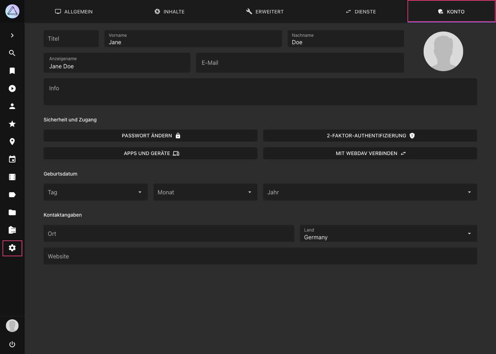

# Konto Einstellungen #

!!! tldr ""
    Aus Sicherheitsgründen erfordert das Ändern von kontobezogenen Einstellungen über die Benutzeroberfläche eine Passwortauthentifizierung, sodass diese Einstellungen nicht verfügbar sind, wenn der [public Modus](https://docs.photoprism.app/getting-started/config-options/#authentication) aktiviert ist.

{ class="shadow" }

## Passwort ändern

1. Klicke auf *Einstellungen*
2. Klicke auf *Konto*
3. Klicke *Passwort ändern*
4. Gib dein aktuelles Passwort ein
5. Gib das neue Passwort ein und bestätige es durch eine erneute Eingabe
6. Klicke auf *Speichern*

{ class="shadow" } 

## 2-Faktor Authentifizierung

Zwei-Faktor  Authentifizierung (2FA) kann eine zusätzliche Sicherheitsebene für dein Konto schaffen, für den Fall, dass sich jemand Zugang zu deinem Passwort verschafft. Wenn sie aktiviert ist, brauchst du zusätzlich zu deinem Passwort einen zufällig generierten Verifizierungscode, um dich einzuloggen:

[Learn more ›](../users/2fa.md)

## Apps und Geräte

Wenn 2FA für dein Konto aktiviert ist, können andere Apps und Dienste dein Passwort nicht mehr verwenden, da sie keinen Zugriff auf die Verifizierungscodes haben.

Du kannst daher app-spezifische Passwörter für sie erstellen, indem du auf die Schaltfläche *Apps und Geräte* klickst. Wir empfehlen, app-spezifische Passwörter auch dann zu verwenden, wenn 2FA für dein Konto nicht aktiviert ist.

Beispiel für die Erstellung eines App-Passworts, das du mit [WebDAV-kompatiblen](../sync/webdav.md) Dateisynchronisierungs-Apps wie [PhotoSync](../sync/sync-phone.md) verwenden kannst:

{ class="shadow" }

!!! tldr ""
    Wenn du die [Berechtigung](https://docs.photoprism.app/developer-guide/api/auth/#authorization-scopes) *WebDAV* auswählst, stellst du sicher, dass das App-Passwort nicht für die Anmeldung über die reguläre Benutzeroberfläche oder für andere Aktionen verwendet werden kann. Apps können auch nicht dein Passwort ändern oder Benutzerkonten verwalten, selbst wenn du ihnen *Vollen Zugriff* gewährst.

## WebDAV Url anzeigen

1. Klicke auf *Einstellungen*
2. Klicke auf *Konto*
3. Klicke *Mit WebDAV verbinden*

{ class="shadow" } 