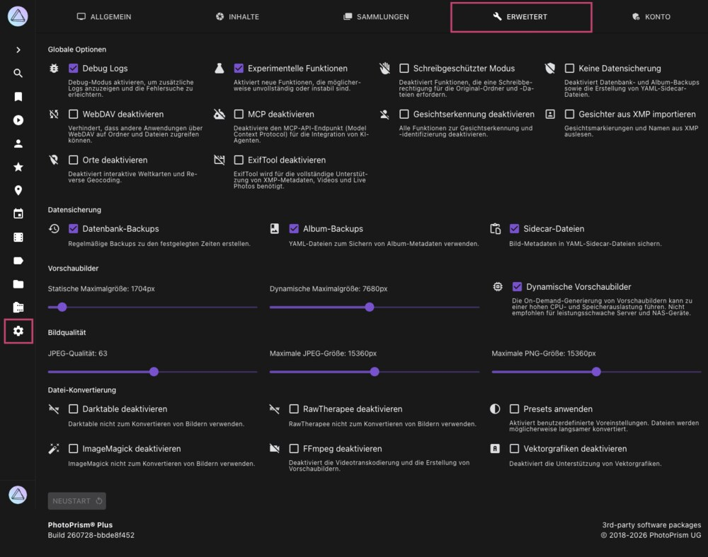
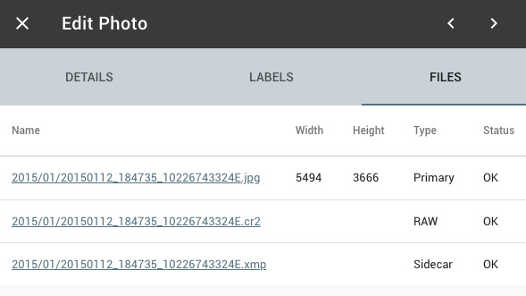

# Erweiterte Einstellungen #
Systemkonfigurationsoptionen wie die Bildqualität können in den erweiterten Einstellungen geändert werden. Du kannst auch bestimmte Funktionen deaktivieren und den Debug- oder schreibgeschützten Modus aktivieren.

!!! tldr ""
    Da diese Einstellungen ohne Authentifizierung nicht sicher sind, sind sie nicht verfügbar, wenn du PhotoPrism im [public Modus](https://docs.photoprism.app/getting-started/config-options/#authentication) verwendest. Das [Ändern von Konfigurationsoptionen](https://docs.photoprism.app/getting-started/config-options/) ist weiterhin über Konfigurationsdateien und Befehlsparameter möglich.

!!! attention ""
    Änderungen von erweiterten Einstellungen erfordern immer einen Neustart.
    Wenn du die Thumbnail-Qualität oder Größen Einstellungen änderst, werden bereits erstellte Thumbnails nicht gelöscht.
    Thumbnails können über die [Kommandozeile](https://docs.photoprism.app/getting-started/docker-compose/#command-line-interface) neu generiert werden.

{ class="shadow" }

Alle [Optionen](https://docs.photoprism.app/getting-started/config-options/) können in deiner `compose.yaml` (oder `docker-compose.yml`) oder auch über Kommandozeilenparameter gesetzt werden. 
Manuell geänderte Werte werden in einer Konfigurationsdatei gespeichert. Sie wird standardmäßig im Ordner `storage/config` gespeichert. 

## Globale Optionen ##

### Debug Logs ###
Debug Logs unter *Dateien>Logs* anzeigen.
Änderungen erfordern einen Neustart.

Der entsprechende [Konfigurations-Parameter](https://docs.photoprism.app/getting-started/config-options/#logging) ist `PHOTOPRISM_DEBUG`.

### Experimentelle Funktionen ###
Aktiviert neue Funktionen, an denen derzeit noch entwickelt wird.

Der entsprechende [Konfigurations-Parameter](https://docs.photoprism.app/getting-started/config-options/#feature-flags) ist `PHOTOPRISM_EXPERIMENTAL`.

### Schreibgeschützter Modus ###
Ist diese Option gewählt, können Dateien nicht importiert, über die Benutzeroberfläche hochgeladen oder gelöscht werden.

Der entsprechende [Konfigurations-Parameter](https://docs.photoprism.app/getting-started/config-options/#feature-flags) ist `PHOTOPRISM_READONLY`.

### Keine Datensicherung ###
Diese Option verhindert die Erstellung von Datenbank-, Album- und YAML-Sidecar-Dateisicherungen.

Der entsprechende [Konfigurations-Parameter](https://docs.photoprism.app/getting-started/config-options/) ist `PHOTOPRISM_DISABLE_BACKUPS`.

### WebDAV deaktivieren ###
Deaktiviert den eingebauten WebDAV-Server. Änderungen erfordern einen Neustart.

Der entsprechende [Konfigurations-Parameter](https://docs.photoprism.app/getting-started/config-options/#feature-flags) ist `PHOTOPRISM_DISABLE_WEBDAV`.

### Gesichter deaktivieren ###
Wenn diese Option aktiviert ist, werden alle Funktionen zur Gesichts­erkennung und zum Erkennen von Gesichtern deaktiviert.

Der entsprechende [Konfigurations-Parameter](https://docs.photoprism.app/getting-started/config-options/#feature-flags) ist `PHOTOPRISM_DISABLE_FACES`.

### Gesichter aus XMP importieren ###
Wenn diese Option aktiviert ist, werden beim Indexieren Gesichtsbereiche und Namen aus den XMP-Metadaten als Personen-Markierungen übernommen. Namen, die du in Anwendungen wie Adobe Bridge, Lightroom, digiKam, ACDSee oder Windows vergeben hast, müssen so nicht erneut eingegeben werden.
[Mehr erfahren ›](../library/metadata.md#gesichtsbereiche)

Die entsprechende [Konfigurations-Option](https://docs.photoprism.app/getting-started/config-options/#computer-vision) ist `PHOTOPRISM_XMP_FACES`.

### Karten deaktivieren ###
Wenn Karten deaktiviert sind, liest PhotoPrism trotzdem noch Geo-Informationen (Längen- und Breitengrad) aus den Metadaten deiner Dateien aus.
Es wird allerdings kein Reverse Lookup mehr gemacht, um Informationen über die Orte der Koordinaten abzufragen.

Die Karten-Ansicht ist dann nicht sichtbar.

Der entsprechende [Konfigurations-Parameter](https://docs.photoprism.app/getting-started/config-options/#feature-flags) ist `PHOTOPRISM_DISABLE_PLACES`.

### ExifTool deaktivieren ###
Keine JSON-Dateien in `storage/sidecar` mit ExifTool erstellen.

Beachte, dass du ExifTool aktiviert haben musst, um Videometadaten wie Dauer, Auflösung und Codec zu extrahieren.

Der entsprechende [Konfigurations-Parameter](https://docs.photoprism.app/getting-started/config-options/) ist `PHOTOPRISM_DISABLE_EXIFTOOL`.

### TensorFlow deaktivieren – veraltet ###
!!! warning ""
    Diese Option ist veraltet. Um die automatische Bildklassifizierung und Gesichtserkennung zu deaktivieren, verwende stattdessen die Konfigurationsoptionen `PHOTOPRISM_DISABLE_FACES` und `PHOTOPRISM_DISABLE_CLASSIFICATION`. Weitere Details findest du im zugehörigen [GitHub Issue](https://github.com/photoprism/photoprism/issues/5310).

Wenn diese Option aktiviert ist, werden Bildklassifizierung und Gesichtserkennung deaktiviert, da beide auf TensorFlow basieren.

Der entsprechende [Konfigurations-Parameter](https://docs.photoprism.app/getting-started/config-options/#feature-flags) ist `PHOTOPRISM_DISABLE_TENSORFLOW`.

## Datensicherung ##

### Datenbank Backups
Datenbank-Backups werden nach dem konfigurierten Zeitplan erstellt.

Der entsprechende [Konfigurations-Parameter](https://docs.photoprism.app/getting-started/config-options/#backup) ist `PHOTOPRISM_BACKUP_DATABASE`.
Der Zeitplan sowie die Anzahl der Backups, die aufbewahrt werden, können mittels `PHOTOPRISM_BACKUP_SCHEDULE` und `PHOTOPRISM_BACKUP_RETAIN` [konfiguriert](https://docs.photoprism.app/getting-started/config-options/#backup) werden.

### Album Backups
[YAML-Dateien, die die Metadaten von Alben sichern](../backups/export.md) werden nach dem konfigurierten Zeitplan erstellt.

Der entsprechende [Konfigurations-Parameter](https://docs.photoprism.app/getting-started/config-options/#backup) ist `PHOTOPRISM_BACKUP_ALBUMS`.
Der Zeitplan kann mittels [`PHOTOPRISM_BACKUP_SCHEDULE`](https://docs.photoprism.app/getting-started/config-options/#backup) konfiguriert werden.

### Sidecar Dateien
[YAML-Dateien, die die Metadaten von Bildern sichern](../backups/export.md) werden erstellt.

Der entsprechende [Konfigurations-Parameter](https://docs.photoprism.app/getting-started/config-options/#sidecar-files) ist `PHOTOPRISM_SIDECAR_YAML`.

## Vorschaubilder ##
In diesem Bereich wird festgelegt, wie JPEG-Vorschaubilder und Miniaturansichten gerendert werden. Das sind hochwertige, verkleinerte Versionen deiner Originale.

[Vorschaubilder sind notwendig](https://docs.photoprism.app/getting-started/faq/#why-is-my-storage-folder-so-large-what-is-in-it), weil Webbrowser große Bilder nur schlecht an den Bildschirm anpassen können.
Die Verwendung von Originalen in voller Auflösung für Diashows und in Suchergebnissen würde außerdem viel Speicherplatz im Browser verbrauchen und die Geschwindigkeit der Indexierung deutlich verringern.

### Skalierungsfilter ###

PhotoPrism rendert Vorschaubilder mit `libvips`, das immer einen hochwertigen Lanczos-3-Lobe-Kernel zur Skalierung verwendet. Die [Konfigurationsoption](https://docs.photoprism.app/getting-started/config-options/#preview-images) `PHOTOPRISM_THUMB_FILTER` und das Dropdown "Skalierungsfilter" bleiben aus Gründen der Abwärtskompatibilität erhalten, haben jedoch keinen Einfluss mehr auf das gerenderte Ergebnis.

!!! info ""
    Die alte native `imaging`-Bibliothek zur Bildverarbeitung wurde im April 2026 entfernt. Vorschaubilder werden jetzt immer mit libvips erzeugt, die zuvor wählbaren Filter (blackman, lanczos, cubic, linear, nearest) haben daher keine Wirkung mehr.

### Statische und Dynamische Maximalgrößen

**Statische Maximalgröße**: Maximalgröße für Thumbnails, die während des Import- bzw. Indexiervorgangs erstellt werden.
Der entsprechende [Konfigurations-Parameter](https://docs.photoprism.app/getting-started/config-options/) ist `PHOTOPRISM_THUMB_SIZE`.

**Dynamische Maximalgröße**: Maximalgröße für Thumbnails, die on demand erstellt werden.
Der entsprechende [Konfigurations-Parameter](https://docs.photoprism.app/getting-started/config-options/) ist `PHOTOPRISM_THUMB_SIZE_UNCACHED`.

!!! danger ""
    Die Verringerung des statischen Größenlimits hat erhebliche Auswirkungen auf die Ergebnisse der [Gesichtserkennung](../organize/people.md) und Bildklassifizierung.
    Einfach ausgedrückt, bedeutet das, dass der Indexer nicht mehr richtig sehen kann.

!!! danger ""
    Wenn die konfigurierte Maximalgröße überschritten wird (z.B. wenn Nutzer einen größeren Bildschirm haben), kann kein ausreichend großes Thumbnail erstellt werden und der Bildbetrachter ist möglicherweise gezwungen, stattdessen das Originalbild anzuzeigen.
    **Beim Skalieren von Bildern im Browser ist die Qualität in der Regel schlecht und sie können zudem in der falschen Orientierung dargestellt werden.**

Die kleinste konfigurierbare Größe beträgt 720px, damit der Indexer Farberkennung, Gesichtserkennung und Bildklassifizierung durchführen kann. Diese bei jedem Aufruf neu zu berechnen, wäre selbst für die leistungsfähigsten Server zu aufwändig. Wenn du nicht nur wenige kleine Bilder hast, würde das die App unbenutzbar machen.

Wir empfehlen, diese Limits hoch zu setzen, damit das Durchsuchen von Bildern möglichst flüssig bleibt.
Sollte der von Thumbnails belegte Speicherplatz allerdings ein ernsthaftes Problem darstellen und bist du bereit, dafür eine höhere Serverauslastung in Kauf zu nehmen, kannst du die *Statische Maximalgröße* auf das Minimum von 720px setzen und gleichzeitig eine höhere *Dynamische Maximalgröße* konfigurieren.
So kann der Server größere Thumbnails bei Bedarf generieren. Das kann beim Betrachten von Bildern im Vollbildmodus zu einer spürbaren Verzögerung führen.

!!! tip ""
    Um Originalbilder anzuzeigen, aktiviere *Dynamische Vorschaubilder* und setze *Dynamische Maximalgröße* sowie *Statische Maximalgröße* auf einen niedrigen Wert wie `720`. Beim Betrachten von Bildern, die dieses Limit überschreiten, werden die Originaldateien angezeigt.

### Dynamische Vorschaubilder

Aktiviert die Erzeugung von Vorschaubildern on the fly, sobald sie zum Betrachten oder zur Analyse benötigt werden. Das spart Speicherplatz, ist aber rechenintensiver und wird daher auf weniger leistungsfähigen Geräten wie dem Raspberry Pi nicht empfohlen.

!!! tip ""
    Thumbnails in Größen bis zur konfigurierten [statischen Maximalgröße](#statische-und-dynamische-maximalgroen) [werden während der Indexierung immer erzeugt](https://docs.photoprism.app/getting-started/faq/#can-i-skip-creating-thumbnails-completely).

Der entsprechende [Konfigurations-Parameter](https://docs.photoprism.app/getting-started/config-options/) ist `PHOTOPRISM_THUMB_UNCACHED`.

### Welche Dateien werden von PhotoPrism erstellt? ###

Die kleinste konfigurierbare statische und dynamische Maximalgröße beträgt 720px, daher werden die meisten Größen bis `fit_720` standardmäßig **immer** erzeugt.
[Höhere Maximalgrößen](#statische-und-dynamische-maximalgroen) generieren Thumbnails mit mehr Details bei höheren Auflösungen – entweder statisch (vorgeneriert während der Indexierung) oder **on demand**, sofern die [Konfiguration es erlaubt](https://docs.photoprism.app/getting-started/config-options/#preview-images).

**Optionale** Vorschaubilder können nicht vorgeneriert werden und werden nur auf Anfrage gerendert, z.B. beim Teilen eines Bildes auf Instagram.

Folgende Tabelle listet Name, Maße, Seitenverhältnis und Verwendungszweck jeder Thumbnailgröße:

|   Name    | Width | Height | Aspect Ratio | Available |       Usage       |
|-----------|-------|--------|--------------|-----------|-------------------|
| colors    |     3 |      3 | 1:1          | Always    | Color Detection   |
| tile_50   |    50 |     50 | 1:1          | Always    | List View         |
| tile_100  |   100 |    100 | 1:1          | Always    | Places View       |
| left_224  |   224 |    224 | 1:1          | On-Demand | AI                |
| right_224 |   224 |    224 | 1:1          | On-Demand | AI                |
| tile_224  |   224 |    224 | 1:1          | Always    | AI, Mosaic View   |
| left_384  |   384 |    384 | 1:1          | Optional  | AI                |
| right_384 |   384 |    384 | 1:1          | Optional  | AI                |
| tile_384  |   384 |    384 | 1:1          | Optional  | AI                |
| left_480  |   480 |    480 | 1:1          | Optional  | AI                |
| right_480 |   480 |    480 | 1:1          | Optional  | AI                |
| tile_480  |   480 |    480 | 1:1          | Optional  | AI                |
| tile_500  |   500 |    500 | 1:1          | Always    | Cards View        |
| fit_720   |   720 |    720 | Preserved    | Always    | SD TV, Mobile     |
| tile_1080 |  1080 |   1080 | 1:1          | Optional  | Instagram         |
| fit_1280  |  1280 |   1024 | Preserved    | On-Demand | HD TV, SXGA       |
| fit_1600  |  1600 |    900 | Preserved    | Optional  | Social Media      |
| fit_1920  |  1920 |   1200 | Preserved    | On-Demand | Full HD           |
| fit_2048  |  2048 |   2048 | Preserved    | Optional  | DCI 2K, Tablets   |
| fit_2560  |  2560 |   1600 | Preserved    | On-Demand | Quad HD           |
| fit_3840  |  3840 |   2400 | Preserved    | Optional  | 4K Ultra HD       |
| fit_4096  |  4096 |   4096 | Preserved    | On-Demand | DCI 4K, Retina 4K |
| fit_5120  |  5120 |   5120 | Preserved    | On-Demand | Retina 5K         |
| fit_7680  |  7680 |   4320 | Preserved    | On-Demand | 8K Ultra HD 2     |
| fit_15360 | 15360 |   8640 | Preserved    | On-Demand | 16K UHD           |

!!! tldr ""
    Die Thumbnails werden in `storage/cache/thumbnails` gespeichert. Der genaue Pfad ist abhängig von Thumbnail-Größe und Hash der Originaldatei, z.B.
    `storage/cache/thumbnails/1/a/3/1a30c1f...9_100x100_center.jpg`

## Bildqualität ##

### JPG Qualität

Um Thumbnails in bestmöglicher Qualität zu erhalten, solltest du die *JPEG*-Qualität auf ein Minimum von 90 einstellen. 
Generell gilt: je höher die Qualität, desto mehr Speicherplatz brauchen die Thumbnails und desto länger dauert die Generierung.

* Qualitäts-Level von >90% werden als hoch eingestuft.
* 80%-90% gilt als mittlere Qualität
* 70-80% gilt als niedrige Qualität (z.B. stark komprimierte Bilder auf Social Media). 

Alles mit einer Qualität von unter 70% gilt als sehr niedrig.

Beispiel: Bei einer JPEG-Qualität von 95 sind die Vorschaubilder ca 500kB groß. Bei einer Qualität von 80 ist die Größe auf ca 100kB reduziert.

!!! tldr ""
    **Das Qualitätsempfinden hängt stark davon ab, wie viele Informationen ein Bild enthält.** 
    Leere Flächen oder Himmel, lassen sich leicht komprimieren. Während Bilder mit vielen Details am meisten unter der Komprimierung leiden.
    Deshalb wirkt sich eine Verringerung der Qualität der Thumbnails auch negativ auf die Ergebnisse der Gesichtserkennung und Bildklassifizierung aus. 

Der entsprechende [Konfigurations-Parameter](https://docs.photoprism.app/getting-started/config-options/) ist `PHOTOPRISM_JPEG_QUALITY`.

### Maximale JPEG-Größe

Hiermit wird die maximale Größe der JPEG-Dateien festgelegt, die bei der Umwandlung von Original-RAW-Bildern erstellt werden.

!!! tldr ""
    [RawTherapee und "heif-convert" können die Auflösung von JPEG-Dateien nicht begrenzen](https://docs.photoprism.app/known-issues/#jpeg-size-limit) , wenn sie Dateien aus anderen Formaten wie RAW, DNG, HEIC oder AVIF konvertieren.

Der entsprechende [Konfigurations-Parameter](https://docs.photoprism.app/getting-started/config-options/) ist `PHOTOPRISM_JPEG_SIZE`.

### Maximale PNG Größe

Hiermit wird die maximale Größe der PNG-Dateien festgelegt, die bei der Umwandlung von Original-Dateien erstellt werden.

Der entsprechende [Konfigurations-Parameter](https://docs.photoprism.app/getting-started/config-options/) ist `PHOTOPRISM_PNG_SIZE`.

## Dateikonvertierung ##
Viele Fotografen, insbesondere Nutzer einer digitalen SLR, verwenden ein verlustfreies RAW-Format anstelle des verlustbehafteten JPEG-Formats. Es gibt auch [Handies](https://www.fredericpaulussen.be/how-to-raw-photos-huawei-p30-pro/), die RAW-Daten abspeichern können oder das Format HEIC/HEIF nutzen.

Unser Ziel ist eine umfangreiche Unterstützung für alle [RAW-Formate](https://en.wikipedia.org/wiki/Raw_image_format), unabhängig vom verwendeten Kameramodell. Deshalb bitten wir dich uns eine Nachricht zu schicken, falls du ein Problem mit den Dateien von einem deiner Geräte hast.

Webbrowser können keine RAW-Formate anzeigen. Deshalb muss PhotoPrism diese Dateien zu JPEGs *konvertieren*. Falls du das nicht möchtest, kannst du das in den [Einstellungen](library.md) ausschalten.

Zusätzlich zu den oben genannten Formaten unterstützt PhotoPrism auch BMP-, GIF-, PNG- und TIFF-Dateien. Bevor du diese Formate zur Speicherung nutzt, solltest du bedenken, dass diese oft keine Metadaten speichern können. Deshalb werden sie in der Regel für Screenshots, Diagramme und Icons verwendet.

{ class="shadow" }

!!! info ""
    Von PhotoPrism erstellte Sidecar-Dateien werden außerhalb des Originals Verzeichnis gespeichert, so dass die RAW zu JPEG Konvertierung auch im
    Read-Only Modus verfügbar ist.

### Darktable deaktivieren

Wenn diese Funktion deaktiviert ist, wird [Darktable](https://www.darktable.org/) nicht für die RAW-Konvertierung verwendet.

Der entsprechende [Konfigurations-Parameter](https://docs.photoprism.app/getting-started/config-options/) ist `PHOTOPRISM_DISABLE_DARKTABLE`.

### RawTherapee deaktivieren

Wenn diese Funktion deaktiviert ist, wird [RawTherapee](https://www.rawtherapee.com/) nicht für die RAW-Konvertierung verwendet.
Der entsprechende [Konfigurations-Parameter](https://docs.photoprism.app/getting-started/config-options/) ist `PHOTOPRISM_DISABLE_RAWTHERAPEE`.

### Presets anwenden

Deaktiviert die parallele Konvertierung von RAW-Dateien, damit Darktable-Presets angewendet werden können.

Der entsprechende [Konfigurations-Parameter](https://docs.photoprism.app/getting-started/config-options/) ist `PHOTOPRISM_RAW_PRESETS`.

### ImageMagick deaktivieren

Wenn diese Funktion deaktiviert ist, wird [ImageMagick](https://imagemagick.org/) nicht für die Konvertierung verwendet.

Der entsprechende [Konfigurations-Parameter](https://docs.photoprism.app/getting-started/config-options/) ist `PHOTOPRISM_DISABLE_IMAGEMAGICK`.

### FFmpeg deaktivieren

Wenn diese Funktion deaktiviert ist, wird [FFmpeg](https://www.ffmpeg.org/documentation.html) nicht zum Transkodieren von Videos oder zum Extrahieren von Standbildern für die Erstellung von Vorschaubildern verwendet, und das Indexieren oder Importieren von Videodateien ist nicht möglich.

Der entsprechende [Konfigurations-Parameter](https://docs.photoprism.app/getting-started/config-options/) ist `PHOTOPRISM_DISABLE_FFMPEG`.

!!! info ""
    Um zu verhindern, dass unerfahrene Benutzer versehentlich die Erstellung von Vorschaubildern für Videos deaktivieren, kann *FFmpeg* nur deaktiviert werden, wenn [Experimentelle Funktionen](#experimentelle-funktionen) aktiviert sind.

### Vektorgrafiken deaktivieren

Deaktiviert die Unterstützung von Vektorgrafiken.

