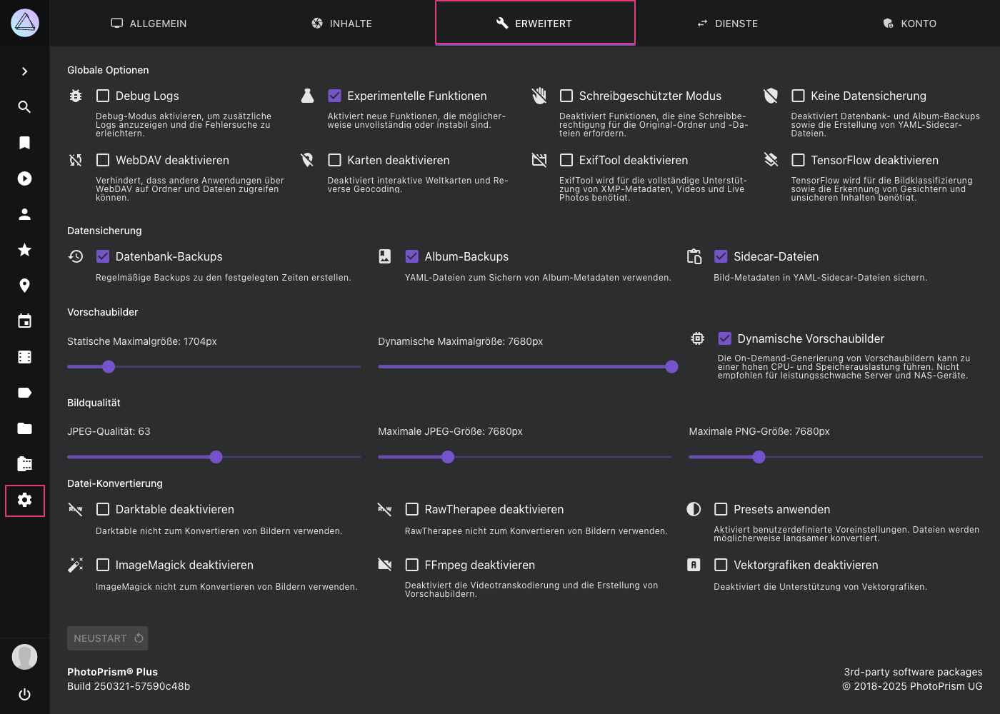

# Erweiterte Einstellungen #
Systemkonfigurationsoptionen wie die Bildqualität können in den erweiterten Einstellungen geändert werden. Du kannst auch bestimmte Funktionen deaktivieren und den Debug- oder schreibgeschützten Modus aktivieren.

!!! tldr ""
    Da diese Einstellungen ohne Authentifizierung nicht sicher sind, sind sie nicht verfügbar, wenn du PhotoPrism im [public Modus](https://docs.photoprism.app/getting-started/config-options/#authentication) verwendest. Das [Ändern von Konfigurationsoptionen](https://docs.photoprism.app/getting-started/config-options/) ist weiterhin über Konfigurationsdateien und Befehlsparameter möglich.

!!! attention ""
    Änderungen von erweiterten Einstellungen erfordern immer einen Neustart.
    Wenn du die Thumbnail-Qualität oder Größen Einstellungen änderst, werden bereits erstellte Thumbnails nicht gelöscht.
    Thumbnails können über die [Kommandozeile](https://docs.photoprism.app/getting-started/docker-compose/#command-line-interface) neu generiert werden.

{ class="shadow" }

Alle [Optionen](https://docs.photoprism.app/getting-started/config-options/) können in deiner `docker-compose.yml` oder auch über Kommandozeilenparameter gesetzt werden. 
Manuell geänderte Werte werden in einer Konfigurationsdatei gespeichert. Sie wird standardmäßig im Ordner `storage/config` gespeichert. 

## Gobale Optionen ##

### Debug Logs ###
Debug Logs unter *Dateien>Logs* anzeigen.
Änderungen erfordern einen Neustart.

Der entsprechende [Konfigurations-Parameter](https://docs.photoprism.app/getting-started/config-options#logging) ist `PHOTOPRISM_DEBUG`.

### Expermientelle Funktionen ###
Aktiviert neue Funktionen, an denen derzeit noch entwickelt wird.

Der entsprechende [Konfigurations-Parameter](https://docs.photoprism.app/getting-started/config-options#feature-flags) ist `PHOTOPRISM_EXPERIMENTAL`.

### Schreibgeschützter Modus ###
Ist diese Option gewählt, können Dateien nicht importiert, über die Benutzeroberfläche hochgeladen oder gelöscht werden.

Der entsprechende [Konfigurations-Parameter](https://docs.photoprism.app/getting-started/config-options#feature-flags) ist `PHOTOPRISM_READONLY`.

### Keine Datensicherung ###
Diese Option verhindert die Erstellung von Datenbank-, Album- und YAML-Sidecar-Dateisicherungen.

Der entsprechende [Konfigurations-Parameter](https://docs.photoprism.app/getting-started/config-options/) ist `PHOTOPRISM_DISABLE_BACKUPS`.

### WebDAV deaktivieren ###
Deaktiviert den eingebauten WebDAV-Server. Änderungen erfordern einen Neustart.

Der entsprechende [Konfigurations-Parameter](https://docs.photoprism.app/getting-started/config-options#feature-flags) ist `PHOTOPRISM_DISABLE_WEBDAV`.

### Karten deaktivieren ###
Wenn Karten deaktiviert sind, liest PhotoPrism trotzdem noch Geo-Informationen (Längen- und Breitengrad) aus den Metadaten deiner Dateien aus.
Es wird allerding kein Reverse Lookup mehr gemacht, um Informationen über die Orte, der Koordinaten, abzufragen.

Die Karten Ansicht ist nicht sichtbar.

Der entsprechende [Konfigurations-Parameter](https://docs.photoprism.app/getting-started/config-options#feature-flags) ist `PHOTOPRISM_DISABLE_PLACES`.

### ExifTool deaktivieren###
Keine JSON-Dateien  in `storage/sidecar` mit ExifTool erstellen.

Beachte, dass du Exiftool aktiviert haben musst, um Videometadaten wie Dauer, Auflösung und Codec zu extrahieren.

Der entsprechende [Konfigurations-Parameter](https://docs.photoprism.app/getting-started/config-options/) ist `PHOTOPRISM_DISABLE_EXIFTOOL`.

### TensorFlow deaktivieren ###
TensorFlow nicht zur automatischen Bild-Kategorisierung und zur Gesichtserkennung verwenden.

Der entsprechende [Konfigurations-Parameter](https://docs.photoprism.app/getting-started/config-options/) ist `PHOTOPRISM_DISABLE_TENSORFLOW`.

## Datensicherung ##

### Datenbank Backups
Datenbank-Backups werden nach dem konfigurierten Zeitplan erstellt.

Der entsprechende [Konfigurations-Parameter](https://docs.photoprism.app/getting-started/config-options.md#backup) ist `PHOTOPRISM_BACKUP_DATABASE`.
Der Zeitplan sowie die Anzahl der Backups, die aufbewahrt werden, können mittels `PHOTOPRISM_BACKUP_SCHEDULE` und `PHOTOPRISM_BACKUP_RETAIN` [konfiguriert](https://docs.photoprism.app/getting-started/config-options.md#backup) werden.

### Album Backups
[YAML-Dateien, die die Metadaten von Alben sichern](../backups/export.md) werden nach dem konfigurierten Zeitplan erstellt.

Der entsprechende [Konfigurations-Parameter](https://docs.photoprism.app/getting-started/config-options.md#backup) ist `PHOTOPRISM_BACKUP_ALBUMS`.
Der Zeitplan kann mittels [`PHOTOPRISM_BACKUP_SCHEDULE`](https://docs.photoprism.app/getting-started/config-options.md#backup) konfiguriert werden.

### Sidecar Dateien
[YAML-Dateien, die die Metadaten von Bildern sichern](../backups/export.md) werden erstellt.

Der entsprechende [Konfigurations-Parameter](https://docs.photoprism.app/getting-started/config-options.md#sidecar-files) ist `PHOTOPRISM_SIDECAR_YAML`.

## Vorschaubilder ##
In diesem Bereich wird festgelegt, wie JPEG-Vorschaubilder und Miniaturansichten gerendert werden. Das sind hochwertige, verkleinerte Versionen deiner Originale.

[Vorschaubilder sind notwendig](https://docs.photoprism.app/getting-started/faq/#why-is-my-storage-folder-so-large-what-is-in-it), weil Webbrowser große Bilder nur schlecht an den Bildschirm anpassen können. 
Die Verwendung von Originalen in voller Auflösung für Diashows und in Suchergebnissen würde außerdem viel Speicherplatz im Browser verbrauchen und die Geschwindigkeit der Indexierung deutlich verringern.

### Skalierungsfilter ###
Du kannst den Algorithmus wählen, der verwendet werden soll, um JPEG Vorschaubilder ('Thumbnails') zu erstellen.

Beispiele der verfügbaren Filter findest du im [folgenden Abschnitt](#skalierungsfilter-beispiele).

Um einen guten Kompromiss zwischen Qualität und Leistung zu finden, empfehlen wir den *Lanczos-Filter*. 
Er ist zwar etwas langsamer bei der Erstellung von Miniaturansichten, erzeugt aber Bilder von sehr hoher Qualität. Im Vergleich dazu kann der weniger anspruchsvolle *kubische Filter* 30 % schneller sein.

Der entsprechende [Konfigurations-Parameter](https://docs.photoprism.app/getting-started/config-options/) ist `PHOTOPRISM_THUMB_FILTER`.

!!! info ""
    Diese Option ist nur verfügbar, wenn `PHOTOPRISM_THUMB_LIBRARY` in deiner Konfigurationsdatei `compose.yaml` oder `docker-compose.yml` auf `„imaging“` gesetzt ist.

### Statische und Dynamische Maximalgrößen

**Statische Maximalgröße**:
Maximalgröße, für Thumbnails, die während des Import- bzw Indexiervorgangs erstellt werden.

Der entsprechende [Konfigurations-Parameter](https://docs.photoprism.app/getting-started/config-options/) ist `PHOTOPRISM_THUMB_SIZE`.

**Dynamische Maximalgröße**:
Maximalgröße, für Thumbnails, die on demand erstellt werden.

Der entsprechende [Konfigurations-Parameter](https://docs.photoprism.app/getting-started/config-options/) ist `PHOTOPRISM_THUMB_SIZE_UNCACHED`.

!!! danger ""
    Die Verringerung des statischen Größenlimits hat erhebliche Auswirkungen auf die Ergebnisse der [Gesichtserkennung](../organize/people.md) und Bildklassifizierung.
    Einfach ausgedrückt, bedeutet das, dass der Indexer nicht mehr richtig sehen kann.

!!! warning ""
    Wenn die eingestellte Maximalgröße überschritten wird (z.B. wenn Nutzer einen großen Bildschirm verwenden),
    und kein Thumbnail in der angefragten Größe vorhanden ist, wird das Originalbild angezeigt.
    **Dies kann dazu führen, dass Bilder in der falschen Orientierung dargestellt werden.**

Die Maximalgröße muss mindestens 720px sein, um zu gewährleisten, dass Thumbnails für Farberkennung, Gesichtserkennung, Bildklassifizierung sowie die Ansichten vorhanden sind.

Wir empfehlen eine hohe Maximalgröße.
Sollte der von Thumbnails belegte Speicherplatz allerdings ein Problem darstellen, kannst du eine niedrigere statische Maximalgröße einstellen.
Setze in diesem Fall eine hohe dynamische Maximalgröße, damit dein Server bei Bedarf Vorschaubilder erstellen kann.
Beachte, dass dies eine hohe Rechenleistung erfordert und es zu einer Verzögerung kommen kann, wenn du Bilder im Vollbildmodus betrachten willst.

!!! tip ""
    Falls du im Vollbildmodus deine Originalbilder angezeigt bekommen möchtest, aktiviere *Dynamische Vorschaubilder*,
    und setze niedrige dynamische und statische Maximalgrößen (z.B. 720).

### Welche Dateien werden von PhotoPrism erstellt? ###
Das kleinste konfigurierbare statische und dynamische Maximalgröße ist 720px, so dass die meisten Größen bis zu `fit_720` standardmäßig **immer** erzeugt werden.
[Höhere Maximalgrößen](#statische-und-dynamische-maximalgroen) generieren Thumbnails mit mehr Details bei höheren Auflösungen - entweder statisch (vorgeneriert während der Indexierung) oder **on demand**, wenn die [Konfiguration es erlaubt](#dynamische-vorschaubilder).

**Optionale** Vorschaubilder können nicht vorgeneriert werden und werden nur auf Anfrage gerendert, z. B. beim Teilen eines Bildes auf Instagram.

Folgende Tabelle listet die verschiedenen Thumbnailgrößen sowie ihre Anwendung:

|   Name    | Breite | Höhe | Aspect Ratio | Verfügbarkeit | Verwendung              |
|-----------|--------|------|--------------|---------------|-------------------------|
| colors    | 3      | 3    | 1:1          | Always        | Color Detection         |
| tile_50   | 50     | 50   | 1:1          | Always        | List View               |
| tile_100  | 100    | 100  | 1:1          | Always        | Places View             |
| left_224  | 224    | 224  | 1:1          | On-Demand     | TensorFlow              |
| right_224 | 224    | 224  | 1:1          | On-Demand     | TensorFlow              |
| tile_224  | 224    | 224  | 1:1          | Always        | TensorFlow, Mosaic View |
| tile_500  | 500    | 500  | 1:1          | Always        | Cards View              |
| fit_720   | 720    | 720  | Preserved    | Always        | SD TV, Mobile           |
| tile_1080 | 1080   | 1080 | 1:1          | Optional      | Instagram               |
| fit_1280  | 1280   | 1024 | Preserved    | On-Demand     | HD TV, SXGA             |
| fit_1600  | 1600   | 900  | Preserved    | Optional      | Social Media            |
| fit_1920  | 1920   | 1200 | Preserved    | On-Demand     | Full HD                 |
| fit_2048  | 2048   | 2048 | Preserved    | Optional      | DCI 2K, Tablets         |
| fit_2560  | 2560   | 1600 | Preserved    | On-Demand     | Quad HD, Notebooks      |
| fit_3840  | 3840   | 2400 | Preserved    | Optional      | 4K Ultra HD             |
| fit_4096  | 4096   | 4096 | Preserved    | On-Demand     | DCI 4K, Retina 4K       |
| fit_7680  | 7680   | 4320 | Preserved    | On-Demand     | 8K Ultra HD 2           |

!!! tldr ""
    Die Thumbnails werden in `storage/cache/thumbnails`gespeichert. Der genaue Pfad ist abhängig von Thumbnail-Größe und Hash der Originaldatei z.B.
    `storage/cache/thumbnails/1/a/3/1a30c1f...9_100x100_center.jpg`

### Dynamische Vorschaubilder
Vorschaubilder können on-demand erstellt werden, also erst, wenn sie gebraucht werden. 
Dies ist beispielsweise beim Betrachten der Bilder der Fall.
Das spart Speicherplatz, ist aber rechenintensiver und wird daher nicht empfohlen, wenn du auf weniger leistungsfähigen Geräten (wie dem Raspberry Pi) arbeitest.

Der entsprechende [Konfigurations-Parameter](https://docs.photoprism.app/getting-started/config-options/) ist `PHOTOPRISM_THUMB_UNCACHED`.

## Bildqualität ##

### JPG Qualität

Um Thumbnails in bestmöglicher Qualität zu erhalten, solltest du die *JPEG*-Qualität auf ein Minimum von 90 einstellen. 
Generell gilt: je höher die Qualität, desto mehr Speicherplatz brauchen die Thumbnails und desto länger dauert die Generierung.

* Qualitäts-Level von >90% werden als hoch eingestuft.
* 80%-90% gilt als mittlere Qualität
* 70-80% gilt als niedrige Qualität (z.B. stark komprimierte Bilder auf Social Media). 

Alles mit einer Qualität von unter 70% gilt als sehr niedrig.

Beispiel: Bei einer JPEG-Qualität von 95 sind die Vorschaubilder ca 500kB groß. Bei einer Qualität von 80 ist die Größe auf ca 100kB reduziert.

!!! tldr ""
    **Das Qualitätsempfinden hängt stark davon ab, wie viele Informationen ein Bild enthält.** 
    Leere Flächen oder Himmel, lassen sich leicht komprimieren. Während Bilder mit vielen Details am meisten unter der Komprimierung leiden.
    Deshalb wirkt sich eine Verringerung der Qualität der Thumbnails auch negativ auf die Ergebnisse der Gesichtserkennung und Bildklassifizierung aus. 

Der entsprechende [Konfigurations-Parameter](https://docs.photoprism.app/getting-started/config-options/) ist `PHOTOPRISM_JPEG_QUALITY`.

### Maximale JPEG-Größe

Hiermit wird die maximale Größe der JPEG-Dateien festgelegt, die bei der Umwandlung von Original-RAW-Bildern erstellt werden.

!!! tldr ""
    [RawTherapee und "heif-convert" können die Auflösung von JPEG-Dateien nicht begrenzen](https://docs.photoprism.app/known-issues/#jpeg-size-limit) , wenn sie Dateien aus anderen Formaten wie RAW, DNG, HEIC oder AVIF konvertieren.

Der entsprechende [Konfigurations-Parameter](https://docs.photoprism.app/getting-started/config-options/) ist `PHOTOPRISM_JPEG_SIZE`.

### Maximale PNG Größe

Hiermit wird die maximale Größe der PNG-Dateien festgelegt, die bei der Umwandlung von Original-Dateien erstellt werden.

Der entsprechende [Konfigurations-Parameter](https://docs.photoprism.app/getting-started/config-options/) ist `PHOTOPRISM_PNG_SIZE`.

## Dateikonvertierung ##
Viele Fotografen, insbesondere Nutzer einer digitalen SLR, verwenden ein verlustfreies RAW-Format anstelle des verlustbehafteten JPEG-Formats. Es gibt auch [Handies](https://www.fredericpaulussen.be/how-to-raw-photos-huawei-p30-pro/), die RAW-Daten abspeichern können oder das Format HEIC/HEIF nutzen.

Unser Ziel ist eine umfangreiche Unterstützung für alle [RAW-Formate](https://en.wikipedia.org/wiki/Raw_image_format), unabhängig vom verwendeten Kameramodell. Deshalb bitten wir dich uns eine Nachricht zu schicken, falls du ein Problem mit den Dateien von einem deiner Geräte hast.

Webbrowser können keine RAW-Formate anzeigen. Deshalb muss PhotoPrism diese Dateien zu JPEGs *konvertieren*. Falls du das nicht möchtest, kannst du das in den [Einstellungen](library.md) ausschalten.

Zusätzlich zu den oben genannten Formaten unterstützt PhotoPrism auch BMP-, GIF-, PNG- und TIFF-Dateien. Bevor du diese Formate zur Speicherung nutzt, solltest du bedenken, dass diese oft keine Metadaten speichern können. Deshalb werden sie in der Regel für Screenshots, Diagramme und Icons verwendet.

{ class="shadow" }

!!! info ""
    Von PhotoPrism erstellte Sidecar-Dateien werden außerhalb des Originals Verzeichnis gespeichert, so dass die RAW zu JPEG Konvertierung auch im
    Read-Only Modus verfügbar ist.

### Darktable deaktivieren

Wenn diese Funktion deaktiviert ist, wird [Darktable](https://www.darktable.org/) nicht für die RAW-Konvertierung verwendet.

Der entsprechende [Konfigurations-Parameter](https://docs.photoprism.app/getting-started/config-options/) ist `PHOTOPRISM_DISABLE_DARKTABLE`.

### RawTherapee deaktivieren

Wenn diese Funktion deaktiviert ist, wird [RawTherapee](https://www.rawtherapee.com/) nicht für die RAW-Konvertierung verwendet.
Der entsprechende [Konfigurations-Parameter](https://docs.photoprism.app/getting-started/config-options/) ist `PHOTOPRISM_DISABLE_RAWTHERAPEE`.

### Presets anwenden

Aktiviert Benutzerdefinierte Voreinstellungen. Dateien werden möglicherweise langsamer konvertiert.

Der entsprechende [Konfigurations-Parameter](https://docs.photoprism.app/getting-started/config-options/) ist `PHOTOPRISM_RAW_PRESETS`.

### FFmpeg deaktivieren

Wenn diese Funktion deaktiviert ist, wird [FFmpeg](https://www.ffmpeg.org/documentation.html) nicht zum Transkodieren von Videos oder zum Extrahieren von Standbildern für die Erstellung von Vorschaubildern verwendet, und das Indexieren oder Importieren von Videodateien ist nicht möglich.

Der entsprechende [Konfigurations-Parameter](https://docs.photoprism.app/getting-started/config-options/) ist `PHOTOPRISM_DISABLE_FFMPEG`.

!!! info ""
    Um zu verhindern, dass unerfahrene Benutzer versehentlich die Erstellung von Vorschaubildern für Videos deaktivieren, kann *FFmpeg* nur deaktiviert werden, wenn [Experimentelle Funktionen](#expermientelle-funktionen) aktiviert sind.

### ImageMagick deaktivieren

Wenn diese Funktion deaktiviert ist, wird [ImageMagick](https://imagemagick.org/) nicht für die Konvertierung verwendet.

Der entsprechende [Konfigurations-Parameter](https://docs.photoprism.app/getting-started/config-options/) ist `PHOTOPRISM_DISABLE_IMAGEMAGICK`.

### Vektorgrafiken deaktivieren

Deaktiviert die Unterstützung von Vektorgrafiken.

## Skalierungsfilter Beispiele ##

Originalbild:

{ class="shadow" }

Dieses Bild wurde unter der Verwendung von verschiedenen Filtern von 600x400 Pixeln auf 150x100 Pixel skaliert.
Die Liste ist sortiert nach Rechengeschwindigkeit.

An erster Stelle steht der schnellste Filter mit der niedgrigsten Qualität, an letzer Stelle der langsamste Filter mit der besten Qualität.

| Filter             | Ergebnis                        |
|--------------------|---------------------------------|
| Nächster Nachbar   |  |
| Bilinear           |   |
| Bikubisch (Scharf) |   |
| Lanczos            |  |

Source: [A Comparative Analysis of Image Interpolation Algorithms](https://dl.photoprism.app/pdf/publications/20160201-Comparative_Analysis_of_Image_Interpolation.pdf)

<!--## Filter ##

Quelle: https://ijarcce.com/wp-content/uploads/2016/02/IJARCCE-7.pdf

### Linear ###

Die bilineare Interpolation berechnet den Wert eines Pixels indem ein gewichteter Mittelwert der vier benachbarten Pixel berechnet wird. Das dabei entstehende Bild ist weicher als das Originalbild. Wenn die Distanzen zu den verwendeten Pixeln gleich sind, dann ist der interpolierte Wert eines Pixels gleich der Summe der Distanzen geteilt durch vier.
Bei der bilinearen Interpolation wird die Interpolation in beiden Richtungen, horizontal und vertikal, durchgeführt. Das Ergebnis ist qualitativ besser als *Nächster Nachbar* und benötigt weniger Rechenzeit als die bikubische Interpolation.

### Kubisch ###

Catmull-Rom ist ein lokal interpolierendes Kurvenintervall was speziell für die Verwendung in der Computergrafik entwickelt wurde. Während die ursprüngliche Verwendung im Design von Oberflächen und Kurven lag, wird es mittlerweile auch in anderen Bereichen eingesetzt. Catmull-Rom Splines gehören zur Familie von kubischen, interpolierenden Splines, so dass die Tangente an jedem Punkt mithilfe des vorherigen und des nächsten Punkts auf dem Kurvenintervall berechnet wird. Das Ergebnis ist ähnlich dem der bikubischen Interpolation im Bezug auf die Schärfe des Ergebnisbildes, aber bei Regionen mit weichen Verläufen ist Catmull-Rom eindeutig überlegen.

### Lanczos ###

Die *Lanczos*-Interpolation ist eine mathematische Formel zur weichen Interpolation eines Bildes, basierend auf verschiedenen Teilen innerhalb des Bildes. Dabei wird jedes Sample auf eine verschobene und skalierte Kopie des Filter-Kerns angewandt. Die Summe dieser Kerne wird dann am aktuell zu berechnenden Pixel ausgewertet. Die *Lanczos*-Interpolation ist **am besten geeignet um Details beizubehalten und ein Minimum an Artefakten zu erhalten**. Jedoch benötigt eine höherwertige *Lanczos*-Interpolation sehr viel Rechenzeit, wodurch es für die meiste kommerzielle Software ungeeignet ist.

### Blackman ###

*Blackman* ist eine modifizierte *Lanczos*-Interpolation die eine bessere Kontrolle über bestimmte Artefakte hat.

-->

