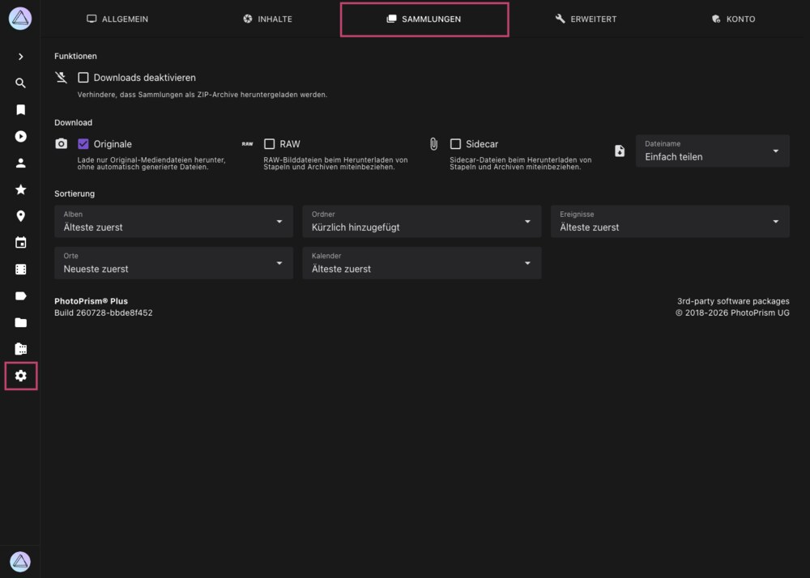

# Einstellungen > Sammlungen #

Im Tab *Sammlungen* legst du fest, wie sich Alben, Ordner, Ereignisse, Kalendermonate und Orte verhalten:
ob sie als ZIP-Archiv heruntergeladen werden können, welche Dateien ein solches Archiv enthält und mit welcher
Sortierung neu erstellte Sammlungen beginnen.

{ class="shadow" }

!!! info ""
    Dieser Tab wird nur Super Admins angezeigt. Für die *Download*-Optionen muss außerdem die [Funktion *Download*](general.md#download) im Tab [*Allgemein*](general.md) aktiviert sein.

## Funktionen ##

#### :material-download-off: Downloads deaktivieren ####

Verhindert, dass komplette Sammlungen als ZIP-Archiv heruntergeladen werden, zum Beispiel über die Download-Schaltfläche eines Albums.
Einzelne Bilder können weiterhin heruntergeladen werden, solange die [Funktion *Download*](general.md#download) aktiviert ist.

## Download ##

Diese Optionen bestimmen, welche Dateien in ein ZIP-Archiv aufgenommen werden, wenn eine komplette Sammlung heruntergeladen wird.
Sie werden nur angezeigt, wenn Downloads nicht wie oben beschrieben deaktiviert wurden.

#### :material-camera: Originale ####

Es werden nur Dateien aus dem Ordner *originals* aufgenommen, nicht die automatisch erzeugten Dateien aus dem Ordner *sidecar*.
Dies ist die empfohlene Standardeinstellung.

#### :material-raw: RAW ####

Nimmt RAW-Dateien mit auf. Da eine RAW-Datei in der Regel deutlich größer ist als das daraus erzeugte JPEG, kann diese
Option die Größe eines Archivs erheblich erhöhen.

#### :material-paperclip: Sidecar ####

Nimmt Sidecar-Dateien wie XMP-Metadaten mit auf. Das wird im Allgemeinen nicht empfohlen, außer für bestimmte professionelle Workflows.

#### :material-file-download: Dateiname ####

Legt fest, wie die Dateien innerhalb des Archivs benannt werden:

| Option           | Dateinamen                                                                                                    |
|------------------|---------------------------------------------------------------------------------------------------------------|
| Aktueller Name   | Der Name, den die Datei aktuell in deiner Bibliothek hat                                                      |
| Originalname     | Der Name, den die Datei beim Hochladen oder Importieren hatte, ersatzweise der aktuelle Name                   |
| Einfach teilen   | Ein normalisierter Name aus Aufnahmezeit und Bildtitel, z. B. `20260728-181530-Sunset-Beach.jpg`               |

!!! note ""
    Dieselben drei Inhaltsoptionen gibt es auch für den Download einzelner Bilder und Bildstapel im Tab [*Inhalte*](library.md#download). Die Optionen hier gelten ausschließlich für komplette Sammlungen.

## Sortierung ##

Legt fest, in welcher Reihenfolge Bilder in **neu erstellten** Sammlungen angeordnet werden. Jede Sammlung speichert ihre
eigene Sortierung, eine Änderung hier wirkt sich also nicht auf bestehende Alben aus. Um die Sortierung eines bestehenden
Albums zu ändern, öffne dessen Bearbeitungs-Dialog und wähle dort eine andere *Sortierung*.

| Einstellung                           | Gilt für                                                    | Standard              |
|---------------------------------------|-------------------------------------------------------------|-----------------------|
| [Alben](../organize/albums.md)        | Alben, die du manuell erstellst                             | Älteste zuerst        |
| [Ordner](../organize/folders.md)      | Ordner-Alben aus deiner Verzeichnisstruktur                 | Kürzlich hinzugefügt  |
| [Ereignisse](../organize/moments.md)  | Intelligente Alben, gruppiert nach Anlass, Reise oder Ort   | Älteste zuerst        |
| Regionen                              | Intelligente Alben, gruppiert nach Bundesland oder Region   | Neueste zuerst        |
| [Kalender](../organize/calendar.md)   | Intelligente Alben, gruppiert nach Jahr und Monat           | Älteste zuerst        |

Verfügbare Sortierungen sind *Neueste zuerst*, *Älteste zuerst*, *Kürzlich hinzugefügt*, *Bildtitel*, *Dateiname*,
*Dateigröße*, *Videolänge* und *Am relevantesten*.

!!! tldr ""
    Diese Werte lassen sich auch direkt in der Datei `settings.yml` in deinem config-Ordner setzen. [Mehr erfahren ›](https://docs.photoprism.app/getting-started/config-files/settings/#albums)
