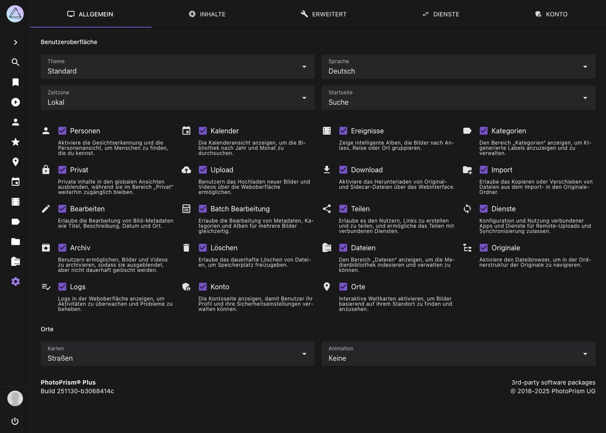

# Allgemeine Einstellungen

In den *Allgemeinen Einstellungen* kannst du die Eigenschaften der Benutzeroberfläche sowie der Karten konfigurieren.

{ class="shadow" }

### Benutzeroberfläche ###
Hier kann das *Theme* und die *Sprache* der Benutzeroberfläche geändert, sowie eine *Startseite* und *Zeitzone* festgelegt werden.

Um PhotoPrism an deine individuellen Bedürfnisse anzupassen, kannst du die folgenden Bereiche und Funktionalitäten ein- und ausschalten.
Deaktivierte Bereiche tauchen nicht in der Hauptnavigation auf.

#### :material-account: Personen ####
Wenn diese Option deaktiviert ist, wird der Bereich Personen nicht angezeigt. Um die Gesichtserkennung zu deaktivieren kannst du `PHOTOPRISM_DISABLE_FACES` oder `PHOTOPRISM_DISABLE_TENSORFLOW` `"true"` in deiner [Konfiguration](https://docs.photoprism.app/getting-started/config-options/) verwenden.

#### :material-calendar: Kalender ####
Wenn diese Option deaktiviert ist, wird der Bereich *Kalender* nicht angezeigt.

#### :material-filmstrip-box: Ereignisse ####
Wenn diese Option deaktiviert ist, wird der Bereich *Ereignisse* nicht angezeigt.

#### :material-label: Kategorien ####
Wenn diese Option deaktiviert ist, wird der Bereich *Kategorien* nicht angezeigt. Außerdem kannst du keine *Kategorien* hinzufügen oder bearbeiten.

#### :material-lock: Privat ####
Schließt als privat markierte Inhalte aus Suchergebnissen, geteilten Alben, Kategorien und Karten aus.

#### :material-cloud-upload: Upload ####
Wenn diese Option deaktiviert ist, können keine Dateien über [*Upload*](../library/upload.md) hochgeladen werden.
Diese Einstellung kann hilfreich sein, wenn du anderen Personen Zugriff auf dein PhotoPrism gibst, diese aber keine Dateien hochladen dürfen.

#### :material-download: Download ####
Wenn diese Option deaktiviert ist, können keine Dateien über die PhotoPrism-Benutzeroberfläche heruntergeladen werden. Bitte beachte, dass es trotzdem möglich sein kann, Dateien mit den integrierten Browserfunktionen herunterzuladen.

#### :material-folder-plus: Import ####
Wenn diese Option deaktiviert ist, gibt es keine Möglichkeit Bilder zu [*importieren*](../library/import.md). Du musst stattdessen [*indexieren*](../library/indexing.md) verwenden, um neue Bilder hinzuzufügen.

#### :material-pencil: Bearbeiten ####
Wenn diese Option deaktiviert ist, können keine Fotodetails bearbeitet werden.

#### :material-form-select: Batch Edit ####
Wenn diese Option deaktiviert ist, ist die Batch-Bearbeitung von Fotodetails nicht möglich.

#### :material-share-variant: Teilen ####
Wenn diese Option deaktiviert ist, können Alben weder geteilt noch zu anderen Diensten (wie ownCloud) hochgeladen werden.

#### :material-sync: Dienste ####
Erlaubt das Teilen von Bildern mit [Apps und Diensten](./sync.md).

#### :material-package-down: Archiv ####
Wenn diese Option deaktiviert ist, gibt es kein *Archiv*. Fotos, die zuvor archiviert wurden, erscheinen wieder in den Suchergebnissen.

#### :material-delete: Löschen ####
Wenn diese Option deaktiviert ist, ist eine dauerhafte Löschung von Dateien aus dem Archiv nicht möglich.

#### :material-film: Dateien ####
Wenn diese Option deaktiviert ist, wird der Bereich *Dateien* nicht angezeigt.

#### :material-file-tree: Originale  ####
Wenn diese Option deaktiviert ist, wird der Bereich *Originale* nicht angezeigt.

#### :material-playlist-check: Logs ####
Wenn diese Option deaktiviert ist, werden keine Server-Logs angezeigt.

#### :material-shield-account-variant: Konto ####
Wenn diese Option deaktiviert ist, wird der Bereich *Konto* nicht angezeigt.

#### :material-map-marker: Karten ####
Wenn diese Option deaktiviert ist, wird der Bereich *Karten* nicht angezeigt.

## Karten ##

Am Ende des Tabs *Allgemeine Einstellungen* kannst du deinen bevorzugten Kartenstil und die Animationslänge für *Karten* wählen.
PhotoPrism enthält vier hochauflösende Weltkarten, um zu sehen, wo du warst, und um lang vergessene Aufnahmen wiederzuentdecken.

Um deine Fotos mit Standortdaten wie Bundesland, Stadt und Kategorie anzureichern, haben wir auch unseren eigenen Geo-Informationsdienst auf Basis von OpenStreetMap gestartet.
Eine zukünftige Version wird zusätzlich Daten zu öffentlichen Veranstaltungen bereitstellen, sodass Alben von beliebten Musikfestivals oder Sportveranstaltungen automatisch erstellt werden können.

