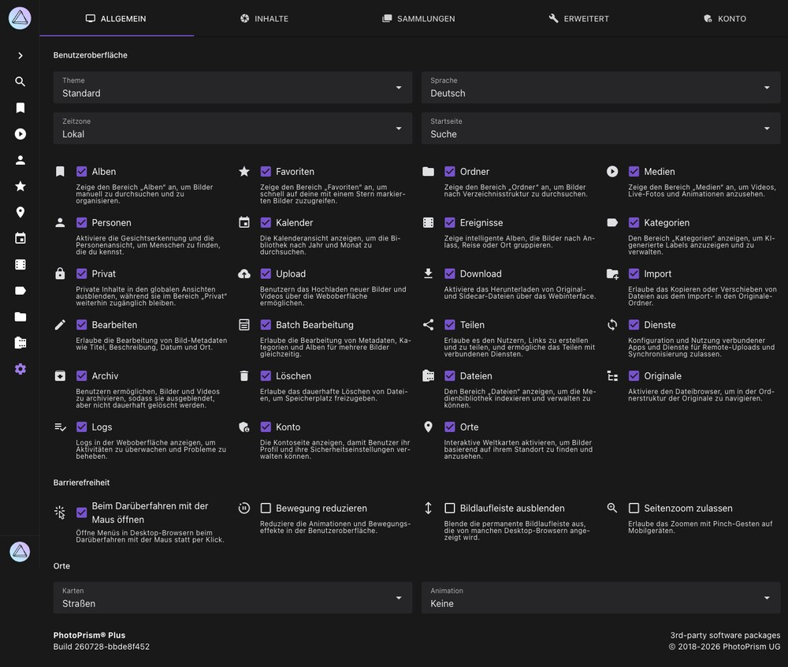

# Allgemeine Einstellungen

In den *Allgemeinen Einstellungen* kannst du grundlegende Eigenschaften der Benutzeroberfläche, Optionen zur Barrierefreiheit sowie die Karten im Bereich *Karten* konfigurieren.

{ class="shadow" }

!!! info ""
    Die Schalter in diesem Tab sind in erster Linie für die instanzweite Anpassung gedacht. Einige Optionen werden nur Super Admins angezeigt und sind nicht in jeder Edition und jedem Sitzungstyp verfügbar.

## Benutzeroberfläche ##
Hier kann das *Theme* und die *Sprache* der Benutzeroberfläche geändert, sowie eine *Startseite* und *Zeitzone* festgelegt werden.

Um PhotoPrism an deine individuellen Bedürfnisse anzupassen, kannst du die folgenden Bereiche und Funktionalitäten ein- und ausschalten.
Deaktivierte Bereiche tauchen nicht in der Hauptnavigation auf.

#### :material-bookmark: Alben ####
Wenn diese Option deaktiviert ist, gibt es keinen Bereich *Alben*, um Bilder manuell zu durchsuchen und zu organisieren.

#### :material-star: Favoriten ####
Wenn diese Option deaktiviert ist, gibt es keinen Bereich *Favoriten*, um schnell auf deine hervorgehobenen Bilder zuzugreifen.

#### :material-folder: Ordner ####
Wenn diese Option deaktiviert ist, gibt es keinen Bereich *Ordner*, um Bilder anhand der Verzeichnisstruktur zu durchsuchen.

#### :material-play-circle: Medien ####
Wenn diese Option deaktiviert ist, gibt es keinen Bereich *Medien*, um Videos, Live-Fotos und Animationen zu durchsuchen.

#### :material-account: Personen ####
Wenn diese Option deaktiviert ist, wird der Bereich Personen nicht angezeigt. Um die Gesichtserkennung zu deaktivieren kannst du `PHOTOPRISM_DISABLE_FACES` oder `PHOTOPRISM_DISABLE_TENSORFLOW` `"true"` in deiner [Konfiguration](https://docs.photoprism.app/getting-started/config-options/) verwenden.

#### :material-calendar: Kalender ####
Wenn diese Option deaktiviert ist, wird der Bereich *Kalender* nicht angezeigt.

#### :material-filmstrip-box: Ereignisse ####
Wenn diese Option deaktiviert ist, wird der Bereich *Ereignisse* nicht angezeigt.

#### :material-label: Kategorien ####
Wenn diese Option deaktiviert ist, wird der Bereich *Kategorien* nicht angezeigt. Außerdem kannst du keine *Kategorien* hinzufügen oder bearbeiten.

#### :material-lock: Privat ####
Blendet als privat markierte Inhalte in den allgemeinen Ansichten aus, hält sie aber im Bereich *Privat* weiterhin zugänglich.

#### :material-cloud-upload: Upload ####
Wenn diese Option deaktiviert ist, können keine Dateien über [*Upload*](../library/upload.md) hochgeladen werden.
Diese Einstellung kann hilfreich sein, wenn du anderen Personen Zugriff auf dein PhotoPrism gibst, diese aber keine Dateien hochladen dürfen.

#### :material-download: Download ####
Wenn diese Option deaktiviert ist, können keine Dateien über die PhotoPrism-Benutzeroberfläche heruntergeladen werden. Bitte beachte, dass es trotzdem möglich sein kann, Dateien mit den integrierten Browserfunktionen herunterzuladen.

Welche Dateien in einen Download aufgenommen werden und ob komplette Sammlungen als ZIP-Archiv heruntergeladen werden können, legst du in den Tabs [*Sammlungen*](collections.md) und [*Inhalte*](library.md#download) fest.

#### :material-folder-plus: Import ####
Wenn diese Option deaktiviert ist, gibt es keine Möglichkeit Bilder zu [*importieren*](../library/import.md). Du musst stattdessen [*indexieren*](../library/originals.md) verwenden, um neue Bilder hinzuzufügen.

#### :material-pencil: Bearbeiten ####
Wenn diese Option deaktiviert ist, können keine Fotodetails bearbeitet werden.

#### :material-form-select: Batch Edit ####
Wenn diese Option deaktiviert ist, ist die Batch-Bearbeitung von Fotodetails nicht möglich.

#### :material-share-variant: Teilen ####
Wenn diese Option deaktiviert ist, können Nutzer keine Freigabe-Links erstellen und keine Inhalte mit verbundenen Diensten teilen.

#### :material-sync: Dienste ####
Erlaubt das Einrichten und Verwenden verbundener [Apps und Dienste](./sync.md) für Remote-Uploads und Synchronisierung.

#### :material-package-down: Archiv ####
Wenn diese Option deaktiviert ist, gibt es kein *Archiv*. Fotos, die zuvor archiviert wurden, erscheinen wieder in den Suchergebnissen.

#### :material-delete: Löschen ####
Wenn diese Option deaktiviert ist, ist eine dauerhafte Löschung von Dateien aus dem Archiv nicht möglich.

#### :material-film: Dateien ####
Wenn diese Option deaktiviert ist, gibt es keinen Bereich *Dateien* für Indexierung und Wartungsaufgaben.

#### :material-file-tree: Originale  ####
Wenn diese Option deaktiviert ist, wird der Bereich *Originale* nicht angezeigt.

#### :material-playlist-check: Logs ####
Wenn diese Option deaktiviert ist, werden keine Server-Logs angezeigt.

#### :material-shield-account-variant: Konto ####
Wenn diese Option deaktiviert ist, wird der Bereich *Konto* nicht angezeigt.

#### :material-map-marker: Karten ####
Wenn diese Option deaktiviert ist, wird der Bereich *Karten* nicht angezeigt.

## Barrierefreiheit ##

Die Optionen im Abschnitt *Barrierefreiheit* legen fest, wie die Benutzeroberfläche auf Eingaben und Bewegung reagiert.
Es handelt sich um instanzweite Voreinstellungen, die von Super Admins gesetzt werden, nicht um Einstellungen einzelner Nutzer.

#### :material-cursor-default-click-outline: Beim Darüberfahren mit der Maus öffnen ####
Wenn diese Option aktiviert ist, öffnen sich Menüs bereits, sobald der Mauszeiger darüber bewegt wird, statt auf einen Klick zu warten.
Deaktiviere sie, wenn sich Menüs beim Bewegen des Zeigers über die Seite ungewollt öffnen.
Auf Touch-Geräten öffnen sich Menüs immer per Tippen, dort hat diese Option also keine Auswirkung.

Änderungen wirken sich sofort aus, ohne die Seite neu zu laden.

#### :material-motion-pause-outline: Bewegung reduzieren ####
Verkürzt oder entfernt Animationen und Übergänge in der Benutzeroberfläche, einschließlich der Fluganimation auf den Karten im Bereich [*Karten*](../organize/places.md).
Deine bevorzugte Länge der Kartenanimation bleibt erhalten und gilt wieder, sobald du *Bewegung reduzieren* ausschaltest.

Änderungen wirken sich sofort aus, außer auf eine bereits geöffnete Karte. Diese übernimmt die neue Einstellung, wenn du sie das nächste Mal öffnest.

#### :material-arrow-up-down: Bildlaufleiste ausblenden ####
Blendet die dauerhaft sichtbare Bildlaufleiste aus, für die manche Desktop-Browser Platz reservieren.
Mobile Browser zeigen eine Bildlaufleiste nur während des Scrollens, dort macht diese Option also keinen sichtbaren Unterschied.

Änderungen wirken sich aus, nachdem die Seite neu geladen wurde.

#### :material-magnify-plus-outline: Seitenzoom zulassen ####
Erlaubt es, die Seite auf Mobilgeräten mit einer Zwei-Finger-Geste zu zoomen.
Die Option ist standardmäßig deaktiviert, damit Zwei-Finger-Gesten die Bilder zoomen und nicht die Benutzeroberfläche darum herum.

Änderungen wirken sich aus, nachdem die Seite neu geladen wurde.

## Karten ##

Am Ende des Tabs *Allgemeine Einstellungen* kannst du deinen bevorzugten Kartenstil und die Animationslänge für *Karten* wählen.
PhotoPrism enthält mehrere hochauflösende Weltkarten, sodass du deine Bibliothek nach Orten durchsuchen kannst.

Um deine Fotos mit Standortdaten wie Land, Bundesland, Stadt und Kategorie anzureichern, enthält PhotoPrism außerdem ein Reverse-Geocoding auf Basis von OpenStreetMap-Daten.

