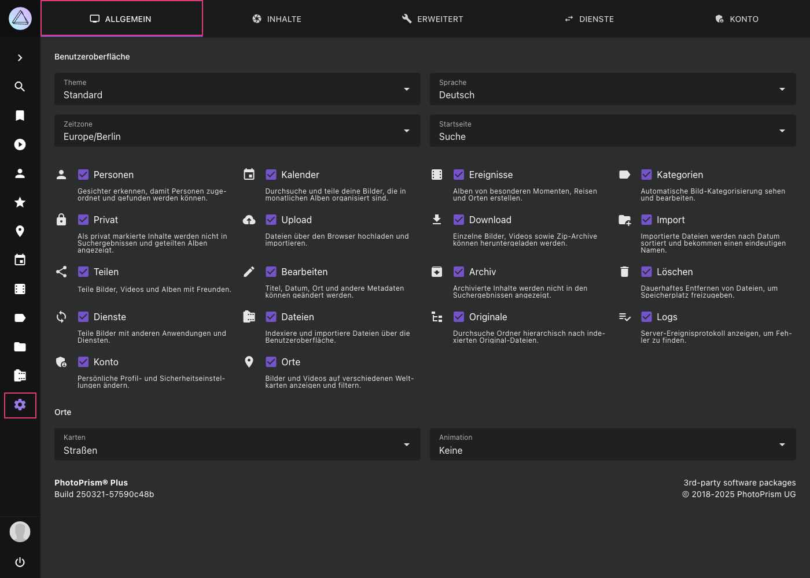

# Allgemeine Einstellungen#

In den *Allgemeinen Einstellungen* kannst du die Eigenschaften der Benutzeroberfläche sowie der Karten konfigurieren.

{ class="shadow" }

### Benutzeroberfläche ###
Hier kann das *Theme* und die *Sprache* der Benutzeroberfläche geändert, sowie eine *Startseite* und *Zeitzone* festgelegt werden.

Um PhotoPrism an deine individuellen Bedürfnisse anzupassen, kannst du die folgenden Bereiche und Funktionalitäten ein- und ausschalten.
Deaktivierte Bereiche tauchen nicht in der Hauptnavigation auf.

#### :material-account: Personen ####
Wenn diese Option deaktiviert ist, wird der Bereich Personen nicht angezeigt. Um die Gesichtserkennung zu deaktivieren kannst du `PHOTOPRISM_DISABLE_FACES` oder `PHOTOPRISM_DISABLE_TENSORFLOW` `"true"` in deiner [Konfiguration](https://docs.photoprism.app/getting-started/config-options/) verwenden.

#### :material-calendar: Kalender ####
Wenn diese Option deaktiviert ist, wird der Bereich *Kalender* nicht angezeigt.

#### :material-filmstrip-box: Ereignisse ####
Wenn diese Option deaktiviert ist, wird der Bereich *Ereignisse* nicht angezeigt.

#### :material-label: Kategorien ####
Wenn diese Option deaktiviert ist, wird der Bereich *Kategorien* nicht angezeigt. Außerdem kannst du keine *Kategorien* hinzufügen oder bearbeiten.

#### :material-lock: Privat ####
Wenn diese Option aktiviert ist, werden private Bilder und Videos nicht in *Suche*, *Videos*, *Favoriten*, *Kategorien*, *Karten* und *geteilten Alben* angezeigt.

#### :material-cloud-upload: Upload ####
Wenn diese Option deaktiviert ist, können keine Dateien über [*Upload*](../library/upload.md) hochgeladen werden.
Diese Einstellung kann hilfreich sein, wenn du anderen Personen Zugriff auf dein PhotoPrism gibst, diese aber keine Dateien hochladen dürfen.

#### :material-download: Download #### {#downloads}
Wenn diese Option deaktiviert ist, können keine Dateien über die PhotoPrism-Benutzeroberfläche heruntergeladen werden. Bitte beachte, dass es trotzdem möglich sein kann, Dateien mit den integrierten Browserfunktionen herunterzuladen.

#### :material-folder-plus: Import ####
Wenn diese Option deaktiviert ist, gibt es keine Möglichkeit Bilder zu [*importieren*](../library/import.md). In diesem Fall musst du neue Bilder über eine [*Indexierung*](../library/indexing.md) hizufügen.

#### :material-share-variant: Teilen ####
Wenn diese Option deaktiviert ist, können Alben weder geteilt noch zu anderen Diensten (wie ownCloud) hochgeladen werden.

#### :material-pencil: Bearbeiten ####
Wenn diese Option deaktiviert ist, kannst du keine Metadaten editieren.

#### :material-package-down: Archiv ####
Diese Option steuert das *Archiv*. Bilder die archiviert wurden, bevor du die Option deaktivierst, werden wieder in *Suche/Videos* dargestellt.

#### :material-delete: Löschen ####
Wenn diese Option aktiviert ist, können Dateien endgültig aus dem Archiv gelöscht werden, um Speicherplatz freizugeben.

#### :material-sync: Dienste ####
Erlaubt das Teilen von Bildern mit [Apps und Diensten](./sync.md).

#### :material-film: Dateien ####
Wenn diese Option deaktiviert ist, wird der Bereich *Dateien* nicht angezeigt.

#### :material-file-tree: Originale  ####
Wenn diese Option deaktiviert ist, wird der Bereich *Originale* nicht angezeigt.

#### :material-playlist-check: Logs ####
Wenn diese Option deaktiviert ist, werden keine Server-Logs angezeigt.

#### :material-shield-account-variant: Konto ####
Wenn diese Option deaktiviert ist, wird der Bereich *Konto* nicht angezeigt.

#### :material-map-marker: Karten ####
Wenn diese Option deaktiviert ist, wird der Bereich *Karten* nicht angezeigt.

### Karten ####
Hier kannst du den Kartenstil und die Geschwindigkeit von Animationen einstellen.
PhotoPrism bietet dir 4 hochauflösende Kartenansichten.

Um deinen Bildern Informationen wie Land, Stadt oder Kategorie hinzuzufügen, haben wir kürzlich **PhotoPrism Places** in Betrieb genommen.
PhotoPrism Places ist unsere eigene Geocoding API, basierend auf  OpenStreetMap.
Zusätzlich werden wir in Zukunft Informationen über öffentliche Events bereitstellen, die an bestimmten Orten stattgefunden haben.
Dadurch können beispielsweise automatisch Alben von Musikfestivals oder Sportevents erzeugt werden.

