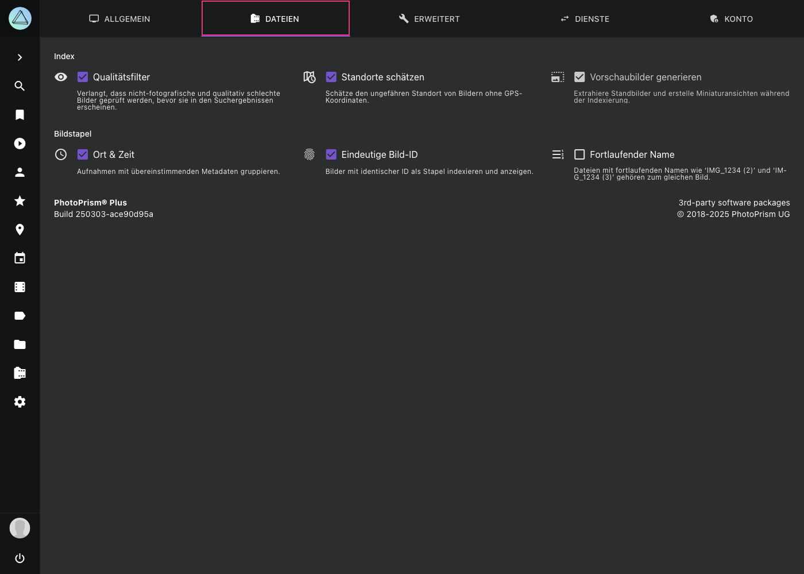

# Einstellungen > Inhalte #

{ class="shadow" }

!!! info ""
    Einige dieser Einstellungen sind nur für [Super Admins](../users/roles.md) verfügbar.

## Index ##

#### :material-eye: Qualitätsfilter ####
Erfordert eine [Überprüfung von nicht fotografischen und qualitativ schlechten Bildern](../organize/review.md), bevor sie in den Suchergebnissen erscheinen.

#### :material-map-clock-outline: Schätzungen ####
Schätzt den Standort von Bildern, die ohne GPS-Informationen aufgenommen wurden, indem er aus dem Standort anderer Bilder, die am selben Tag aufgenommen wurden, extrapoliert wird.

!!! danger ""
    Beachte, dass, wenn du Bilder von nicht zusammenhängenden Veranstaltungen an verschiedenen Orten hast, die GPS-Koordinaten der Bilder von einer Veranstaltung auf die Bilder der anderen Veranstaltung angewendet/extrapoliert werden, denen die Koordinaten fehlen (auch wenn diese in verschiedenen Ordnern sind).

!!! note ""
    Für nicht-fotografische Bilder oder Bilder ohne Kamerainformationen wird keine Standortbestimmung durchgeführt.

#### :material-image-size-select-large: Vorschaubilder ####
Erstellt automatisch JPEG-Vorschaubilder für andere Dateitypen, damit sie in den Suchergebnissen und im Vollbildmodus angezeigt werden können.

!!! danger ""
    Die Option *Vorschaubilder* sollte nicht deaktiviert werden, da sie PhotoPrism daran hindert, andere Dateitypen als JPEG zu indexieren, es sei denn, es gibt bereits JPEG-Sidecar-Dateien mit demselben Dateinamenpräfix. Siehe *Bildstapel*, um mehr über die Namenskonventionen von Sidecar-Dateien zu erfahren.

!!! info ""
    Um zu verhindern, dass unerfahrene Benutzer versehentlich die Erstellung von Vorschaubildern deaktivieren, können *Vorschaubilder* nur deaktiviert werden, wenn [Experimentelle Funktionen](advanced.md#expermientelle-funktionen) aktiviert sind.

## Bildstapel ##

PhotoPrism gruppiert zusammengehörige Dateien automatisch zu Bildstapeln.
Bildstapel sind Gruppen von Dateien, die den gleichen Ursprung haben, sich aber in Qualität, Format, Größe oder Farbe unterscheiden.

Du kannst folgende Optionen nutzen, um Bilder zu gruppieren:

* :material-format-list-numbered-rtl: **Fortlaufende Dateinamen** zum Beispiel `/2018/IMG_1234 (2).jpg` und `/2018/IMG_1234 (3).jpg`
* :material-clock-outline: **Gleicher Ort und Zeit** Gruppiert Bilder, die an derselben GPS-Position und in derselben Sekunde aufgenommen wurden
* :material-fingerprint: **Gleiche eindeutige Bild-ID**  vergleicht die *ImageUniqueID* (Exif) oder *Instance ID*

Gleichnamige Dateien, die sich im selben Ordner befinden, z.B. `/2018/IMG_1234.jpg` und  `/2018/IMG_1234.avi`, werden immer gruppiert.

!!! note ""
    Beachte, dass es **nicht möglich ist, die Gruppierung von Dateien mit demselben Namen zu deaktivieren**, da sonst wichtige Funktionen nicht mehr funktionieren würden. Beipsielsweise die Unterstützung von Apple [Live Photos](../organize/video.md#live-fotos) (die aus einer Foto- und einer Videodatei bestehen) sowie anderen Multidatei-/Hybridformaten wie RAW/JPEG und die Indexierung von Metadaten aus XMP/JSON Sidecar-Dateien.

### Werden gruppierte Dateien automatisch getrennt, wenn die ich Einstellungen ändere?

Wenn du die Bildstapel-Einstellungen änderst, werden Dateien, die bereits gruppiert sind, **nicht automatisch voneinander getrennt**. Das liegt daran, dass das Entstapeln ein ressourcenintensiver Vorgang ist, bei dem jede Datei neu indexiert werden muss.

Das Ergebnis hängt auch von der genauen Reihenfolge ab, in der du die Dateien entstapelst, da z. B. Nicht-Medien-Sidecar-Dateien an die verbleibende Mediendatei in einem Stapel gebunden bleiben. Wir denken darüber nach, in einer zukünftigen Version einen entsprechenden Befehl bereitzustellen.

!!! note ""
    Wenn du PhotoPrism zum ersten Mal verwendest und deine Bibliothek mit anderen Einstellungen neu indexieren möchtest, kannst du den Befehl `photoprism reset` [in einem Terminal](https://docs.photoprism.app/getting-started/docker-compose/#command-line-interface) ausführen, um den Index zurückzusetzen und von vorne zu beginnen. [Mehr erfahren >](https://docs.photoprism.app/getting-started/docker-compose/#examples)

### Welche fortlaufenden Dateinamen werden unterstützt?
Dateien mit folgenden Namen werden mit `/2018/IMG_1234.jpg` gruppiert, falls Gruppieren bei **fortlaufenden Dateinamen** aktiviert ist.

- `/2018/IMG_1234 (2).jpg` `/2018/IMG_1234 (3).jpg`
- `/2018/IMG_1234 copy.jpg` `/2018/IMG_1234 copy 1.jpg` `/2018/IMG_1234 copy 2.jpg`
- `/2018/IMG_1234 (-2.7)` `/2018/IMG_1234 (+3.3).jpg` `/2018/IMG_1234(-2.7).jpg`  `/2018/IMG_1234(+3.3).jpg`

## Suche

In diesem Abschnitt kannst du die Listenansicht und das Anzeigen von Titeln und Bildunterschriften in den Suchergebnissen deaktivieren.

## Download ##

#### :material-camera: Originale ####
Nur Dateien aus dem Ordner *originals* werden heruntergeladen, nicht aber Dateien, die automatisch im Ordner *sidecar* erstellt wurden. Dies ist die empfohlene Standardeinstellung.

#### :material-raw: RAW ####
RAW Dateien herunterladen.

#### :material-paperclip: Sidecar ####
Sidecar-Dateien herunterladen, z.B. XMP-Metadaten. Dies wird im Allgemeinen nicht empfohlen, außer für professionelle Workflows.

!!! info ""
    Beachte, dass deine Einstellungen keine Auswirkungen auf ZIP-Archive haben, wenn du komplette Alben herunterlädst. Um Album-Downloads zu konfigurieren, können fortgeschrittene Benutzer die Datei `settings.yml` in ihrem config Ordner bearbeiten. [Mehr erfahren ›](https://docs.photoprism.app/getting-started/config-files/settings/#albums)

<!--## Umwandlung von RAW zu JPEG ##
Viele Fotografen, insbeondere Nutzer einer digitalen SLR, verwenden ein verlustfreies RAW-Format anstelle des verlustbehafteten JPEG-Formats. Es gibt auch [Handies](https://www.fredericpaulussen.be/how-to-raw-photos-huawei-p30-pro/) die RAW-Daten abspeichern können oder das Format HEIC/HEIF nutzen.
Das Ziel von PhotoPrism ist eine umfangreiche Unterstützung für alle [RAW-Formate](https://en.wikipedia.org/wiki/Raw_image_format), unabhängig vom verwendeten Kameramodell. Deshalb bitten wir dich uns eine Nachricht zu schicken, falls du ein Problem mit den Dateien von einem deiner Geräte hast.

Webbrowser können keine RAW-Formate anzeigen. Deshalb muss PhotoPrism diese Dateien zu JPEGs *konvertieren*. Falls du das nicht möchtest, kannst du das in den [Einstellungen](ui.md) ausschalten.

Zusätzlich zu den oben genannten Formaten unterstützt PhotoPrism auch BMP-, GIF-, PNG- und TIFF-Dateien. Bevor du diese Formate zur Speicherung nutzt, solltest du bedenken, dass sie oft keine Metadaten speichern können. Deshalb werden sie in der Regel für Screenshots, Diagramme und Icons verwendet.

### Read-only Modus ###
Die Konvertierung von RAW-Formaten benötigt sehr viel Rechenzeit, weshalb normalerweise die dann erzeugten JPEG-Dateien neben den RAW-Dateien für die zukünftige Verwendung abgespeichert werden. Im *read-only Modus* (schreibgeschützt) schreibt PhotoPrism jedoch keine Daten in deine Bildverzeichnisse. Da es nicht sinnvoll wäre die konvertierten Daten im Arbeitsspeicher oder einem temporären Verzeichnis abzulegen, ist die automatische Konvertierung im *read-only Modus* deaktiviert.

Wenn du dir unsicher bist, ob du neben deinen RAW-Dateien auch JPEG-Dateien abspeichern sollst, bedenke, dass es in 20 Jahren bestimmt einen JPEG-Viewer geben wird. Die Unterstützung von einer proprietären RAW-Datei ist jedoch nicht garantiert.
Nutzern, die PhotoPrism zum Anzeigen von Fotos [(im *read-only Modus*)](https://github.com/photoprism/photoprism/issues/189) nutzen wollen, empfehlen wir die JPEGs manuell oder mithilfe eines anderen Tools zu erzeugen.

Wie PhotoPrism mit der automatischen Konvertierung im *read-only Modus* in Zukunft umgehen wird, ist noch nicht abschließend entschieden. Vielleicht gibt es eine Möglichkeit, mit akzeptablem Rechenaufwand und Qualität RAW-Bilder automatisch zu konvertieren. Diese könnten dann in einen Ordner `cached/converted` abgelegt werden. Von da aus könnten sie dann in das Verzeichnis mit den Originalen kopiert/verschoben werden. Was hälst du davon? Wir freuen uns auf dein Feedback!-->