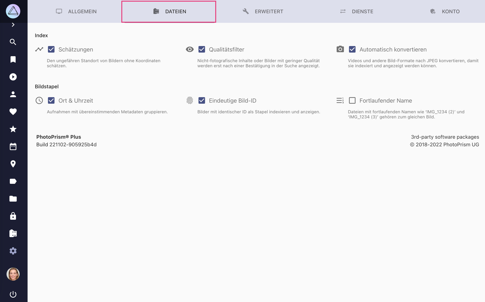

# Bibliotheks Einstellungen #

{ class="shadow" }

##Indexierung ##

#### :material-chart-timeline-variant: Schätzungen ####
Schätzt den Standort von Bildern, die ohne GPS-Informationen aufgenommen wurden, indem er aus dem Standort anderer Bilder, die am selben Tag aufgenommen wurden, extrapoliert wird.

#### :material-eye: Qualitätsfilter ####
Erfordert eine [Überprüfung von nicht fotografischen und qualitativ schlechten Bildern](../organize/review.md), bevor sie in den Suchergebnissen erscheinen.

#### :material-camera: Automatische Konvertierung zu JPEG ####
Erstellt automatisch JPEG-Vorschaubilder für andere Dateitypen, damit sie in den Suchergebnissen und im Vollbildmodus angezeigt werden können.

!!! danger ""
    Die Option *Automatisch konvertieren* sollte nicht deaktiviert werden, da sie PhotoPrism daran hindert, andere Dateitypen als JPEG zu indexieren, es sei denn, es gibt bereits JPEG-Sidecar-Dateien mit demselben Dateinamenpräfix. Siehe *Bildstapel*, um mehr über die Namenskonventionen von Sidecar-Dateien zu erfahren.

## Bildstapel ##
PhotoPrism gruppiert zusammengehörige Dateien automatisch zu Bildstapeln.
Bildstapel sind Gruppen von Dateien, die den gleichen Ursprung haben, sich aber in Qualität, Format, Größe oder Farbe unterscheiden. Gehe zu *[Einstellungen > Dateien](../settings/library.md)*, um die Stacking-Einstellungen für deine Bibliothek zu ändern.

Du kannst folgende Optionen nutzen, um Bilder zu gruppieren:

* :material-format-list-numbered-rtl: **Fortlaufende Dateinamen** zum Beispiel `/2018/IMG_1234 (2).jpg` und `/2018/IMG_1234 (3).jpg`
* :material-clock-outline: **Gleicher Ort und Zeit** Gruppiert Bilder, die an derselben GPS-Position und in derselben Sekunde aufgenommen wurden
* :material-fingerprint: **Gleiche eindeutige Bild-ID**  vergleicht die *Unique Image ID* (Exif), *Document ID*, oder *Instance ID* (XMP)

Gleichnamige Dateien, die sich im selben Ordner befinden, z.B. `/2018/IMG_1234.jpg` und  `/2018/IMG_1234.avi`, werden immer gruppiert.

!!! warning ""
    Wenn du die Stacking-Einstellungen änderst, werden bereits gruppierte Dateien nicht automatisch wieder getrennt.

<!--## Umwandlung von RAW zu JPEG ##
Viele Fotografen, insbeondere Nutzer einer digitalen SLR, verwenden ein verlustfreies RAW-Format anstelle des verlustbehafteten JPEG-Formats. Es gibt auch [Handies](https://www.fredericpaulussen.be/how-to-raw-photos-huawei-p30-pro/) die RAW-Daten abspeichern können oder das Format HEIC/HEIF nutzen.
Das Ziel von PhotoPrism ist eine umfangreiche Unterstützung für alle [RAW-Formate](https://en.wikipedia.org/wiki/Raw_image_format), unabhängig vom verwendeten Kameramodell. Deshalb bitten wir dich uns eine Nachricht zu schicken, falls du ein Problem mit den Dateien von einem deiner Geräte hast.

Webbrowser können keine RAW-Formate anzeigen. Deshalb muss PhotoPrism diese Dateien zu JPEGs *konvertieren*. Falls du das nicht möchtest, kannst du das in den [Einstellungen](ui.md) ausschalten.

Zusätzlich zu den oben genannten Formaten unterstützt PhotoPrism auch BMP-, GIF-, PNG- und TIFF-Dateien. Bevor du diese Formate zur Speicherung nutzt, solltest du bedenken, dass sie oft keine Metadaten speichern können. Deshalb werden sie in der Regel für Screenshots, Diagramme und Icons verwendet.

### Read-only Modus ###
Die Konvertierung von RAW-Formaten benötigt sehr viel Rechenzeit, weshalb normalerweise die dann erzeugten JPEG-Dateien neben den RAW-Dateien für die zukünftige Verwendung abgespeichert werden. Im *read-only Modus* (schreibgeschützt) schreibt PhotoPrism jedoch keine Daten in deine Bildverzeichnisse. Da es nicht sinnvoll wäre die konvertierten Daten im Arbeitsspeicher oder einem temporären Verzeichnis abzulegen, ist die automatische Konvertierung im *read-only Modus* deaktiviert.

Wenn du dir unsicher bist, ob du neben deinen RAW-Dateien auch JPEG-Dateien abspeichern sollst, bedenke, dass es in 20 Jahren bestimmt einen JPEG-Viewer geben wird. Die Unterstützung von einer proprietären RAW-Datei ist jedoch nicht garantiert.
Nutzern, die PhotoPrism zum Anzeigen von Fotos [(im *read-only Modus*)](https://github.com/photoprism/photoprism/issues/189) nutzen wollen, empfehlen wir die JPEGs manuell oder mithilfe eines anderen Tools zu erzeugen.

Wie PhotoPrism mit der automatischen Konvertierung im *read-only Modus* in Zukunft umgehen wird, ist noch nicht abschließend entschieden. Vielleicht gibt es eine Möglichkeit, mit akzeptablem Rechenaufwand und Qualität RAW-Bilder automatisch zu konvertieren. Diese könnten dann in einen Ordner `cached/converted` abgelegt werden. Von da aus könnten sie dann in das Verzeichnis mit den Originalen kopiert/verschoben werden. Was hälst du davon? Wir freuen uns auf dein Feedback!-->