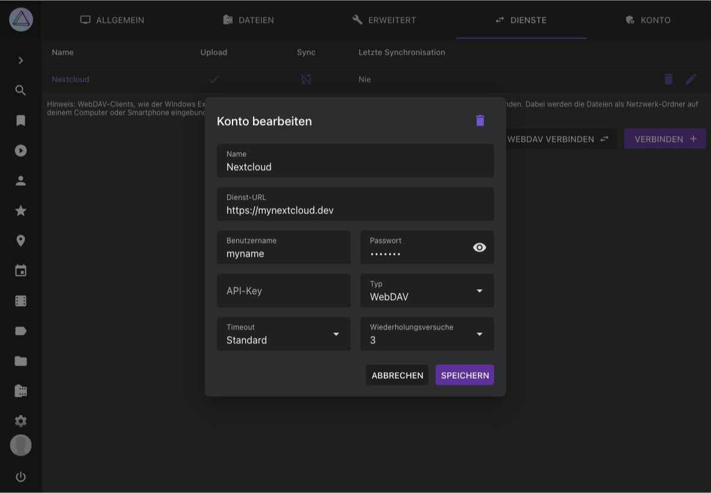

# Dienste #

Du kannst deine PhotoPrism-Instanz mit anderen Diensten mit WebDAV-Unterstützung verbinden, zum Beispiel mit anderen PhotoPrism-Instanzen, Nextcloud oder ownCloud.

!!! tldr ""
    Da diese Einstellungen ohne Authentifizierung nicht sicher sind, sind sie nicht verfügbar, wenn du PhotoPrism im [public Modus](https://docs.photoprism.app/getting-started/config-options/#authentication) verwendest.

Das kann nützlich sein, wenn du Dateien zwischen mehreren Diensten [teilen](../share/services-share.md) oder [synchronisieren](../sync/services-sync.md) willst.

## Dienst einrichten ##

1. Gehe zu *Einstellungen*
2. Öffne das *Dienste* Tab
3. Klicke auf *Verbinden*
4. Trage die Server URL, den Nutzernamen sowie das Passwort ein
5. Klicke *Verbinden*
   { class="shadow" }
6. Dein Server ist jetzt mit PhotoPrism verbunden

## Verbindungsdetails bearbeiten ##
1. Gehe zu *Einstellungen*
2. Öffne das *Dienste* Tab
3. Klicke :material-pencil:
4. Bearbeite die Konto-Details und klicke *Speichern*

   { class="shadow" }

## Upload Einstellunegn bearbeiten ##

1. Gehe zu *Einstellungen*
2. Öffne das *Dienste* Tab
3. Klicke in den Upload Bereich deines Dienstes

{ class="shadow" }
4. Wähle den Ordner, in den die Dateien hochgeladen werden sollen und klicke *Speichern*

{ class="shadow" }

Du kannst jetzt [Alben oder Dateien mit diesem Dienst teilen](../share/services-share.md).

!!! attention ""
	Auf Grund von Problemen bei bestimmten Nextcloud Einstellungen kann es vorkommen, dass nach dem Upload bei Nextcloud nur 0 Byte große Dateien ankommen. 
	[Hier](https://github.com/photoprism/photoprism/issues/443) findest du Informationen, die dir helfen, das Problem zu beheben.

## Synchronisation Einrichten##

1. Gehe zu *Einstellungen*
2. Öffne das *Sync* Tab
3. Klicke in den Sync Bereich deines Servers
   { class="shadow" }
4. Aktiviere die Synchronisation in der Ecke oben rechts
5. Wähle den Ordner, in welchem sich deine Bilder befinden
6. Entscheide wie oft die Dateien synchronisiert werden sollen
7. Selektiere alle Optionen, die zu deinem Anwendungsfall passen und klicke *Speichern*

{ class="shadow" }

### Synchronisations-Optionen ###
* *Dateien herunterladen*  - alle Dateien, die noch nicht in PhotoPrism existieren, werden regelmäßig von deinem Dienst heruntergeladen
* *Dateien hochladen* - alle Dateien (auch als privat markierte oder archivierte), die auf deinem Dienst noch nicht existieren, werden regelmäßig hochgeladen
* *Namen beibehalten* - Dateinamen werden beibehalten
* *RAWs und Videos kopieren* - Neben JPEGs werden auch RAW Dateien und Videos synchronisiert
