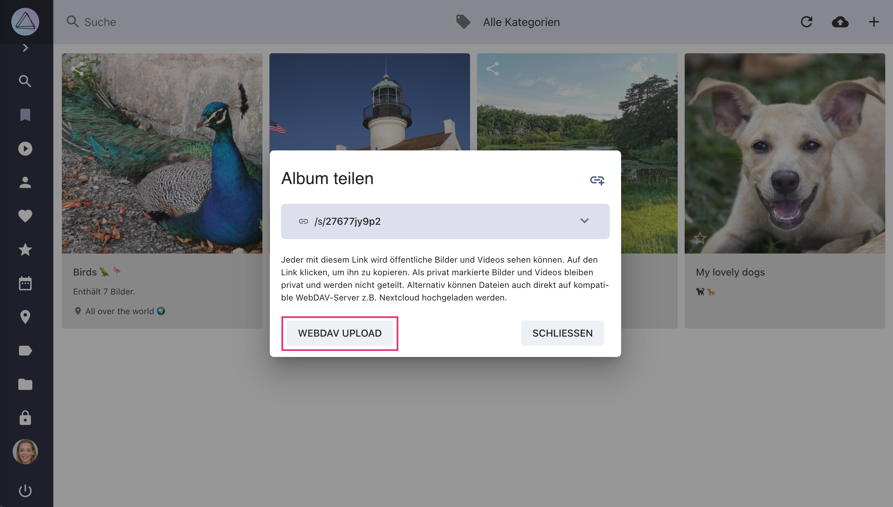
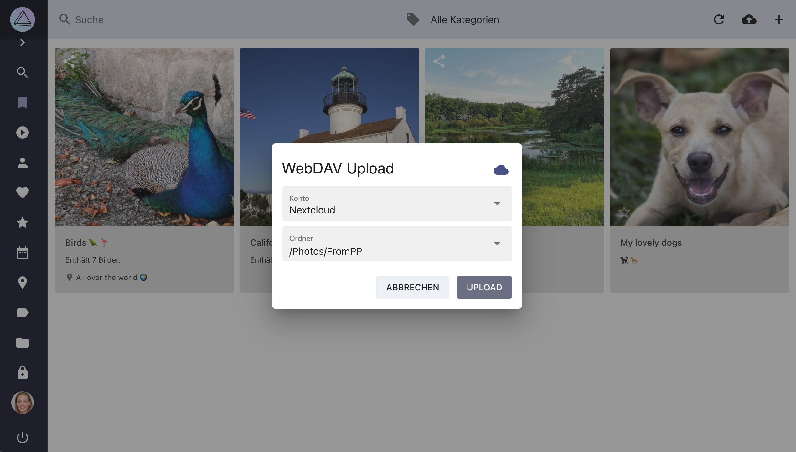

# Mit anderen Apps teilen #

In den [Einstellungen](../settings/sync.md) kannst du deine PhotoPrism-Instanz mit anderen Diensten mit WebDAV-Unterstützung verbinden, zum Beispiel mit anderen PhotoPrism-Instanzen, Nextcloud oder ownCloud.

## Dateien mit anderen Apps teilen ##

2. Wähle Bilder aus
3. Öffne das Kontext-Menü
4. Klicke :material-cloud:
   { class="shadow" }
5. Wähle ein Konto und klicke *Upload*

{ class="shadow" }

!!! attention ""
    Auf Grund von Problemen bei bestimmten Nextcloud Einstellungen kann es vorkommen, dass nach dem Upload bei Nextcloud nur 0 Byte große Dateien ankommen.
    [Hier](https://github.com/photoprism/photoprism/issues/443) findest du Informationen, die dir helfen, das Problem zu beheben.

## Alben mit anderen Apps teilen ##

1. Gehe zu *Alben* / *Erlebnisse* / *Kalender* / *Länder* / *Ordner*
2. Wähle ein Album aus
3. Öffne das Kontext-Menü
4. Klicke :material-share-variant:
5. Klicke *WebDAV Upload*
   { class="shadow" }
6. Wähle ein Konto und klicke *Upload*

{ class="shadow" }