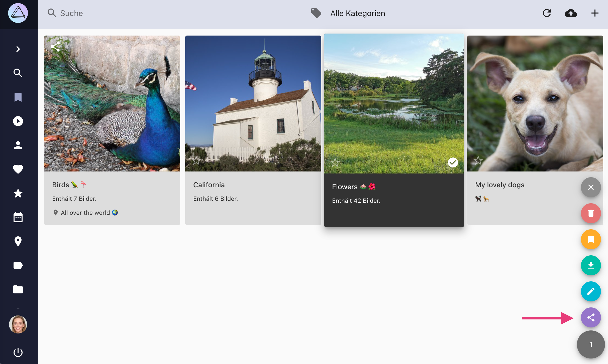
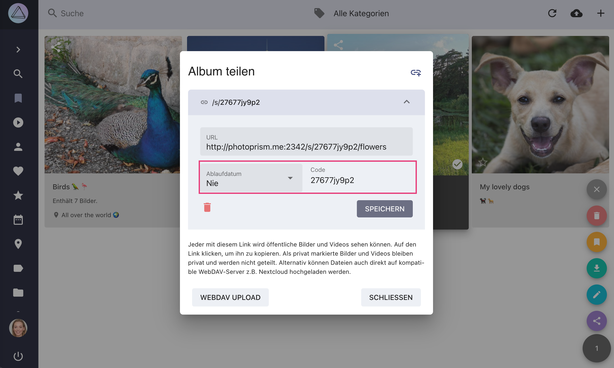
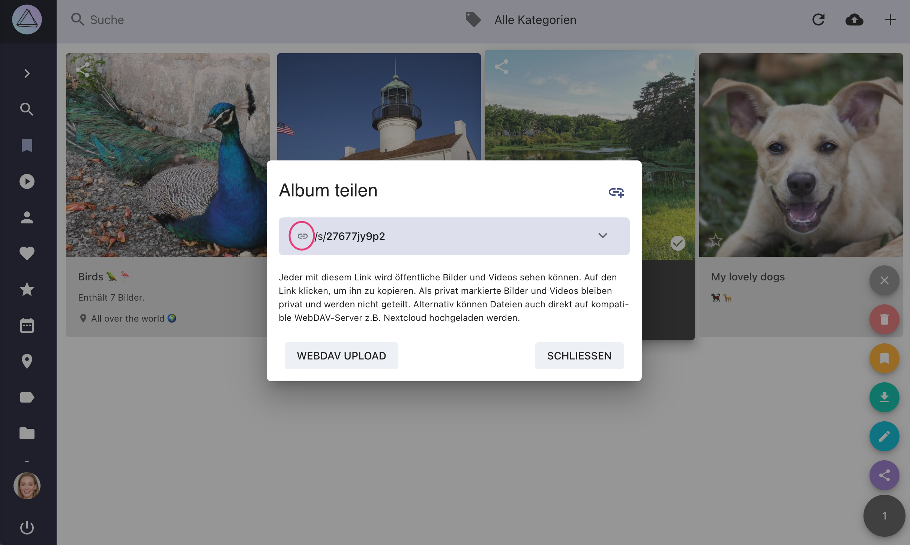

# Album-Link teilen #

Erstelle Freigabelinks, um Alben, Momente, Kalender Monate, Länder oder Ordner mit deinen Freunden zu teilen.

Deine Freunde können Bilder und Videos aus freigegebenen Alben anzeigen und herunterladen.
Bilder, die als privat markiert sind, werden nicht angezeigt.

{ class="shadow" }

!!! info ""
    Wenn Link-Besucher auf den Standort eines Fotos klicken, können sie die Fotos des freigegebenen Albums in der Kartenansicht betrachten.

{ class="shadow" }

Durch klicken auf :material-power: können Link-Besucher ihre Sitzung beenden.

## Freigabelink erstellen ##
=== "Kontext-Menü"
     1. Gehe zu *Alben* / *Erlebnisse* / *Kalender* / *Länder* / *Ordner*
     2. Selektiere das Album, das du teilen möchtest
     3. Öffne das Kontext-Menü
     4. Klicke :material-share-variant:

    { class="shadow" }

=== "Album-Suchleiste"
     1. Gehe zu *Alben* / *Erlebnisse* / *Kalender* / *Länder* / *Ordner*
     2. Öffne das Album, das du teilen möchtest
     3. Klicke :material-share-variant:

      { class="shadow" }

Dann

5. Klicke :material-chevron-down: um die *Link Details* zu öffnen
6. Setze den *Code* und das *Ablaufdatum*
7. Klicke *Speichern*

    { class="shadow" }

8. Kopiere den Link, indem du auf ihn klickst

    { class="shadow" }

9. Teile ihn mit deinen Freunden

!!!tip "Mehrere Alben über einen Link teilen"
    Du kannst mehrere Alben über denselben Link teilen, indem du den gleichen Code verwendest.

!!!tip ""
    Du kannst zusätzliche Links mit unterschiedlichen Codes und Ablaufdaten erstellen, indem du auf :material-link-plus: klickst

## Freigabelink löschen ##

1. Gehe zu *Alben*
2. Klicke auf :material-share-variant: auf dem Albumcover 

    
    
3. Klicke :material-chevron-down:
4. Klicke :material-delete:

     
