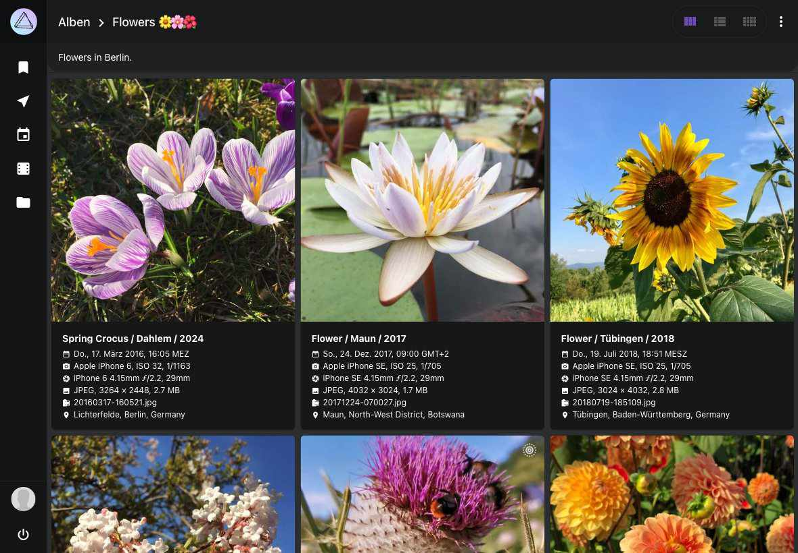
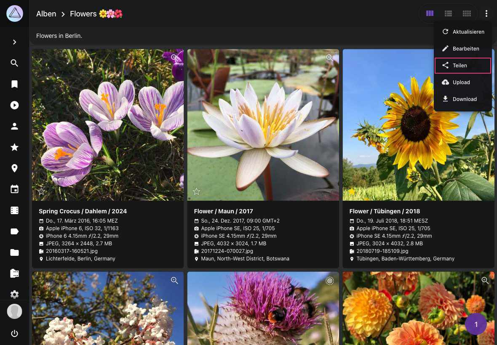

# Erstellen und Teilen von Album Links #

Geheime Links ermöglichen es, [manuell erstellte Alben](../organize/albums.md) sowie ausgewählte [Ereignisse](../organize/moments.md), [Monate](../organize/calendar.md), Regionen oder [Ordner](../organize/folders.md) mit deinen Liebsten zu teilen. Du kannst für jedes Album mehrere Links erstellen und optional ein Ablaufdatum festlegen. Für die Verwendung der Links ist zwar keine Registrierung erforderlich, aber [das Teilen von Alben mit Benutzern, die ein Konto haben](../users/sharing.md) ist auf diese Weise ebenfalls möglich.

Wenn du ein Album teilst, sind als privat markierte Bilder für andere nicht sichtbar. Nicht private Bilder können angesehen und heruntergeladen, aber ihre Metadaten nicht geändert werden.

{ class="shadow" }

!!! info ""
    Wenn Link-Besucher auf den Standort eines Fotos klicken, können sie die Fotos des freigegebenen Albums in der Kartenansicht betrachten.

{ class="shadow" }

Durch klicken auf :material-power: können Link-Besucher ihre Sitzung beenden.

## Freigabelink erstellen ##
=== "Kontext-Menü"
     1. Gehe zu *Alben* / *Ereignisse* / *Kalender* / *Regionen* / *Ordner*
     2. Selektiere das Album, das du teilen möchtest
     3. Öffne das Kontext-Menü
     4. Klicke :material-share-variant:

    { class="shadow" }

=== "Album-Suchleiste"
     1. Gehe zu *Alben* / *Ereignisse* / *Kalender* / *Regionen* / *Ordner*
     2. Öffne das Album, das du teilen möchtest
     3. Klicke :material-dots-vertical:
     4. Klicke :material-share-variant:

      { class="shadow" }

Dann

5. Klicke :material-chevron-down: um die *Link Details* zu öffnen
6. Setze den *Code* und das *Ablaufdatum*
7. Klicke *Speichern*

    { class="shadow" }

8. Kopiere den Link, indem du auf ihn klickst

    { class="shadow" }

9. Teile ihn mit deinen Freunden

!!!tip "Mehrere Alben über einen Link teilen"
    Du kannst mehrere Alben über denselben Link teilen, indem du den gleichen Code verwendest.

!!!tip ""
    Du kannst zusätzliche Links mit unterschiedlichen Codes und Ablaufdaten erstellen, indem du auf :material-link-plus: klickst

## Freigabelink löschen ##

1. Gehe zu *Alben*
2. Klicke auf :material-share-variant: auf dem Albumcover 

    
    
3. Klicke :material-chevron-down:
4. Klicke :material-delete:

     
